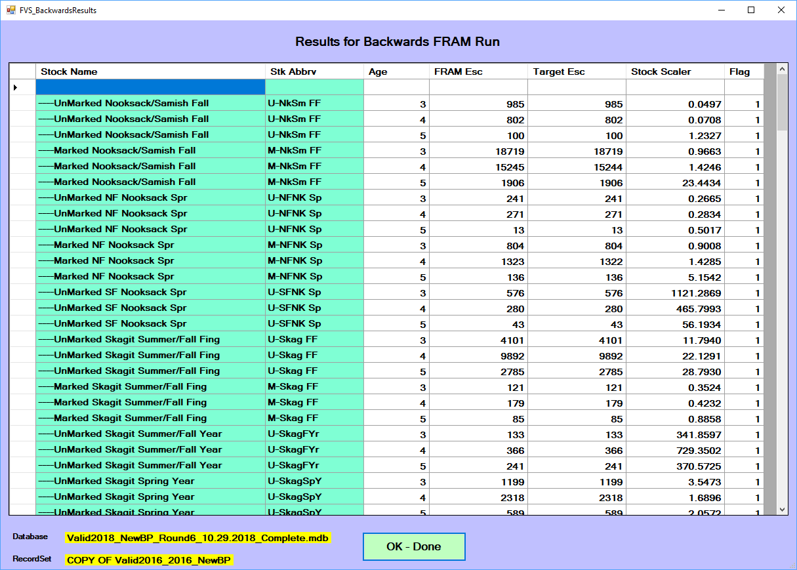

“Forward” FRAM model runs begin from a forecasted "pre-fishing" cohort and then apportion fishery impacts to the model stocks through the species-specific time steps. This conceptually parallels the observed seasonal progression of salmon returning to spawning grounds and release areas.^[Recall that FRAM is not spatiotemporally explicit. Rather, all fishery impacts and maturation adjustments are handled simultaneously across the vector of stocks (and ages for Chinook) within a given timestep and preterminal/terminal substep. Thus, all fisheries occurring in the same time step operate on the same abundance, and any *spatial* precedence is a function of the annual fishery sequence through time. For example, spring catches in Alaska do not directly influence spring catches in BC and WA. However, these geographic precursors do affect summer catches in Puget Sound and elsewhere due to time step/timing.]

In contrast, a “backward” FRAM (bkFRAM) model run combines observed terminal run size and escapement values with observed catch values to iteratively derive a set of recruit scalers, such that those scalers produce a starting cohort capable of producing the known catch and escapement. Starting cohorts are initial FRAM run sizes before natural mortality, fishing mortality, and maturation. For Chinook, bkFRAM calculates age 3 to 5 starting cohorts, and for Coho, starting cohorts are in units of January Age 3 fish. This process is conceptually related to traditional “run reconstruction” approaches.

These runs play several important roles. 

During the preseason planning process, Chinook forecasts are commonly reported in terms of terminal run size. Thus, the initial preseason Chinook model run is actually a backwards model run that enables the reconstruction of a starting cohort for all subsequent preseason modeling. This “average run” is a backwards Chinook FRAM run that targets the new season’s terminal return forecasts (by stock) in the context of fishery parameters averaged from recent observed years.

Following completion of a fishing year, a post-season backwards run is performed to incorporate the most current representation of what actually happened. Note that in addition to the new year, updates to the data characterizing older years may also be integrated during this process. The Pacific Salmon Commission’s Coho Technical Committee (CoTC) conducts post-season Coho model runs to evaluate annual Pacific Salmon Treaty obligations. The salmon co-managers (Washington Treaty Tribes and WDFW) conduct post-season Chinook model runs, which can be found on their website at: https://fisheriesservices.nwifc.org/fram-model-runs/post-season-fram-modeling/

BkFRAM can be run for an individual stock or a combination of stocks (including all stocks). It requires a “seed” run that contains desired fishery impacts (observed values for post-season runs or recent year average values for pre-season runs). The seed run will also contain starting cohorts for stocks where this parameter is known; i.e. the forecast is already in starting cohort units rather than terminal run size units.

BkFRAM can run in three modes. The mode is selected using a flag in the input process. Flags are stock-specific, allowing all three flags (values = 0,1,2) to be used in a single bkFRAM model run.

 - Mode 0 (flag 0): This mode does not use bkFRAM to find starting stock scalars. Instead, FRAM uses the starting cohort values from the existing “StockRecruit” table in the project database.
 
 - Mode 1 (flag 1): This mode uses an algorithm to iteratively adjust stock recruit scalars until the target abundance is achieved. Target abundances are adipose mark specific. This method is used when the mark rate of a stock is known. 
 
 - Mode 2 (flag 2): This mode is selected when target mark rates are unavailable. Algorithms from mode 1 are used to find the starting stock recruit scalars that result in the combined target abundance (marked and unmarked components). The program will then apply mark rates derived from the existing “StockRecruit” table to split starting cohorts into marked and unmarked components.

# Running BkFRAM

After selecting "Post Season run" from the FRAM main menu, the Backwards FRAM submenu is presented. The Coho and Chinook versions are slightly different.

```{r, echo = FALSE, out.width="100%", fig.cap='The post-season or backwards FRAM submenu for Chinook'}
knitr::include_graphics("images/fvs_back_menu.png")
```

```{r, echo = FALSE, out.width="100%", fig.cap='The post-season or backwards FRAM submenu for Coho'}
knitr::include_graphics("images/fvs_back_menu_coho.png")
```

Next, target abundance values must be set if they are not already. Selecting the ‘Target Escapements” button brings up the Target Escapements for Backwards FRAM menu, which has a slightly different layout for Chinook and Coho. 

# Target escapements for Chinook

The values for the FRAM calculations to target must be provided by stock, mark status, and age, in conjunction with a control flag. The effects of flag values are displayed on screen, with `0` meaning the value is not used, `1` it is used, and `2` that it is intended to be automatically split into marked and unmarked components. A flag value of `3` is deprecated but allowed for legacy compatibility.

When terminal run size is known for a stock by age and mark status, these can be entered with a flag of “1” in the correspondingly labeled cells. If the mark rate is unknown, enter the combined (marked plus unmarked) abundance in the “TOTAL” row and flag as “2” (i.e. will use mark rates from “seed run”). If you do not wish to overwrite existing cohort sizes for a stock, flag relevant row(s) (Total, Marked, Unmarked) as “0”.

While the FRAM interface enables editing individual values, the “Import Escapements” option allows an “all-at-once” update via the selection of an MS Excel template file containing model inputs compiled outside of FRAM. Select the “Import Escapements” button and then locate and selecting the file (“BkFRAM_ChinookTemplate...xls”) with the desired values.

```{r, echo = FALSE, out.width="100%", fig.cap='Post-season target escapements'}
knitr::include_graphics("images/fvs_back_target.png")
```

Once the input values are updated, select “OK - Done” to return to the Backwards FRAM Run Menu to “Start Iterations”.

The following table represents which Chinook FRAM fisheries (by FisheryID numeric values and generic titles) and time steps (horizontal) are included in the run size definition of each stock (by StockID numeric values and StockName) (vertical). A “yes” denotes that the landed catch of ages 3-5 Chinook in fishery and time steps are added to the age 3-5 run to the river (escapement + freshwater catch). T1 equals October-April time step, T2 equals May-June time step, and T3 equals July-September time step

# Target escapements for Coho

Enter target escapements by stock and mark status and flag as “1” in the correspondingly labeled cells. Coho escapement values should exclude jacks (age 2), as coho are assumed to be age 3 in the FRAM model framework.  If the mark rate is unknown, enter the combined (marked plus unmarked) escapement in either the marked or unmarked stock row and flag as “2” (will use mark rates from “seed run”). If you do not wish to overwrite exisiting cohort sizes for a stock, flag relevant row(s) (Marked, Unmarked) as “0”.

Escapement values can also be loaded from a MS Excel template file designed for model inputs (“CohoFRAMInputTemplate....xls”) by selecting the “Import Escapements” button and then locating and selecting the file with the desired values. The template file workbook needs to contain a worksheet tab called “FRAMEscapeV2”, and the user may need to unhide it within the template. The escapement values within the worksheet are organized as rows by stock and mark status and columns per year. A column exists for every year desired for updating model inputs. The program will request a single ‘Year’ to load from the Excel worksheet.

Escapement values can be also be exported by selecting the “Export to Spreadsheet” button on the Target Escapements for Backwards FRAM menu using the same workbook template file needed for importing. The program will also request the ‘Year’ of data to export.

Once the input values are updated, select “OK - Done” to return to the Backwards FRAM Run Menu to “Start Iterations”.

# Start iterations

With target escapements entered, the number of desired iterations can be selected and then “Start Iterations” clicked. The default number of iterations is 99. This number will rarely be reached, as iterations automatically terminate when the convergence criteria is met (run size within 1 fish of target).

For Coho, selecting the “Run without MSF Bias Correction (if checked)” button will process the backwards run without the MSF Bias Correction factor applied.  By default, the MSF Bias Correction is applied during preseason forward Coho FRAM modeling and thus it is also by default applied during backward FRAM.  Thus, this box is most commonly left unchecked.

For Chinook, selecting the “Age 2 from 3” box will cause the program to process using fishing year (FY) age 2 from 3 abundances (e.g., the recruit scaler for age 3s will be used for age 2s). This corresponds to the preseason mode of operation. After selecting “Start Iterations”, a prompt requires the user to select whether or not to use TAMI catches for the run. 
Choosing "yes" is appropriate if the correct TAMI fishery catches (e.g., 7BCD net) are not yet loaded into FRAM. Conversely, "no" will skip this step when the FRAM run already has the correct TAMI catches stored (i.e, because FRAM has already been run forward with the correct TAMM and TAMI catches are automatically saved into the FRAM database). 

# View and save BkFRAM results

After iterations are complete, the program returns a result screen (with slightly different layouts for Chinook and Coho) which lists target escapements, resulting BkFRAM escapements, and new stock recruit scalers side by side in order to assess whether values have sufficiently converged.

```{r, echo = FALSE, out.width="100%", fig.cap='Convergence is displayed per-stock and age'}

```

Finally, after exiting the table display, a new option to "Save BkFRAM targets and new Recruit Scalars[sic]" is available.

If no further changes to escapement or flagging are needed, this will write values to the database before returning to the main menu.

The "Save BkFRAM..." button brings up the following message box: “This action saves BkFRAMTargets as well as Recruit Scalars. To save, please follow instructions of next menu.” Then the ‘Save-Menu’ pops-up, where the user can select to replace the existing run, save as a new run, or cancel save. Note that if the user selects the “Save BkFRAM Targets and New Recruit Scalars” button after the targets are entered or imported, but before iterations are run, the save action will only save the new targets.

