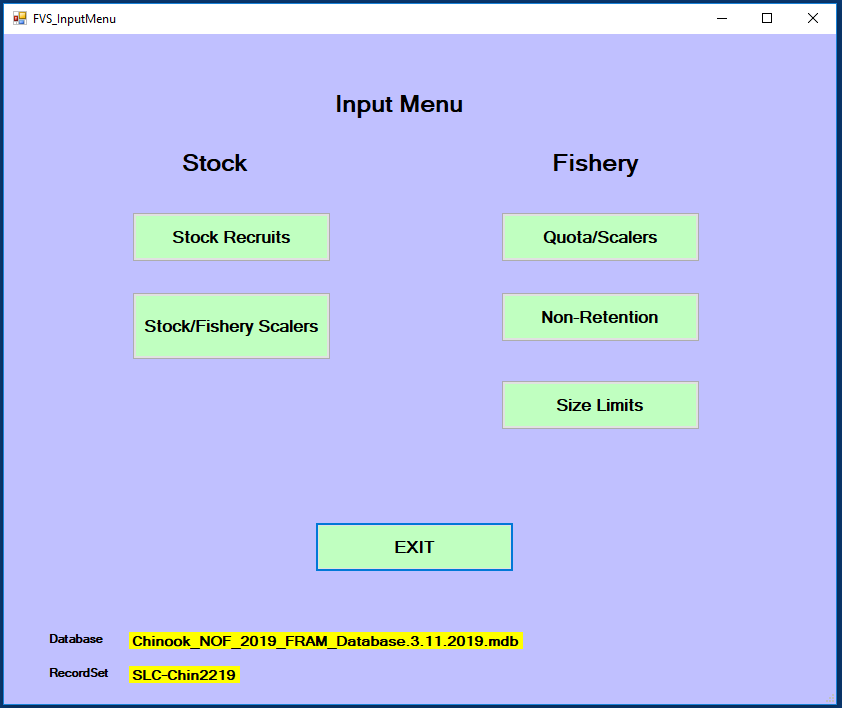
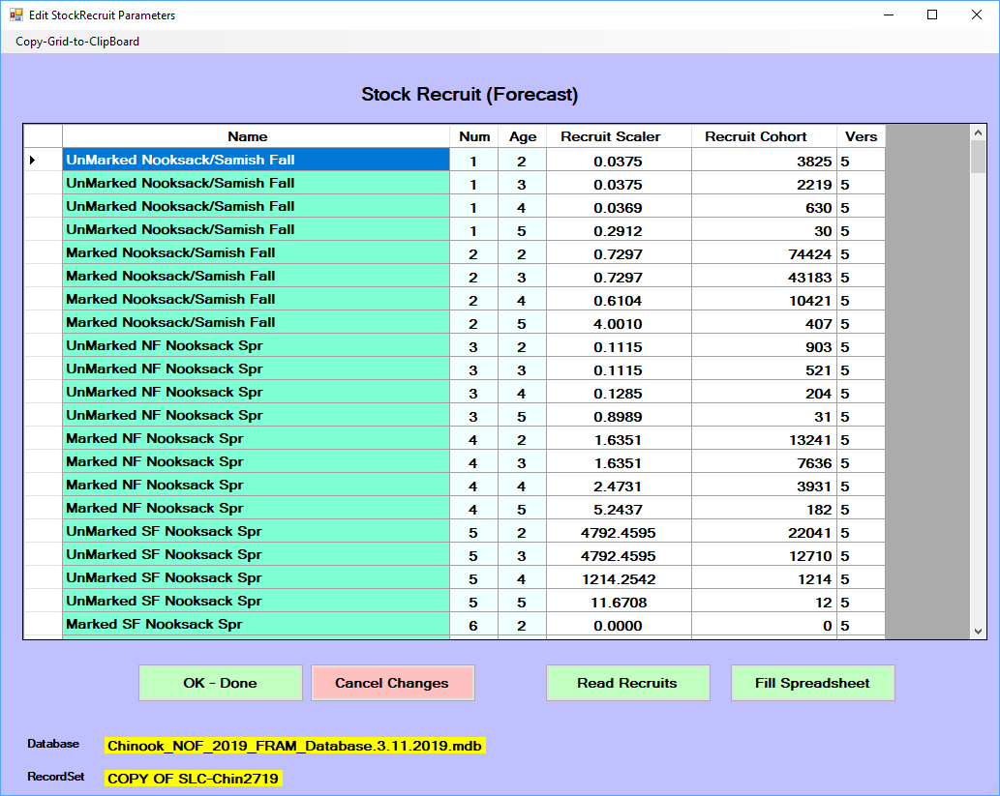
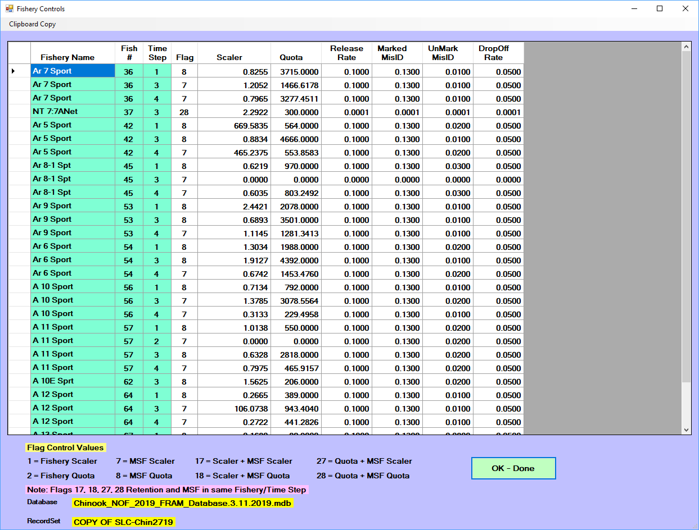

FRAM allows users to explore different management scenarios by adjusting "inputs" ([Per-run parameters]) that control fishery and stock properties.

For some analyses, it may make sense to adjust model parameters outside of the FRAM application. For example, a uniform increase or decrease in a group of fisheries over multiple time steps may be accomplished more easily by manipulating the project database directly. 

However, the main menu "Edit model run" button accesses a convenient interface for changing individual values within the application. Clicking this produces a submenu divided into further "Stock" and "Fishery" buttons.

```{r edit_run_menu, echo = FALSE, out.width='100%'}

```

# Stock recruits

Stock recruit scalers (`StockRecruit` in [Per-run parameters]) are multiplied against a base period abundance (`BaseCohort` in [Base period parameters]) to generate a starting, pre-fishing cohort by stock (and age for Chinook).^[See [FramCalcs:ScaleCohort](https://github.com/Angelikahagen/MainFRAM_VS-Repo/blob/9985faadb23cd27b227cbe079113928e7035fddb/FramCalcs.vb#L3569)]

These parameters represent the magnitude of the current stock abundance relative to that during the base period years. Thus, a stock recruit scaler of 1 indicates an annual abundance for that stock equal to the base period, a value >1 is an abundance larger than the base period, and <1 is an abundance smaller than the base period. 

Coho ‘Recruit Cohort’ values are in January age-3 units, whereas Chinook ‘Recruit Cohort’ contains four age-class specific initial ocean abundance values.

For preseason forward runs, stock recruit scaler values are a function of stock-specific forecasts provided by technical staff at the beginning of the planning cycle. They are generally established at the outset of preseason planning and then updated if necessary as additional data are available for the year (i.e. Canadian Chinook forecasts are not usually available until the end of March). For Chinook, stock recruit scalers are typically produced from terminal run size forecasts by running [Backwards FRAM].

Accordingly, recruit scalers would not usually be manually adjusted during a typical forward model run, but the interface enables this possibility if, for example, one wanted to explore the implications of a much larger or smaller salmon return than was predicted or with a different age distribution (e.g., "what happens if stock X returns at half of what was forecast and/or with far more younger fish?").

Note that updating the stock recruit scaler will automatically update the associated recruit cohort and vice versa.

The “Read Recruits” button can be used to load forecast values compiled in the external FRAMVSTemplate file from sheet FRAM_Recruits.  Conversely, the “Fill Spreadsheet” button can be used to download values from the model run to the FRAMVSTemplate file, where additional notation or comments can be stored.

```{r edit_run_stock_recruit, echo = FALSE, out.width='100%'}

```

# Stock/Fishery Scalers

Stock-fishery-specific exploitation rate (ER) scalers allow adjustments to the base period directed impacts of a particular fishery on a specific stock or group of stocks within each time step. These scalers function act on the base period fishery-stock-specific ERs. 

These parameters can provide a temporary fix to an identified issue in the FRAM base period calibration. They are also used to represent negotiated closures within a fishery (e.g. a spatial closure). Any such adjustments must be supported by an accepted external analysis of fishery-stock interactions which demonstrates how and why the fishery would be expected to have different stock-specific contribution levels than it had during the base period years (e.g. CWT recoveries or genetic stock identification).

Stock-fishery-specific ER scalers display 0 until a fishery is selected from the upper left drop-down menu. 

If a fishery/time-step is not modeled, a “****” is displayed with blue highlight.

By default, the values are equal to 1, which means the base period exploitation rate is used. Thus, a value >1 is a larger ER than the base period and <1 is smaller than the base period ER. 

After choosing the focal fishery, the desired values are directly input into each cell and the “Ok - Done” button writes those changes to the project database for the active model run. These changes then persist across subsequently copied runs.

Few to none of these scalers may be "actively" modifying the many possible stock-fishery combinations in a FRAM run, and the red "Show Active Scalers" button presents a secondary screen filtered to and highlighting those particular instances. Although values cannot be directly modified on this screen, it can serve as a useful check of the current model run parameterization.

```{r, echo = FALSE, out.width='100%', fig.cap='Stock-fishery scalers display 0 until a fishery is selected.'}
knitr::include_graphics("images/fvs_edit_stock_fish_er.png")
```

# Fishery Quota/Scalers

These [Per-run parameters] control the representation of fishery effort and may be the most frequently adjusted FRAM element during preseason planning.

As noted in the [Edit input parameter values] section of [A Basic Forward Run], legal, landed catch fishery impacts are controlled by "quotas" and/or "scalers" which are in turn controlled by per-timestep `fishery flags`. Values entered or adjusted under the quota/scalers input menus are stored in the [Project database tables] `FisheryScalers`. Fisheries without an input will be modeled with a default fishery effort scaler of 0.0 (flag = 1).

The flag values (displayed in the interface) determine whether the fishery is treated as non-selective and/or mark selective, and whether catch is processed as a fixed expectation (quotas) or as effort relative to the base period (scalers). Both modes operate on the fishery as a whole, combining with stock and age specific exploitation rates to determine resulting impacts from the fishery. 

Note that many fishery/time-step cells are filled with asterisks (****) designating a lack of base period information to model that stratum. If a fishery now operates in one of those time steps the input (and impacts) need to be combined with an adjacent fishery or time step.

A single value in the input interface (either a scaler or quota) can be entered, and once the model is run, the resulting associated value will be populated in the interface (e.g. enter a quota value here and proceed through the menus to complete a model run, which will then return the resulting scaler value for that entered quota).  Several values can be entered or updated before clicking “OK – Done”.

```{r, echo = FALSE, out.width='100%', fig.cap='Fishery flag effects are shown below the current scaler and quota values.'}
knitr::include_graphics("images/fvs_edit_fish_quotascaler.png")
```

The values for mark-selective fisheries are displayed on a secondary input screen that is displayed after selecting "Ok - done". Only fishery and time steps flagged in the first fishery controls screen as mark-selective or a combination with a mark-selective component will be present in the secondary MSF input screen (flags 7, 8, 17, 18, 27,28; displaying a magenta highlight in Scaler/Quota cells). **Thus, if you want to enter a MSF or change a MSF input parameter, be sure it is flagged as such first.**

In addition to scaler and quota inputs, the MSF fishery controls input screen also contains four additional input parameters. Some of these parameters are derived and agreed-to each preseason planning cycle by salmon co-managers and others are set by the PFMC management process.  Thus, some stay fairly static year-to-year and some change annually.

  - Release Rate:		Hooking release mortality rate (landed fish then released)
  - Marked MisID:	Release rate of marked fish that could be legally retained
  - UnMark MisID:	Retention rate of unmarked fish that should have been released
  - DropOff Rate:		Fishery-related mortality rate (fish that escape but die due to injury)

Note these four MSF input parameters cannot have a zero value and must be >0.0000.

```{r, echo = FALSE, out.width='100%', fig.cap='Mark-selective values are displayed on a second interface after approving non-selective values.'}

```

Altering a fishery `quota` has fairly intuitive implications (though the target value may itself result from considerable additional calculation external to FRAM). In contrast, the particular numeric effects of altering `fishery scalers` requires more prior knowledge of the base period practices (and stock composition).

In addition to the direct adjustment of single values in the interface (which are then written to the database), the "Import catch" and "Export to spreadsheet" buttons provide functionality to read and write values for all fisheries and time steps at once from an external [FRAMVSTemplate file], on sheets FRAMinput and FRAM_MSF. Note also the "clipboard copy" option in the upper left corner of the interface.


# Non-Retention

Coho or Chinook non-retention (CNR) inputs represent any fishery (or portion of a fishery) that will be open for salmon fishing but requires release of Coho or Chinook.  Differences in the input menu screens for Coho and Chinook reflect the different methodologies. 

For Chinook, similar to other inputs, control flag values (flags 1 – 4) determine the mode by which non-retention impacts are calculated, with different modes requiring various additional parameter values (Field1, Field2, Field3, Field4) (definitions displayed in the lower left of the interface window). Typically, only flag 3 (Legal/Sublegal Encounters) or flag 4 (Total Encounters) are used. Encounters for Puget Sound marine sport fisheries can be automatically updated using the [Automate Pass 1 Pass 2] button on the FRAM [Utilities] menu.

For Coho, non-retention mortality is calculated outside of the model and entered as the total number of dead fish resulting from the non-retention portion of a fishery/time-step.  Typically, the value is derived from a historic level of landed or encountered coho and then applying both a release mortality rate and a drop-off mortality rate to that historic level, and summing the two types of mortalities.

Similarly, the individual values can be altered (and consequently saved to the run in the database) and there is also a button to “Zero All Fields”.  In addition, the interface provides options to “Import NonRetention” and “Export to Spreadsheet” all fishery/time steps from the external FRAMVSTemplate file (sheet FRAM_CNR). 

Note many fishery/time-step cells are filled with asterisks (****) designating a lack of base period information to model that stratum. If a fishery now operates in one of those time steps the input (and impacts) need to be combined with an adjacent fishery or time step.

```{r, echo = FALSE, out.width='100%', fig.cap='Chinook non-retention impacts'}
knitr::include_graphics("images/fvs_edit_fish_nonret.png")
```

```{r, echo = FALSE, out.width='100%', fig.cap='Coho non-retention impacts'}
knitr::include_graphics("images/fvs_edit_fish_nonret_coho.png")
```


# Size Limits (Chinook)

The minimum length of legal landed catch is defined per-fishery and time-step. This is relevant for multi-aged Chinook modeling where the minimum retention size limit (unit = fork length in millimeters) may vary annually, by fishery and/or by time-step. Generally:

- troll fisheries often require larger fish than sport in the same location and time
- winter limits are often smaller

```{r, echo = FALSE, out.width='100%', fig.cap='Size limits'}
knitr::include_graphics("images/fvs_edit_fish_sizelimit.png")
```
