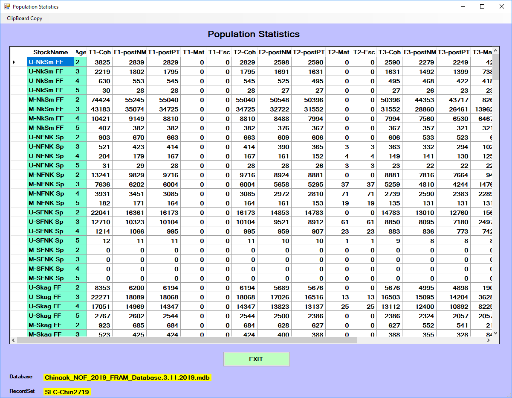

A FRAM model run produces [Output values] that are stored in several [Project database tables].

These results can be accessed and analyzed with external applications such as R or Microsoft Excel, and this is often preferable when addressing multiple model runs. For example, when examining a particular stock or fishery across multiple model runs within a single project database, the key tables can be joined and filtered to reach a focal subset for further manipulation and visualization. 

However, the FRAM application also provides functionality to interactively view results for a single run by selecting the main menu button `Output/Results`.

# Screen reports

The "Output Type Selection" submenu offers `Screen Reports`. Note that if all values are zero within these reports, then the model must be run in the project database to generate actual results.

```{r out_main, echo = FALSE, out.width='100%'}
knitr::include_graphics("images/fvs_output.png")
```

Selecting this then displays several further options.

```{r out_screen, echo = FALSE, out.width='100%'}
knitr::include_graphics("images/fvs_output_screenrpt.png")
```

Select a screen report by clicking in the appropriate checkbox. Once in view, note that many of these reports include a “clipboard copy” option in the upper left corner. This allows the user to paste the data into other external programs (e.g., Microsoft Word or Excel).

## Fishery mortality reports

This view aggregates across stocks within a fishery, summarizing different types of mortality. For Chinook, these values can be displayed summed or broken out by age per fishery (i.e., all age 3 catch within fishery N). Results may also be displayed as a zero value for strata in which base period data are unavailable. In other screen reports, these strata are often denoted with "****".

 - `Landed Catch` designates fish that are caught and retained
 - `NonRetention` includes incidental mortalities from mark-selective fisheries and/or other fisheries not targeting Chinook or coho (e.g., pink or chum salmon, test fishing, etc.)
 - `Shakers` accounts for non-landed mortalities from sub-legal encounters
 - `Dropoff` (also net drop out) represents mortality from encounters in which the fish is never observed (i.e., "the one that got away")
 - `TotalMortality` is the sum of these components
 - For Chinook, `AEQ-Total Mort` designates the "adult equivalent" translation of the total mortality, reflecting an age-based estimate of the fish that could have actually survived to return to spawn given subsequent years of fishing and non-fishing related impacts (e.g., younger fish that are killed due to fishing in year Y would not necessarily have survived to return in a later year Y+t, even in the absence of year Y's fishing)

```{r out_screen_fishmort, echo = FALSE, out.width='100%'}
knitr::include_graphics("images/fvs_output_screenrpt_fishmort.png")
```

## Stock mortality reports

The mortality types described above can also be viewed by fishery and time step for an individual stock or a selected sub-set of stocks. After selecting this report, a menu allows selection of a single stock or multiple stocks using Control+Click. After the desired stocks are highlighted, click “OK – Done” to view the report. The fishery mortality data types will be summarized for all stocks selected.

```{r out_screen_stockmort, echo = FALSE, out.width='100%'}
knitr::include_graphics("images/fvs_output_screenrpt_stockmort.png")
```

## Population statistics

The "popstat" report is regularly used for Chinook, as it clearly illustrates changes through the major FRAM processing steps that take a stock from starting cohort to escapement. It presents the cohort trajectory through time steps for each stock, broken out by age for Chinook. The columns describe the progression through time of the starting cohort through natural mortality, pre-terminal fisheries, maturation, and terminal fisheries to escapement. For Chinook, note that FRAM currently calculates "marine escapement" while "spawning escapement" is handled within [TAMM].  

For Chinook the report data represent by time step: starting cohort by age (T#-StartCoh), cohort after natural mortality (T#-postNM), cohort after pre-terminal fisheries (T#-postPT), mature cohort resulting from stock-specific maturity age parameters as provided by the base period (T#-Mat), escapement of the mature cohort remaining after FRAM’s set of terminal fisheries (T#-Esc).

```{r out_screen_popstatchin, echo = FALSE, out.width='100%'}

```

For Coho the report data represent by time step: starting cohort (T#-Coht), cohort after natural mortality and pre-terminal fisheries (T#-Rem), mature cohort in time step 5 (Oct-Dec) only (Mature), and escapement of the mature cohort remaining after terminal and freshwater fisheries (Escape; i.e. spawner escapement). 

```{r out_screen_popstatcoho, echo = FALSE, out.width='100%'}
knitr::include_graphics("images/fvs_output_screenrpt_popstatcoho.png")
```

## Mark-Selective Fishery Reports

This option generates detailed accounting of stock-specific mortality for a selected mark-selective fishery and time step. All fisheries/time-steps flagged as mark-selective in a particular model run will be available in the drop-down menu on the upper left. Once a selection is made, the values for each stock impacted in that fishery/time-step are presented. Values for unmarked and marked components include: handled fish, catch mortality, non-retention mortality, drop-off mortality, and for Chinook only will include sub-legal mortality. 

Additionally, the red “WDFW MSF Report” button transfers Chinook information related to landings, encounters, and mortalities aggregated across all stocks to an external Excel spreadsheet. The button is not available for Coho modeling. 

```{r out_screen_msfrpt, echo = FALSE, out.width='100%'}
knitr::include_graphics("images/fvs_output_screenrpt_msfrpt.png")
```

## Fishery stock composition report

After selection of a single fishery from the drop-down menu, this report displays the percentage of each stock within the total mortality for each time step. Only those stocks impacted by the fishery will be displayed (i.e. a different set of stocks can be displayed for each fishery). Note: for Chinook fisheries without a 100% model stock proportion, percentages within this report only represent the modeled portion of the catch.

```{r out_screen_stockcomp, echo = FALSE, out.width='100%'}
knitr::include_graphics("images/fvs_output_screenrpt_stockcomp.png")
```

## Stock impacts per 1000

This normalized view of stock-specific total mortality impacts for each fishery and time step offers another perspective on relative differences. This report demonstrates the stock contribution (in numbers of non-AEQ fish) to a hypothetical total mortality of 1,000 fish in each fishery/time step. Only a single stock component can be selected (i.e. only the Skookum Creek Hatchery Marked stock can be viewed and a separate selection would be necessary to see the results for the Skookum Creek Hatchery Unmarked stock).

```{r out_screen_stock1000, echo = FALSE, out.width='100%'}
knitr::include_graphics("images/fvs_output_screenrpt_stock1000.png")
```

# Report Drivers

Report drivers generate 14 pre-formatted output report types using unique instructions found in the report driver.  Many of these reports are also available as screen reports or found in FRAM output to TAMM files.  A report driver is species-specific, tied to a unique base period for parameters, and contains a header with metadata.  The output reports are given a .PRN file extension and can be opened with a text editor such as Microsoft Notepad.  The actual report drivers, with instructions on what to include, are stored in the MS Access project database table ReportDriver.

From the main menu, select “Output/Results”, “Report Driver File”, to get to the report driver file options.  The most straightforward step is to “Select Driver” from the available report drivers already in the project database table ReportDriver. Click the checkbox next to one from the list and you will be re-directed back to the driver file options menu. Next, click the “Run Reports” button to name and save the output PRN file.  Once you click save from the prompt, the output PRN file is generated and ready to view. The “Edit Report Driver” option is no longer functional in updated versions of FRAM and thus a new report driver must be created to make changes from an old one.  Changes to a report driver need to be made in the project database table ReportDriver.

Many FRAM databases include various previously created custom report drivers. To create a new report driver, select “Output/Results”, “Report Driver File”, “Create Report Driver”. Select the desired report from the 14 available options and specify parameters for customization from the selection boxes. A good example of a unique, customizable report is the “Terminal Run Summary”. This report allows the user to specify fisheries and time steps for inclusion in the terminal run definition of selected stocks. When prompted, save the driver. The new driver will then appear in the “Select Driver” report selection box. To produce output, select the new driver and click “Run Report”.
