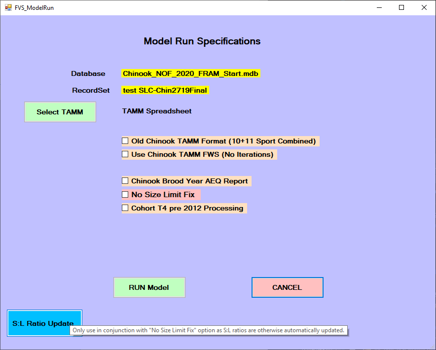
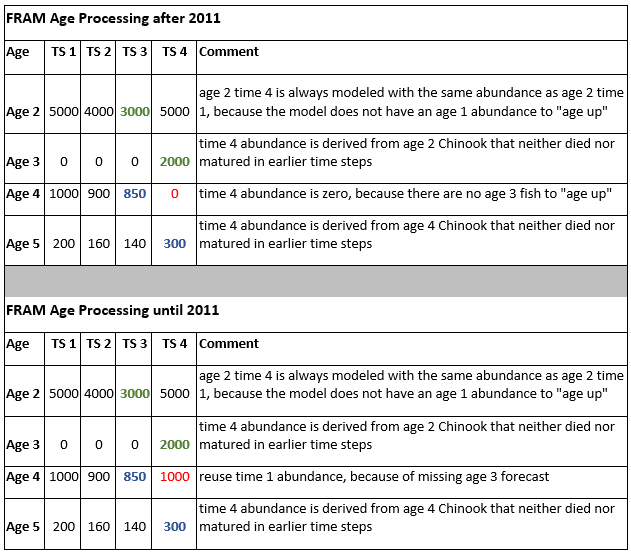

This menu item initiates a model run - applying the current parameters and input values to produce new output values.

The application monitors when a user may have altered values relative to the currently loaded run. If "Run Model” is selected when input values have changed but have not yet been saved to the project database tables associated with the model run, then a pop-up window will prompt with the message “Input Values Have Been Changed! Changes Must be Saved before Running Model!!! Save Current Model Run???”.

If you select “Yes” and save your model inputs by replacing the current model run or creating a new model run, then when you click “Run Model” from the Main Menu, it will present the Model Run Specifications menu.

If you select the “No”, a message will warn you “Please be aware that the OUTPUT for this model run cannot be duplicated without saving your INPUT values.”  If you click “OK”, then it will present the Model Run Specifications menu.  

The forwards FRAM Model Run Specifications menu screens include several optional checkboxes which differ by species. The sections below describe these in more detail.

The “Select TAMM” button is used to navigate to and select an associated [TAMM] file (see also [Running FRAM with TAMM]). Note that when a model run with a TAMM begins, the prompt “Do you want to save TAMM Transfer Values into TAMM spreadsheet?” will apear. Choosing "Yes" will ensure [TAMX] values are updated. After run completion, the TAMM file used will include updated values and be open, though possibly in the background. **Make sure to navigate to the open TAMM file and save it to retain the modeled values.**

Once the model run is complete, the model run name may have been updated with a prefix in the list of model runs within a database (Main Menu – Select Model Run to see list).  For coho, the prefix “bc-“ is added when the default calculations for MSF bias correction have been used in a model run. For Chinook, the prefix “SLC-“ is added when the default calculations for size limit fix have been used in a model run.

# Coho

```{r, echo = FALSE, out.width='100%', fig.cap='Model run options for Coho'}
knitr::include_graphics("images/fvs_run_model_coho.png")
```

## Run coastal iterations

Beginning with the 2017 preseason, FRAM was updated to automate a previously manual process of iterating Washington coastal terminal fishery inputs between TAMM and FRAM.  The fishery inputs are read into FRAM from a formatted table on TAMM sheet WACoastTerminal (starting row 150, cells in green highlight, as landed catch; flag 2 = fishery quota) and iterated to ± 1 fish.

When working with a Coho project database, from the main menu “Run Model” button, the Model Run Specifications screen requires you to select the TAMM file associated with the model run and then select the checkbox for “Run Coastal Iterations” before clicking the “RUN Model” button to complete the process.

By default, this checkbox should be used/checked with all preseason Coho model runs, as Washington coastal iterations are needed every time a terminal area’s fishery structure changes or when a pre-terminal FRAM fishery changes the ocean escapement value.

In general, FRAM produces an ocean escapement for each Washington coastal coho stock and regional technical staff utilize those values in regional terminal harvest management models. The local stock-specific harvest rates from the regional terminal models are then utilized in the WACoastTerminal sheet of the TAMM and in subsequent calculations.  These results differ from the base period exploitation rates used in FRAM.  
However, FRAM is used with base period stock composition for associated impacts upon non-local stocks in terminal regional fisheries with “dip-ins” (i.e. fish which could be expected to return to their native systems if not harvested; not a stray).  

Thus, the final results of stock impacts in Washington coastal terminal fisheries are a combination of regional specific local stock impacts and those produced by the FRAM and its base period.  

## Run without MSF bias correction
 
By default, a mark-selective fishery bias correction factor is used in both preseason and post-season Coho FRAM modeling.  The MSF bias correction in FRAM was a result of demonstrating that unmarked mortalities were underestimated due to multiple encounter bias from mark-selective fisheries [@conrad2010] and the desire to incorporate bias-corrected equations into FRAM [@conrad2011, @ahb2012].  

The checkbox “Run w/o MSF Bias Correction” should not be checked except in unusual circumstances or for troubleshooting purposes.  As a result of the MSF bias correction factor calculations in FRAM, the program will often prompt the user with a warning that a particular stock has exceeded 100% ER (i.e. the stock size has gone negative in the model and at what point).  This is often helpful in troubleshooting issues with fishery inputs.


# Chinook

```{r, echo = FALSE, out.width='100%', fig.cap='Model run options for Chinook'}

```

## Old Chinook TAMM Format (10 + 11 Sport Combined)

Prior to 2007, FRAM combined fishery impacts from Areas 10 and 11 sport for the purpose of TAMX reporting. These fisheries are now separated in TAMX. Loading a current TAMX into a pre-2007 TAMM will result in line offsets that create errors.

Check this button, if you want to run and load TAMX output into an old version of TAMM.

## Use Chinook TAMM FWS (No Iterations)

Selecting this button when running FRAM with TAMM will not load TAMI values into FRAM, yet load TAMX output into TAMM. Existing FRAM terminal fishery values will be used to run FRAM. TAMM iterations will not be performed. 

This button is rarely used, but can be a helpful shortcut when needing TAMM output, but TAMM terminal fishery inputs are not available. Compiling information for a long time series of post-season runs is an example of where this procedure may be beneficial. TAMM consolidates a multitude of terminal fishery inputs into just a few key TAMI values. These fewer, consolidated values are easier to compile than the detailed TAMM inputs (e.g., avoiding splitting post-season catches into regulation periods for sockeye, coho, chum etc.). Terminal fishery catches can be directly entered into FRAM. As long as TAMM contains updated terminal run sizes and freshwater inputs, TAMX output will be compatible with the TAMM it is loaded into.

## Chinook Brood Year AEQ Report

Selecting this check box produces a brood year exploitation rate report called “BY-Cohort-Compare-FramVS.txt” located in the same directory as the FRAM database.

Brood year calculations subject the forecast abundance of an age to the current fishing year’s fishery inputs, calculate the resulting escapement as well as the number of fish remaining in the ocean and advance to the next age. The resulting age+1 is then also subjected to the same fishery inputs, until age 5 is reached. Thus the same fishery inputs are used for all four ages (2-5) resulting from a brood year. FRAM algorithms are applied to each age class in forward and reverse mode.

Note that, in contrast, a “true” brood year run would apply fishery inputs from the first year to age 2s, compute the resulting age 3s, apply fishery inputs from year+1 to these age 3s, compute the resulting age 4s, apply fishery inputs from year+2 to these age 4s, compute the resulting age 5s, and finally apply fishery inputs from year+3 to the age 5s.

Forward and reverse brood year computations by age; i.e. calculate age 2 starting cohort for age 3 forecast with reverse calculations, then calculate age 4 and 5 starting cohort with forward calculations.

```{r, echo = FALSE, out.width='80%', fig.cap='Chinook brood year AEQ report conceptual approach'}
knitr::include_graphics("images/fvs_run_model_chin_broodAEQtable.png")
```

This then generates a report with this type of information:

```{r, echo = FALSE, out.width='100%', fig.cap='Chinook brood year AEQ report'}
knitr::include_graphics("images/fvs_run_model_chin_broodAEQreport.png")
```

## No size limit fix

FRAM allows for evaluations of the effect of changes in minimum size limit regulations to fishery catches and stock impacts.  Size limits are altered infrequently in hook and line salmon fisheries. FRAM’s original size limit evaluation algorithms were problematic, because they resulted in changes to the number of total encounters with each size limit change. FRAM uses different rates to model encounters of legal and sublegal fish. These rates are computed during the calibration process and are based on landed catch and encounter information during base period years (currently brood years 2005-2008).

When size limits are modeled in FRAM, each fish smaller than the size limit is treated as a sublegal fish. Sublegal encounter rates are used to compute releases and release mortalities. Conversely, each fish larger than the size limit is deemed legal and legal encounter rates are used to estimate catch as well as releases and release mortalities in mark selective fisheries. As the size limit is changed, a portion of the population (with sizes between the old and the new size limit) that previously received a sublegal encounter rate will receive a legal encounter rate or vice versa. Because legal and sublegal encounter rates are not the same for the same stock and age, this leads to the total number of computed encounters varying with size limits, an incorrect outcome, if effort remains constant. 

FRAM incorporates corrected equations that hold total encounters constant, regardless of the modeled size limit (@ahb2013, @mchugh2015, @johnson2015).

In a first round of evaluations, FRAM computes sublegal encounters using sublegal/legal ratios based on recent field data (i.e., length-frequency data for Chinook encounters in recreational test fisheries). These ratios are updated each year in the [Project database tables] “SLRatio”. To produce the desired sublegal encounters, FRAM iteratively calculates an “Encounter Rate Adjustment” for each fishery and time step, such that sublegal encounters summed over stocks and ages within a fishery and time step produce the target sublegal/legal ratios, given legal sized, landed catch inputs (fishery scalers or quotas). Once run, “Encounter Rate Adjustments” are stored in the “RunEncounterRateAdjustment” column of the “SLRatio” table. 

Size limit changes are evaluated with Van Bertalanffy growth equations. These equations determine the proportion legal and or/sublegal by stock and age under desired size limit regulations. The model calculates the legal and sublegal encounters for both the original and new minimum size limit and then adjust the differences so that total encounters remain constant.

When the new size limit is less than the base-period size limit, the difference in sublegal encounters between the base size-limit and the new size-limit becomes landed catch that is added to the calculated landed catch evaluated at the base-period size limit.  Encounters are calculated by dividing the encounter estimates by the sublegal release mortality rate.

Conversely, when the new size limit is greater than the base-period size limit, the difference in landed catch between the new size limit and the base-period size limit becomes sublegal encounters.  This encounter difference is added to the calculated sublegal encounters from the base-period size limit to get total sublegal encounter mortality. 

**When this button is checked**, FRAM will not automatically update the encounter rate adjustments needed to achieve desired sublegal/legal ratios and instead use the encounter rate adjustments in the existing model run. FRAM will also revert to original size limit evaluation algorithms, where total encounters can fluctuate when size limits are changed.

If unsure, please leave this button unchecked (default), as the default setting will produce the most accurate run. However, there are several reasons to check the “No-Size-Limit-Fix” button:

 - To speed up the run, as sublegal encounter iterations, especially when performed with TAMM, can be very time consuming. However, for correct results, the following assumptions need to be met:
   - “Encounter Rate Adjustments” were updated during a previous model run and will result in desired sublegal/legal ratios (see Background paragraph above).
   - The sublegal/legal ratios in the database were computed for the same size limits that exist in the current model run.

 -	For backwards compatibility to reproduce an “old-style” (pre 2013) run


## Cohort T4 pre 2012 Processing

This button exists for backwards compatibility reasons. Prior to 2012, FRAM would not have reused time step 1 forecasts in time step 4 for ages with a missing "age minus 1" abundance. Chinook age up in time step 4; i.e. an age 2 fish becomes an age 3 fish, an age 3 fish turns age 4, etc. Previously, if a stock was not expected to return at a certain age, time 4 of age+1 would have been left blank. Since 2012, for these stocks, time step 4 of a given age reuses the time step 1 abundance of the same age.

```{r, echo = FALSE, out.width='100%', fig.cap='Chinook T4 pre 2012 processing differences'}

```


## S:L ratio update

Since 2014, FRAM computes sublegal encounters using sublegal/legal ratios (@mchugh2015, @johnson2015). These ratios are usually derived from recent field data (i.e., length-frequency data for Chinook encounters in recreational test fisheries) and updated annually in the “SLRatio” table of FRAM’s ACCESS database. To produce the desired sublegal encounters, FRAM iteratively calculates an “Encounter Rate Adjustment” for each fishery and time step such that sublegal encounters summed over stocks and ages within a fishery and time step produce the target sublegal/legal ratios, given legal sized landed catch inputs (fishery scalers or quotas). Once run, “Encounter Rate Adjustments” are stored in the “RunEncounterRateAdjustment” column of the “SLRatio” table. 

The “S:L Ratio Update” button is a relic from pre-2019 FRAM.exe releases. The new FRAM default (leave “No Size Limit Fix” button unchecked) automatically updates Encounter Rate Adjustments with each model run in the course of computing size limit corrected legal and sublegal encounters.

When this button is clicked, FRAM will calculate “Encounter Rate Adjustments” for each fishery and time step such that sublegal encounters summed over stocks and ages within a fishery and time step produce the target sublegal/legal ratios. These ratios are then stores in the “RunEncounterRateAdjustment” column of the “SLRatio” table.

A message box will appear when clicking the “S:L Ratio Update” button. 

```{r, echo = FALSE, out.width="70%"}
knitr::include_graphics("images/fvs_adv_slratio.png")
```

The user then has the option to check “Load TargetRatio from spreadsheet” box before clicking the “Initialize” button. This brings up a file selection dialog box. Choose the file with the desired sublegal/legal ratios. The file will most likely have “SL Ratios…” in the title and contain a tab called “SLRatioImport”. If the ratios are already loaded, leave this box unchecked. As soon as the ratios are loaded in the database, within a few seconds of clicking “Initialize”, FRAM’s “Run-Menu” will appear. Select the “Run Model” button to run FRAM as usual.

Since “Encounter Rate Adjustments” are automatically updated in the default mode, selecting this option only makes sense in combination with clicking the “No Size Limit Fix” button. This results in a model run with updated “Encounter Rate Adjustments”, but old size limit evaluations. Doing so is only advisable if the user is sure that size limits in the current model run are compatible with the sublegal/legal ratios in the database.
One other reason to select the "S:L Ratio Update" button is the option to programmatically load target sublegal/legal ratios from an Excel workbook as described above.
