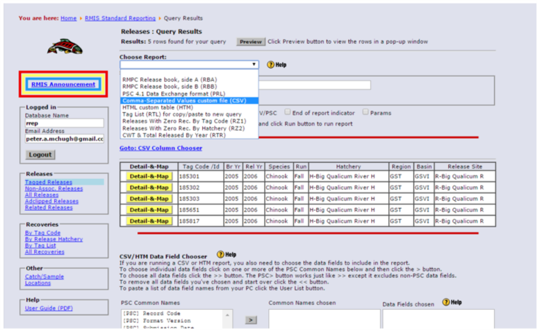
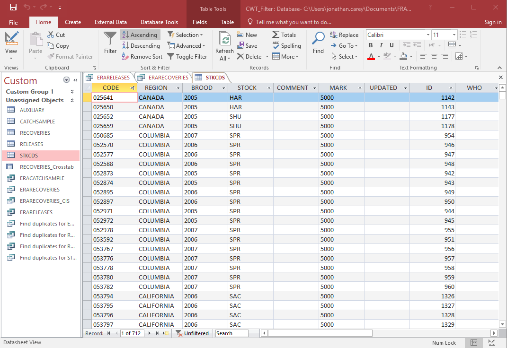
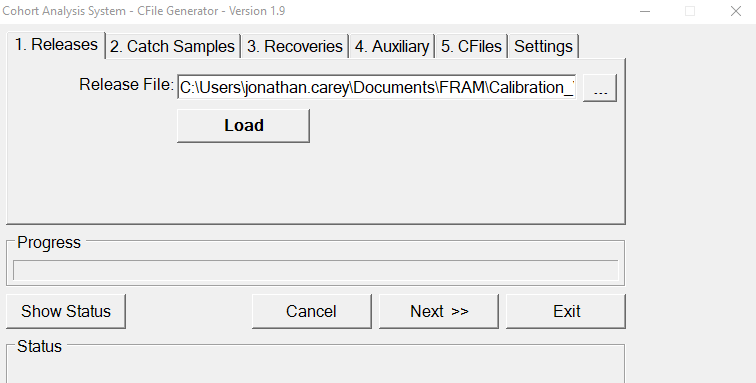
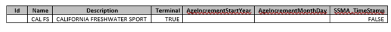

```{r include=FALSE}
page_title <- "Chinook Base Period"
```

---
title: `r page_title`
editor_options: 
  chunk_output_type: console
---

```{r, include=FALSE, results = 'hide', warning = FALSE, message = FALSE}
knitr::opts_chunk$set(warning = FALSE, message = FALSE, fig.height=9, fig.width=9)
```

<p style="color: black; font-size: 25px; font-weight: bold">
Base period documentation is currently incomplete.
</p>

# 1. Chinook FRAMBuilder

## 1.1. Background and purpose 

Considerable processing is required to translate coded-wire tag (<a href = "https://framverse.github.io/fram_doc/calcs_glossary.html#Coded-Wire_Tag_(CWT)" target = "_blank" title = "CWT: Coded-wire tag">CWT</a>) data from the Regional Mark Processing Center’s (<span title = "RMPC: Regional Mark Processing Center">RMPC</span>) Regional Mark Information System (<a href = "https://framverse.github.io/fram_doc/calcs_glossary.html#Regional_Mark_Information_System_(RMIS)" target = "_blank" title = "RMIS: Regional Mark Information System">RMIS</a>) database into meaningful units within a <span title = "FRAM: Fishery Regulation Assessment Model">FRAM</span> <a href = "https://framverse.github.io/fram_doc/calcs_glossary.html#Base_Period" target = "_blank" title = "Base Period">base period</a> (<span title = "BP: Base Period">BP</span>) <a href = "https://framverse.github.io/fram_doc/calcs_glossary.html#Calibration" target = "_blank" title = "Calibration">calibration</a> context. Individual tag groups must be associated with a specific <span title = "FRAM: Fishery Regulation Assessment Model">FRAM</span> model stock, and tag recoveries at a particular time, location (indicated by <span title = "RMIS: Regional Mark Information System">RMIS</span> location code), gear type must be mapped to one of <span title = "FRAM: Fishery Regulation Assessment Model">FRAM</span>'s fisheries and time steps. The FRAMBuilder program and workflow described here was developed to fulfill these needs, among others.

Early in the development of FRAMBuilder and the overall <span title = "CWT: Coded-wire tag">CWT</span> mapping workflow, the base period workgroup (<span title = "BPW: Base Period Workgroup">BPW</span>) identified distinct advantages/benefits to leveraging the Pacific Salmon Commission’s Chinook Technical Committee’s (<span title = "CTC: Chinook Technical Committee">CTC</span>) <span title = "CWT: Coded-wire tag">CWT</span> analysis tools: the Cohort Analysis System (<span title = "CAS: Cohort Analysis System">CAS</span>) mapping program and companion database. The <span title = "BPW: Base Period Workgroup">BPW</span> ultimately decided to tie FRAMBuilder to the <span title = "CTC: Chinook Technical Committee">CTC</span> world because this connection: (**1**) allows for the seamless integration of <span title = "CTC: Chinook Technical Committee">CTC</span> ‘Auxiliary’ <span title = "CWT: Coded-wire tag">CWT</span> files, agency-supplied/prepared files that supplement or correct known errors/gaps in <span title = "RMIS: Regional Mark Information System">RMIS</span>’s <span title = "CWT: Coded-wire tag">CWT</span> recovery information; (**2**) facilitates the efficient inclusion of screened/vetted <span title = "CWT: Coded-wire tag">CWT</span> release groups (i.e., selected by <span title = "CTC: Chinook Technical Committee">CTC</span> members with regional expertise) into the calibration database; and (**3**) increases the overlap in information driving models supporting the management decisions of the <a href = "https://framverse.github.io/fram_doc/calcs_glossary.html#Pacific_Salmon_Commission_(PSC)" target = "_blank" title = "PSC: Pacific Salmon Commission">Pacific Salmon Commission</a> (<span title = "PSC: Pacific Salmon Commission">PSC</span>), the <a href = "https://framverse.github.io/fram_doc/calcs_glossary.html#Pacific_Fishery_Management_Council_(PFMC)" target = "_blank" title = "PFMC: Pacific Fishery Management Council">Pacific Fishery Management Council</a> (<span title = "PFMC: Pacific Fishery Management Council">PFMC</span>), and state–tribal co-managers. Additionally, given partial overlap in the fishery assessment units used by the <span title = "CTC: Chinook Technical Committee">CTC</span> and in <span title = "FRAM: Fishery Regulation Assessment Model">FRAM</span>, the integration of <span title = "CAS: Cohort Analysis System">CAS</span> into the <span title = "FRAM: Fishery Regulation Assessment Model">FRAM</span> calibration workflow offered efficiency in the form of an initial stage of <span title = "RMIS: Regional Mark Information System">RMIS</span>-to-<span title = "FRAM: Fishery Regulation Assessment Model">FRAM</span> mapping. 

The following provides
  - a roadmap of the process from raw <span title = "RMIS: Regional Mark Information System">RMIS</span> <span title = "CWT: Coded-wire tag">CWT</span> release/recovery data to something useable in a <span title = "FRAM: Fishery Regulation Assessment Model">FRAM</span> calibration
  - basic documentation on the structure/function of the FRAMBuilder program, its companion <span title = "FRAM: Fishery Regulation Assessment Model">FRAM</span>-<span title = "CAS: Cohort Analysis System">CAS</span> database, and the ruleset it follows to get <span title = "CWT: Coded-wire tag">CWT</span> recoveries from the initial <span title = "CAS: Cohort Analysis System">CAS</span> stage of mapping to a final <span title = "FRAM: Fishery Regulation Assessment Model">FRAM</span> fishery/time step state. As for the tools ‘borrowed’ from the <span title = "CTC: Chinook Technical Committee">CTC</span> (i.e., CAS.exe), we provide only a brief sketch here and refer the reader to <span title = "CTC: Chinook Technical Committee">CTC</span> resources for further documentation.


## 1.2. Overview

The procedures to map an individual <span title = "CWT: Coded-wire tag">CWT</span> recovery to a <span title = "FRAM: Fishery Regulation Assessment Model">FRAM</span> stock and fishery are conceptually straightforward: in screening candidate codes, make a determination regarding which tags are suitable representatives for model stocks, and then, given recovery details such as <span title = "RMIS: Regional Mark Information System">RMIS</span> location codes, gear codes, dates, etc., make a determination regarding the model fishery/time step to which the recovery belongs. 

In practice, however, this task is made difficult by the thousands of tag codes representing unique hatchery release groups that are available for consideration. This means that the hundreds of thousands of individual tag recoveries from these groups must all be mapped from the thousands of unique time-location-gear code combinations to one of <span title = "FRAM: Fishery Regulation Assessment Model">FRAM</span>’s fisheries. The FRAMBuilder workflow addresses this challenge via to the following steps: 

  1. Select tag groups.
  2. Query <span title = "RMIS: Regional Mark Information System">RMIS</span> for release/recovery data.
  3. Load <span title = "RMIS: Regional Mark Information System">RMIS</span> query results into the <span title = "CTC: Chinook Technical Committee">CTC</span> Filter database, and query it to create <span title = "CAS: Cohort Analysis System">CAS</span> input files.
  4. Load tags into <span title = "CAS: Cohort Analysis System">CAS</span> (i.e., stage 1 of mapping – to <span title = "CTC: Chinook Technical Committee">CTC</span> fishery strata).
  5. Run FRAMBuilder (i.e., map/process recoveries).
  6. Export data for any necessary post-FRAMBuilder processing to create calibration input files.

```{r fb_overview, echo = FALSE, out.width='100%'}
knitr::include_graphics("images/fb_overview.png")
```

In addition to these steps, a handful of other functions can be invoked during step 5, depending on a user’s needs. These are also described further below. The remainder of this document is organized around each of these steps, where each subsection offers both ‘how to’ details and documentation on processing decisions, algorithms, etc. where necessary. 

## 1.3. Required programs and data files 

**Data files**

  - <u>A list of tag codes:</u> A list of tag codes is needed for the purposes of querying <span title = "RMIS: Regional Mark Information System">RMIS</span> (release/recovery), as well as for populating the <span title = "CTC: Chinook Technical Committee">CTC</span> Filter database’s ‘STKCDS’ table.
  - <u><span title = "CWT: Coded-wire tag">CWT</span> release data:</u> These are the raw release details for the chosen codes, acquired from <span title = "RMIS: Regional Mark Information System">RMIS</span> via a ‘Tagged Releases’ query; query results are downloaded as a <span title = "CSV: Comma-separated values file">CSV</span>, with the headings specified under Step 2 below.
  - <u><span title = "CWT: Coded-wire tag">CWT</span> recovery data:</u> These are the raw recovery details for the selected codes, acquired from <span title = "RMIS: Regional Mark Information System">RMIS</span> via a ‘Recoveries By Tag Code’ query; query results are downloaded as a <span title = "CSV: Comma-separated values file">CSV</span>, with the headings specified under Step 2 below.
  - <u>Auxiliary files (or ‘auxiliaries’):</u> These are text files (*.csv or *.txt), prepared by <span title = "CTC: Chinook Technical Committee">CTC</span> members from a variety of agencies/jurisdictions, that contain supplementary <span title = "CWT: Coded-wire tag">CWT</span> recovery information that is meant to augment (or revise) the <span title = "CWT: Coded-wire tag">CWT</span> information acquired from <span title = "RMIS: Regional Mark Information System">RMIS</span> for some stocks; these files are typically created on a stock/code basis and are necessary to ensure the calibration process includes the most accurate information. For example, <span title = "CWT: Coded-wire tag">CWT</span> recoveries in escapement—a major anchor point for the type of backwards cohort reconstruction underlying <span title = "FRAM: Fishery Regulation Assessment Model">FRAM</span> calibration—are not available via <span title = "RMIS: Regional Mark Information System">RMIS</span> for many Canadian stocks.

**Microsoft Access Databases**

  - <u>The <span title = "CTC: Chinook Technical Committee">CTC</span>’s Filter Database:</u> This is a Microsoft Access database into which the <span title = "RMIS: Regional Mark Information System">RMIS</span> release/recovery query results (above), combined with a tag list (‘STKCDS’) are loaded. Using two custom queries, this database returns RELEASES.txt and RECOVERIES.txt files which can be imported directly to the <span title = "FRAM: Fishery Regulation Assessment Model">FRAM</span>-<span title = "CAS: Cohort Analysis System">CAS</span> database. 
  - <u>A <span title = "FRAM: Fishery Regulation Assessment Model">FRAM</span>-modified <span title = "CAS: Cohort Analysis System">CAS</span> database (<span title = "FRAM: Fishery Regulation Assessment Model">FRAM</span>-<span title = "CAS: Cohort Analysis System">CAS</span> hereafter):</u> This Access database is an adaptation of the <span title = "CTC: Chinook Technical Committee">CTC</span> <span title = "CAS: Cohort Analysis System">CAS</span> database (final preseason 2019 version), which includes several tables (and added fields to existing tables) designed to (**1**) cross-walk <span title = "CTC: Chinook Technical Committee">CTC</span> fishery strata to <span title = "FRAM: Fishery Regulation Assessment Model">FRAM</span> fisheries or (**2**) to house/contain mapped outputs for direct export/use in <span title = "CAS: Cohort Analysis System">CAS</span> (The <span title = "FRAM: Fishery Regulation Assessment Model">FRAM</span>-<span title = "CAS: Cohort Analysis System">CAS</span> fishery crosswalk adheres strictly to the <span title = "CTC: Chinook Technical Committee">CTC</span>’s ‘fine scale’ fishery strata from 2019; any attempt to create an updated <span title = "FRAM: Fishery Regulation Assessment Model">FRAM</span>-<span title = "CAS: Cohort Analysis System">CAS</span> database will require an updated <span title = "FRAM: Fishery Regulation Assessment Model">FRAM</span> to <span title = "CTC: Chinook Technical Committee">CTC</span> crosswalk (database table ‘FRAM_Fishery’). Versions of FRAMBuilder databases and outputs created prior to 2019 were based on the final preseason <span title = "CTC: Chinook Technical Committee">CTC</span> <span title = "CAS: Cohort Analysis System">CAS</span> database from 2013 and the ‘fine scale’ fishery strata contained therein.)

**Programs & companion files**

  - <u>FRAMBuilder 2.0:</u> Because FRAMBuilder is very much an interactive program subject to ad hoc changes/revisions to fulfill the <span title = "BP: Base Period">BP</span> team’s evolving needs, it hasn’t yet been developed into a distributed, fully compiled .exe file (i.e., ‘production mode’). Thus, the ‘program’ is actually a Microsoft Visual Studio solution (.sln) file that is operated within the development environment (i.e., Visual Studio, version 2008+). The code base and history of modifications can be found at: https://github.com/jon-carey/FRAMBuilder.
  - <u>The <span title = "CTC: Chinook Technical Committee">CTC</span>’s <span title = "CAS: Cohort Analysis System">CAS</span> (and dll):</u> CAS_1.9.exe and CASLib.dll (2019 versions; Versions of FRAMBuilder databases and output created prior to 2019 used the 2013 version of <span title = "CAS: Cohort Analysis System">CAS</span>: CAS1.5_No_Restrictions.exe)
  - <u>Visual Studio, version 2008+:</u> To operate FRAMBuilder ‘in the environment’ you will need a compiler; Visual Studio Express for desktops is a good free option (if Professional isn’t on your list of programs).
  - <u>Others:</u> Although they aren’t tied explicitly to the mapping procedures outlined here, there are both R and OpenBUGS programs that estimate parameters for growth functions from <span title = "CWT: Coded-wire tag">CWT</span> length observations (i.e., mapped to <span title = "FRAM: Fishery Regulation Assessment Model">FRAM</span> fishery and size limit regulation) summarized by FRAMBuilder. Jon Carey also has an R program (and input template/files) that estimates missing recoveries for freshwater sport (Puget Sound, Willapa Bay tribs) and estuary sport (Willapa Bay).


## 1.4. Main workflow

### 1.4.1. Select tag groups

The full rationale surrounding the final decisions to include/exclude tag codes is beyond the scope of this document, but the basic selection guidelines are as follows.

Preference was given to <span title = "CWT: Coded-wire tag">CWT</span> codes associated with <span title = "CTC: Chinook Technical Committee">CTC</span> <a href = "https://framverse.github.io/fram_doc/calcs_glossary.html#Exploitation_Rate_(ER)" target = "_blank" title = "ER: Exploitation Rate">ER</a> indicator stocks, as these have already been screened by <span title = "CTC: Chinook Technical Committee">CTC</span> members with regional expertise and deemed to best represent natural and hatchery Chinook stocks within their jurisdiction. 

For stocks/regions beyond the <span title = "CTC: Chinook Technical Committee">CTC</span>’s scope, selection was guided by the following criteria/considerations:

  - For nearly all stocks, tag selection was limited to **brood years (<span title = "BY: Brood year(s)">BY</span>) 2005-2008**
    - additional brood years were included for special calibration analyses (e.g., out-of-base procedures relied on brood years 2002-2004, growth functions)
    - due to the ‘collapse years’, Sacramento/Central Valley fall Chinook include 2009 brood releases and omit 2005-06 broods

  - Only stocks belonging to the ‘5000’ series of marks (i.e., adipose-fin clipped) were included; unmarked fish could not be used due to their absence in (**1**) <span title = "CWT: Coded-wire tag">CWT</span> samples for visually sampled fisheries and (**2**) mark-selective fishery catches.
  - <span title = "CWT: Coded-wire tag">CWT</span> release groups were generally avoided
    - from ‘experimental’ production groups (e.g., novel stock crosses),
    - with questionable warning flags (e.g., <span title = "BKD: Bacterial kidney disease">BKD</span> outbreak), 
    - that were released at stages earlier than the fingerling stage, and/or 
    - that were released at locations with difficult/poor escapement enumeration (e.g., acclimation ponds). 

For further detail on codes selected for particular stocks, please refer to the Chinook <span title = "FRAM: Fishery Regulation Assessment Model">FRAM</span> stock profile spreadsheet, available for download at: https://github.com/jon-carey/FRAMBuilder.

### 1.4.2. Query <span title = "RMIS: Regional Mark Information System">RMIS</span> for release/recovery data

Given a set of codes, the next task is to query <span title = "RMIS: Regional Mark Information System">RMIS</span> for the necessary release and recovery information. The online system requires a user account and can be accessed by visiting https://www.rmpc.org and selecting ‘<span title = "RMIS: Regional Mark Information System">RMIS</span> Standard Reporting.’ Release data are acquired via the ‘Releases: Tagged Releases’ query form, which requires your tag list. When pasting in your list of tag codes, it is important to ensure that any leading zeros are maintained, otherwise the system will not recognize the tag codes. After entering the list of tags and clicking ‘Retrieve’, you’ll have to choose the type of report (<span title = "CSV: Comma-separated values file">CSV</span> via email is preferred) and specify the fields returned in the query results. Loading the Filter Database requires a specific User List of fields (copy/paste the list from here):

  tag_code_or_release_id<br>
  species<br>
  run<br>
  brood_year<br>
  release_location_code<br>
  first_release_date<br>
  last_release_date<br>
  cwt_1st_mark<br>
  cwt_1st_mark_count<br>
  cwt_2nd_mark<br>
  cwt_2nd_mark_count<br>
  non_cwt_1st_mark<br>
  non_cwt_1st_mark_count<br>
  non_cwt_2nd_mark<br>
  non_cwt_2nd_mark_count<br>
  hatchery_location_code<br>
  stock_location_name<br>
  related_group_type<br>
  related_group_id<br>

Upon validating the user list and clicking the ‘Run’ button, results will be returned to your screen/email.

These should be saved for importing to the Filter Database, preferably programmatically (i.e., via a call to a suitable tool such as `readr::read_csv("report_url_from_RMIS_email.csv"))`).

```{r fb_rmis_tagged_rel, echo = FALSE, out.width='100%', fig.cap='<span title = "RMIS: Regional Mark Information System">RMIS</span>’s ‘Tagged Releases’ query form'}
knitr::include_graphics("images/fb_rmis_tagged_rel.png")
```

```{r fb_rmis_report, echo = FALSE, out.width='100%', fig.cap='Form for specifying query result specs, specifically report type (<span title = "CSV: Comma-separated values file">CSV</span>)'}

```

```{r fb_rmis_fields, echo = FALSE, out.width='100%', fig.cap='Sub-form for setting a User List of fields to be included in query results'}
knitr::include_graphics("images/fb_rmis_fields.png")
```

The steps to run the custom ‘Releases: Tagged Releases’ query are now repeated for the ‘Recoveries: By Tag Code’ query, but with a custom User List of the following fields:

  recovery_id<br>
  recovery_date<br>
  period_type<br>
  period<br>
  species<br>
  sex<br>
  length<br>
  length_code<br>
  tag_code<br>
  tag_status<br>
  estimation_level<br>
  recovery_location_code<br>
  fishery<br>
  estimated_number<br>
  sample_type<br>
  run_year<br>
  recorded_mark<br>
  catch_sample_id<br>
  detection_method<br>
  sampled_maturity<br>
  reporting_agency<br>
  adclip_selective_fishery<br>

Query results can now be saved as a <span title = "CSV: Comma-separated values file">CSV</span> imported into the Filter Database. *Be careful when opening/viewing these query results before importing into Filter Database; <span title = "CSV: Comma-separated values file">CSVs</span> open readily in Excel and can be unintentionally reformatted upon opening (e.g., text to numeric will drop leading zeros on some codes).*

### 1.4.3. Filter <span title = "RMIS: Regional Mark Information System">RMIS</span> data for importing to <span title = "CAS: Cohort Analysis System">CAS</span>

The release and recovery <span title = "CSV: Comma-separated values file">CSV</span> files constructed in Step 2 can now be imported directly into the Filter Database. This is achieved via the Microsoft (<span title = "MS: Microsoft">MS</span>) Access functions under External Data > Import & Link > Text File. This allows you to specify the appropriate Releases.CSV or Recoveries.CSV file in the ‘File Name field’ (browse and point to accordingly) and append records to the appropriate database table (RELEASES or RECOVERIES). To minimize potential error, it is generally advisable to start with a clean Filter Database for these steps.

After loading <span title = "RMIS: Regional Mark Information System">RMIS</span> query results, the Filter Database’s ‘STKCDS’ table (Figure 1) must be populated with the tag codes contained in the release and recovery datasets. The three letter abbreviations in the STOCK field must follow existing conventions (i.e., be in the <span title = "CAS: Cohort Analysis System">CAS</span> ‘SpeciesStock’ table), otherwise records will be rejected [Note: although all <span title = "FRAM: Fishery Regulation Assessment Model">FRAM</span> stocks are already covered, new stocks can be added via steps contained in <span title = "CTC: Chinook Technical Committee">CTC</span> <span title = "CAS: Cohort Analysis System">CAS</span> help files]. 

```{r fb_filter_mdb, echo = FALSE, out.width='100%', fig.cap='Figure 1: The Filter Database’s ‘STKCDS’ table, which requires tag code, jurisdiction, brood year, stock acronym, and marking status'}

```

After the Filter Database is loaded with necessary content, these data are ‘filtered’ via two queries (releases, recoveries) that are saved as .txt files for import into <span title = "CAS: Cohort Analysis System">CAS</span>. The ‘ERARECOVERIES’ filter query eliminates 
  1. recovery observations that cannot be used in a quantitative analysis (i.e., <span title = "RMPC: Regional Mark Processing Center">RMPC</span> ‘sample type’ = 5), 
  2. high seas fishery recoveries,  
  3. some recoveries that are dealt with as auxiliaries (e.g., Canadian escapements), 
  4. the handful of recoveries in Alaska that occur outside of Southeast (i.e., location codes for all recoveries from Alaska should begin with ‘1M1…’)

See <a href = "https://framverse.github.io/fram_doc/base_chin.html#171_Appendix_A:_CTC_Filter_Database_Recoveries_Query_Detailsnotes" target = "_blank" title = "Appendix A">Appendix A</a> for <span title = "SQL: Structured query language">SQL</span> query details. The ‘ERARELEASES’ filter query, in contrast to recoveries, does minimal joining (STKCDS to Releases) and reformats the release data in prep for <span title = "CAS: Cohort Analysis System">CAS</span> import. Step 3 should yield two text files: ERARELEASES.TXT and ERARECOVERIES.TXT

### 1.4.4. Load filtered <span title = "CWT: Coded-wire tag">CWT</span> data into <span title = "CAS: Cohort Analysis System">CAS</span>

Using the CAS_1.9.exe program (<span title = "CAS: Cohort Analysis System">CAS</span> program or CAS.EXE hereafter), the ERARELEASE.TXT and ERARECOVERIES.TXT files can now be imported into the <span title = "FRAM: Fishery Regulation Assessment Model">FRAM</span>-<span title = "CAS: Cohort Analysis System">CAS</span> database. 

Depending on the application, you may want to first clear out the entire <span title = "FRAM: Fishery Regulation Assessment Model">FRAM</span>-<span title = "CAS: Cohort Analysis System">CAS</span> database, using the <span title = "CAS: Cohort Analysis System">CAS</span> program (Figure 2). First, however, you must connect your <span title = "CAS: Cohort Analysis System">CAS</span> program to the <span title = "FRAM: Fishery Regulation Assessment Model">FRAM</span>-<span title = "CAS: Cohort Analysis System">CAS</span> database with which you’re working (you will be prompted to do so upon opening the program). Once connected, you can clear things out as needed (Figure 2) and then you’re ready to import filter database output releases (Figure 3), recoveries, and/or any auxiliary files (discussed further below).

```{r fb_cas_settings, echo = FALSE, out.width='100%', fig.cap='Figure 2: The <span title = "CAS: Cohort Analysis System">CAS</span> program’s Settings menu, the location in which loaded data can be deleted'}
knitr::include_graphics("images/fb_cas_settings.png")
```

The procedure for each file type is the same, you first point the program to the appropriate release, recoveries, or auxiliary text file (.TXT or .CSV) and menu, then you click ‘Load’ and wait for the process to complete. Once <span title = "CAS: Cohort Analysis System">CAS</span> has finished loading the data, you should examine the running <span title = "CAS: Cohort Analysis System">CAS</span> error log (‘CASErrors.TXT’, this is written where the program occurs) and the ‘*.BAD’ (a text file) associated with each input you’ve attempted to load. These will describe which (if any) records were rejected and offer clues regarding why this occurred.

```{r fb_cas_releases, echo = FALSE, out.width='100%', fig.cap='Figure 3: The <span title = "CAS: Cohort Analysis System">CAS</span> program’s Releases loading menu'}

```

#### 1.4.4.1. Troubleshooting rejected releases and recoveries

Typically a handful, and sometimes many, records will be rejected during the <span title = "FRAM: Fishery Regulation Assessment Model">FRAM</span>-<span title = "CAS: Cohort Analysis System">CAS</span> database loading process. This can feel like the most cumbersome step of the <span title = "FRAM: Fishery Regulation Assessment Model">FRAM</span>-<span title = "CAS: Cohort Analysis System">CAS</span> database loading process, but with some patience and insight is relatively easy to work through. The good news is that, generally speaking, once a solution to a parsing problem or release rejection problem is resolved in the <span title = "FRAM: Fishery Regulation Assessment Model">FRAM</span>-<span title = "CAS: Cohort Analysis System">CAS</span> database, it will address all future instances subject to the same circumstances (and/or future reloads).

Common problems and solutions include (solution in italics):

  1. For releases, this can arise because the stock code isn’t included in the ‘SpeciesStock’ database table (this shouldn’t happen, but if it does, see <span title = "CTC: Chinook Technical Committee">CTC</span> help file guidance)
    - *upon adding the new stock’s details, it should load correctly*
  2. For recoveries, the recovery location may not be parsing in such a way that can get a recovery from an <span title = "RMIS: Regional Mark Information System">RMIS</span> location code all the way to a <span title = "CTC: Chinook Technical Committee">CTC</span> fine-scale fishery
    - *in this case, you’ll have to manually add a parsed location (with fine-scale fishery mapping) to the <span title = "FRAM: Fishery Regulation Assessment Model">FRAM</span>-<span title = "CAS: Cohort Analysis System">CAS</span> database ‘FisheryLookup’ table, and reload the associated BAD records*
    - For example <span title = "RMIS: Regional Mark Information System">RMIS</span> Location Code: “3F10510  080122 R” parses to the fields in green, and you must supply the red info (Fishery = CTC Fishery Stratum, CWDBFishery = <span title = "RMIS: Regional Mark Information System">RMIS</span> Fishery Code, Species = 1 for Chinook; gray fields can be left empty)

```{r fb_cas_trouble_loc, echo = FALSE, out.width='100%', fig.cap='The parsing rules from RMIS Location Code to field values are: Char(1) = StateProvince; Char(2) = WaterType; Char(3) = Sector; Char(4-6) = Region; Char(7-9) = Area; Char(10-16) = Location; Char(17-19) = Sub-Location.'}
knitr::include_graphics("images/fb_cas_trouble_loc.png")
```

  3. In other cases, the recovery location might be parsing correctly, but a fishery really isn’t part of the <span title = "FRAM: Fishery Regulation Assessment Model">FRAM</span> (or <span title = "CTC: Chinook Technical Committee">CTC</span> universe). In rare cases, for example, Chinook <span title = "FRAM: Fishery Regulation Assessment Model">FRAM</span>’s stocks have been recovered in net fisheries in Cook Inlet and Prince William Sound. 
    - *These rarities are not included and treated as though they’re ‘natural mortality’.*
  4. On rare occasions, <span title = "RMIS: Regional Mark Information System">RMIS</span> contains records with a valid sample type, but no ‘estimated number’ for a particular tag recovery. 
    - *In these cases, the user must decide what to do, i.e., to enter a value or omit altogether.*
    - For example, if it’s likely a data error and in fact each fish represents an individual (e.g., censused escapement at a hatchery), then these records could be given an estimated number of 1.0 and reloaded. It is on the <span title = "BP: Base Period">BP</span> team, however, to make the call given whatever information is available (regional expertise/contacts, etc.).
  5. A portion of the auxiliary data you’re supplying isn’t part of the tag set of interest. For example, a <span title = "CTC: Chinook Technical Committee">CTC</span> member from Canada may supply escapements for all of their stocks for all years in a single file, whereas you’re only interested in 2005-2008 broods.
    - *If this is the basis for rejection, there’s nothing more that you need to do.*

#### 1.4.4.2. What are auxiliaries?

As noted above, so-called auxiliary <span title = "CWT: Coded-wire tag">CWT</span> recovery files are also loaded into the <span title = "FRAM: Fishery Regulation Assessment Model">FRAM</span>-<span title = "CAS: Cohort Analysis System">CAS</span> database during this stage of the overall process, and are denoted as such in the ‘CWDBRecovery’ table (‘Auxiliary’ = T/F field). These files, which are supplied by regional experts who steward <span title = "CWT: Coded-wire tag">CWT</span> recovery data for particular stocks or fisheries, are meant to either augment or correct the data acquired via <span title = "RMIS: Regional Mark Information System">RMIS</span> for the tag groups in question. While the deficiencies/errors in <span title = "RMIS: Regional Mark Information System">RMIS</span> content and/or the basis for auxiliary file creation are beyond the scope of this manual, these files are necessary to ensure that all observations of tagged model stock cohorts are correctly captured in the <span title = "FRAM: Fishery Regulation Assessment Model">FRAM</span> <span title = "BP: Base Period">BP</span> dataset. Because these datasets are routinely updated, it is important to acquire the latest versions from the appropriate <span title = "CTC: Chinook Technical Committee">CTC</span> point(s) of contact prior to completing a full <span title = "FRAM: Fishery Regulation Assessment Model">FRAM</span>-<span title = "CAS: Cohort Analysis System">CAS</span> loading process. Finally, similar input files may need to be created for any non-<span title = "CTC: Chinook Technical Committee">CTC</span> stocks necessitating similar supplementary or revisionary data (e.g., for unsampled freshwater sport fisheries in Puget Sound and Willapa Bay). Because the <span title = "CTC: Chinook Technical Committee">CTC</span>’s fine-scale fishery change routinely, if not updating to the current version of the <span title = "CAS: Cohort Analysis System">CAS</span> database, it may be necessary to modify auxiliaries to revert to the 2019 convention before using.

For further documentation on the <span title = "CAS: Cohort Analysis System">CAS</span> program and database, see the design specs document prepared by Wostman and Associates, Inc. for <span title = "ADFG: Alaska Department of Fish and Game">ADFG</span> and the <span title = "CTC: Chinook Technical Committee">CTC</span>, as well as the <span title = "CAS: Cohort Analysis System">CAS</span> help files located here: https://github.com/jon-carey/FRAMBuilder/tree/master/CTC%20CAS%20Documentation. For more information on the <span title = "FRAM: Fishery Regulation Assessment Model">FRAM</span>-<span title = "CAS: Cohort Analysis System">CAS</span> database, and more specifically how it has been modified to integrate <span title = "FRAM: Fishery Regulation Assessment Model">FRAM</span> functionality, see <a href = "https://framverse.github.io/fram_doc/base_chin.html#172_Appendix_B:_Overview_of_the_FRAM-modified_CAS_database" target = "_blank" title = "Appendix B">Appendix B</a>. 

### 1.4.5. Run FRAMBuilder

When the <span title = "FRAM: Fishery Regulation Assessment Model">FRAM</span>-<span title = "CAS: Cohort Analysis System">CAS</span> database has been successfully loaded with the <span title = "CWT: Coded-wire tag">CWT</span> data needed for running the <span title = "BP: Base Period">BP</span> calibration, we have just a few additional (albeit very important) steps to (**1**) complete the <span title = "RMIS: Regional Mark Information System">RMIS</span> to <span title = "FRAM: Fishery Regulation Assessment Model">FRAM</span> fishery mapping work, (**2**) process the selected tags/broods for the selected stocks so they correspond to a single ‘super code’, and (**3**) format and write calibration input files to the <span title = "FRAM: Fishery Regulation Assessment Model">FRAM</span>-<span title = "CAS: Cohort Analysis System">CAS</span> database. This section covers the rationale and sequence of steps underlying this process.

#### 1.4.5.1. Mapping/adjustment rules

Before diving into the ‘how to’ details, here we summarize the main rules/processing tasks that FRAMBuilder executes to map <span title = "CWT: Coded-wire tag">CWT</span> recoveries from <span title = "CAS: Cohort Analysis System">CAS</span> fishery purgatory to their final <span title = "FRAM: Fishery Regulation Assessment Model">FRAM</span> fishery/time step/age stratum (within code, see the subroutine ‘BGworker_output_DoWork’ in ‘OutputOptions.vb’ for further detail). Note that the following special mapping rules were revised in 2019 in accordance with updating from the 2013 <span title = "CAS: Cohort Analysis System">CAS</span> database and fishery structure to the 2019 <span title = "CAS: Cohort Analysis System">CAS</span> database and fishery structure. Whenever specific criteria invoke special processing rules, FRAMBuilder does the following: 

  1. Split <span title = "CAS: Cohort Analysis System">CAS</span> Puget Sound Areas 10/11/13 Net (Fishery = 2315) and Terminal Net (Fishery = 2316) into <span title = "FRAM: Fishery Regulation Assessment Model">FRAM</span> 10A, 10E, 10/11, 13A, and SPS Net fisheries; this is done using the <span title = "RMIS: Regional Mark Information System">RMIS</span> recovery location code. Also assign 13C (Chambers) to freshwater net, consistent with <a href = "https://framverse.github.io/fram_doc/calcs_glossary.html#Terminal_Area_Management_Module_(TAMM)" target = "_blank" title = "TAMM: Terminal Area Management Module">TAMM</a> treatment of the fishery.
  2. Split <span title = "CAS: Cohort Analysis System">CAS</span> Puget Sound Areas 10/11/13 Sport (Fishery = 3311) and Terminal Sport (Fishery = 3315) into <span title = "FRAM: Fishery Regulation Assessment Model">FRAM</span> Areas 10, 10A, 10E, 11, and 13 Sport fisheries; this is done using the <span title = "RMIS: Regional Mark Information System">RMIS</span> recovery location code. Recoveries are only assigned to 10A and 10E during July – September, consistent with fishery regulations. Note that due to suspected errors in data coding in <span title = "RMIS: Regional Mark Information System">RMIS</span>, it is not possible to perfectly separate 10A/10E from general Area 10 in some base period years.
  3. Assign recoveries mapped to <span title = "CAS: Cohort Analysis System">CAS</span> Puget Sound Area 8-2 Sport (Fishery = 3308) during the summer to <span title = "FRAM: Fishery Regulation Assessment Model">FRAM</span> 8D (Tulalip Bay) sport, as general Area 8 is closed to Chinook retention during the summer; this is done using the recovery month.
  4. Assigned <span title = "CAS: Cohort Analysis System">CAS</span> Puget Sound Stilly/Sno Net (Fishery = 2313) and Terminal Net (Fishery = 2314) recoveries that occur in 8D (Tulalip Bay) to <span title = "FRAM: Fishery Regulation Assessment Model">FRAM</span> Tulalip Bay Net; this is done using the <span title = "RMIS: Regional Mark Information System">RMIS</span> recovery location code.
  5. Separate the <span title = "KMZ: Klamath management zone">KMZ</span> component of <span title = "CAS: Cohort Analysis System">CAS</span> California Troll (Fishery = 1314) and assign to <span title = "FRAM: Fishery Regulation Assessment Model">FRAM</span> <span title = "KMZ: Klamath management zone">KMZ</span> Troll; this is done using the <span title = "RMIS: Regional Mark Information System">RMIS</span> recovery location code.
  6. Separate the <span title = "KMZ: Klamath management zone">KMZ</span> component of <span title = "CAS: Cohort Analysis System">CAS</span> California Sport (Fishery = 3331) and assign to <span title = "FRAM: Fishery Regulation Assessment Model">FRAM</span> <span title = "KMZ: Klamath management zone">KMZ</span> Sport; this is done using the <span title = "RMIS: Regional Mark Information System">RMIS</span> recovery location code.
  7. Assign <span title = "CAS: Cohort Analysis System">CAS</span> Hood Canal Net (Fishery = 2318) and Terminal Net (Fishery = 2319) recoveries that occur in 12H (Hoodsport) to <span title = "FRAM: Fishery Regulation Assessment Model">FRAM</span> freshwater net, consistent with <span title = "TAMM: Terminal Area Management Module">TAMM</span> treatment of the fishery.
  8. Correct Washington Area 1 Troll recoveries that have historically (incorrectly) been mapped (by <span title = "CAS: Cohort Analysis System">CAS</span>) to Oregon Area 3 Troll (Fishery = 1309).
  9. Separate the combined Bellingham Bay (Areas 7BCD) treaty/non-treaty net fishery recoveries into separate treaty/non-treaty components. Unfortunately, this ‘processing rule’ can’t be fully implemented in code because a non-distinct (indiscernible treaty/non-treaty) fishery/gear code combination precludes assignment with certainty for a non-trivial percentage (>20%) of 7BCD recoveries. Thus, 7BCD net recoveries are pre-processed externally (see supplemental file ‘BellinghamBayEvaluation_2019.xlsx’) to make individual tag ‘Tr/NT’ assignments based on fishery/gear codes in <span title = "RMIS: Regional Mark Information System">RMIS</span> and/or annual treaty/non-treaty catch proportions (see <a href = "https://framverse.github.io/fram_doc/base_chin.html#173_Appendix_C:_%E2%80%9CDon%E2%80%99t_Forget%E2%80%9D_external_data_pre-processing_steps" target = "_blank" title = "Appendix C">Appendix C</a>). Once this pre-processing step has been completed, FRAMBuilder will assign recoveries to the appropriate <span title = "FRAM: Fishery Regulation Assessment Model">FRAM</span> fishery based on the values entered in the ‘Tr_NT’ field of the CWDBRecovery table.
  10. Map recoveries assigned to <span title = "CAS: Cohort Analysis System">CAS</span> Washington Coast Net (Fishery = 2321) that occur in Area 4B to <span title = "FRAM: Fishery Regulation Assessment Model">FRAM</span> <span title = "JDF: Juan de Fuca">JDF</span> net.
  11.	Map recoveries assigned to <span title = "CAS: Cohort Analysis System">CAS</span> Washington Area 2 Sport (Fishery = 3319) that occur in Willapa Bay and are of Willapa stock to freshwater sport (because the model does not contain a Willapa Bay sport fishery).
  12.	Map all freshwater fishery recoveries, i.e., sport, net, B10 sport, Col R Net, to the escapement fishery (fishery 74); this step facilitates calibration in <a href = "https://framverse.github.io/fram_doc/calcs_glossary.html#Extreme_Terminal_Run_Size_(ETRS)" target = "_blank" title = "ETRS: Extreme terminal run size">ETRS</a> units, as desired under the new <span title = "BP: Base Period">BP</span> framework.
  13.	Make and modify <a href = "https://framverse.github.io/fram_doc/calcs_glossary.html#Time_Step" target = "_blank" title = "Time step">time step</a> (<span title = "TS: Time step">TS</span>) assignments as needed; <span title = "TS: Time step">TS</span> assignments are made initially based on the calendar month in which a recovery occurred (month <4 & >=10 is <span title = "TS1: Time step 1">TS1</span>; 5&6 = <span title = "TS2: Time step 2">TS2</span>; 7-9 = <span title = "TS3: Time step 3">TS3</span>), but in several instances things will have to be shifted slightly to reflect the timing rules and biological assumptions built into the calibration’s cohort reconstruction. For instance, since fall Chinook are only allowed to mature in <span title = "TS3: Time step 3">TS3</span>, recoveries in freshwater sport/net/escapement during <span title = "TS1: Time step 1">TS1</span>/<span title = "TS4: Time step 4">4</span> are assigned to <span title = "TS3: Time step 3">TS3</span>. 
  14.	Determine the <span title = "FRAM: Fishery Regulation Assessment Model">FRAM</span> age equivalent for each fish. This is initially done as ‘age = run year - brood year’, with subsequent adjustments to reflect (**a**) fish having birthdays on Oct 1, (**b**) Willamette and Cowlitz/Kalama/Lewis spring Chinook (yearling releases) having ages treated as true age - 1 in <span title = "FRAM: Fishery Regulation Assessment Model">FRAM</span>, and (**c**) min (age 2) and max (age 5) age constraints imposed by the model/cohort reconstruction. The origin of this decrementing is undocumented (precedes FRAMBuilder 2.0) and only applies to these two yearling release stocks; assumedly, this is because they’re yearling releases with maturation in <span title = "TS1: Time step 1">TS1</span>/<span title = "TS4: Time step 4">4</span>.
  15.	Identify sublegal recoveries for exclusion, as they should not be used in the calculation of legal exploitation rates. This is done by identifying recoveries that have reported lengths (from <span title = "RMIS: Regional Mark Information System">RMIS</span>) that are less than the lower bound of the size limit in the given fishery/time-step. For southern <span title = "US: United States">US</span> and Alaskan fisheries, size limit regulations are in terms of total length. These are converted to fork length for modeling purposes, using the total length to fork length conversion from Conrad & Gutmann (1996). For fisheries where this conversion was applied, the lower bound of the size limit was set to 2.8 cm and based on the sum of the 95% prediction interval for the conversion (1.8 cm) and an estimated measurement error (1 cm). Size limit regulations for Canadian fisheries are in terms of fork length, thus the lower bound was set to 1 cm and represents only measurement error. 

*<u>Note, whenever any of these special processing rules is invoked for a particular recovery, a record detailing related adjustments is added to the <span title = "FRAM: Fishery Regulation Assessment Model">FRAM</span>-<span title = "CAS: Cohort Analysis System">CAS</span> database’s ‘FRAM_ProcessLog’ table</u>*

#### 1.4.5.2. Merging & weighting

Beyond applying mapping/adjustment rules, a secondary function of FRAMBuilder is to merge <span title = "CWT: Coded-wire tag">CWT</span> data for a given stock within selected <span title = "BP: Base Period">BP</span> broods and ultimately across broods to create a synthetic all-broods ‘super code’. The program is flexible and can accommodate a few different merging approaches. Within brood years, merging can be done either (**1**) on an unweighted basis (default) or (**2**) using user-specified weights which are generated on a stock/code/<span title = "BY: Brood year(s)">BY</span> basis and added to the ‘FRAM_Weights’ table. The first option treats all <span title = "CWT: Coded-wire tag">CWT</span> release groups within a stock/<span title = "BY: Brood year(s)">BY</span> as though they’re equivalent and simply lumps them together accordingly. Thus, if several hatcheries/groups make up a single <span title = "FRAM: Fishery Regulation Assessment Model">FRAM</span> stock, they’re essentially self-weighting within <span title = "BY: Brood year(s)">BYs</span> as a function of the number of fish released and early marine survival. The latter option allows users to specify weights that up/down weight particular <span title = "CWT: Coded-wire tag">CWT</span> codes/groups according to any rationale. For example, the Skagit spring yearling model stock is actually a composite fingerling/yearling stock for which user-supplied weights have been developed to achieve a 50:50 representation of the two life history variants in the pool of recovered <span title = "CWT: Coded-wire tag">CWTs</span>. 

Once codes are merged within <span title = "BY: Brood year(s)">BYs</span> for a given stock, FRAMBuilder merges the within-<span title = "BY: Brood year(s)">BY</span>-merged <span title = "CWT: Coded-wire tag">CWT</span> recovery data across <span title = "BY: Brood year(s)">BYs</span> using one of three approaches: (**1**) unweighted merging, (**2**) recoveries-weighted merging [the default], or (**3**) user-specified weighting (Note that user-specified between <span title = "BY: Brood year(s)">BY</span> merging hasn’t been fully tested/vetted). The first option is equivalent to the default within-year method in that <span title = "BY: Brood year(s)">BYs</span> are pooled as-is and thus self-weighting; this essentially means that <span title = "BY: Brood year(s)">BYs</span> with better survival and/or abundance will have greater influence in the calibration dataset. The second and default option (‘recoveries weighted’) is designed to rescale recoveries (i.e., <span title = "Corrected age-fishery-time step specific recoveries for brood year b">$R'_{aft \! - \! b}$</span> $=$ <span title = "Brood year b specific weighting factor">$W_b$</span> $\times$ <span title = "Age-fishery-time step specific recoveries for brood year b">$R_{aft \! - \! b}$</span>) within each brood year so that all <span title = "BY: Brood year(s)">BYs</span> have equal influence on the calibration dataset, i.e., for brood year b the weighting/scaling factor (<span title = "Brood year b specific weighting factor">$W_b$</span>) is computed as <span title = "Brood year b specific weighting factor">$W_b$</span> = max(all <span title = "Total recoveries for brood year b">$R_b$</span>) / <span title = "Total recoveries for brood year b">$R_b$</span>, where <span title = "Total recoveries for brood year b">$R_b$</span> = $\sum\ R_{aft \! - \! b}$ and <span title = "Total recoveries for brood year b">$R_b$</span> and <span title = "Age-fishery-time step specific recoveries for brood year b">$R_{aft \! - \! b}$</span> are the estimated recoveries total for brood year *b* and the fishery-age-time step-specific recoveries total within brood year *b*. As above, the last option permits the user to specify (again, within the ‘FRAM_Weights’ database table) any weighting scheme that’s desired. This latter option might apply, for example, when there’s an anomalous year in the data series for a stock, exploitation or survival/abundance wise, that contains some useful information but needs to be down-weighted to avoid giving it undue influence on the final calibration dataset.

*<u>Note, the default weighting scheme emulates what’s historically been assumed/done for Washington’s Puget Sound stocks within the <span title = "PSC: Pacific Salmon Commission">PSC</span> Chinook Model calibration procedure</u>*

#### 1.4.5.3. Output file creation and database population

Once data processing is complete, FRAMBuilder writes several results to the <span title = "FRAM: Fishery Regulation Assessment Model">FRAM</span>-<span title = "CAS: Cohort Analysis System">CAS</span> database, with specific RunID attribution (a unique date-time based stamp). The main outputs of interest are:

  1. The ‘<span title = "FRAM: Fishery Regulation Assessment Model">FRAM</span>-OUT_CWTAll’ table; this contains the results for the processing run in a format (merged, etc.) that can be fed directly into the main calibration program. Note that some post-processing is currently needed to create the full 39/78 stock structure dataset (see Apendix C), which occurs in an excel file called ‘Calibration_CWT_Inputs; MM.DD.YY.xlsx’ and requires output from the ‘FRAM_star_CWT’ table.
  2. The ‘FRAM_star_CWT’ table; this contains mapped/summarized results for various stages in the processing sequence, i.e., mapped stock-fishery-age-<span title = "TS: Time step">TS</span> totals by code (indicated by raw code ID), by <span title = "BY: Brood year(s)">BY</span> (Xyy.STK where yy and STK are the <span title = "BY: Brood year(s)">BY</span> and 3-letter stock ID), and ‘super code’ (ABmm.STK, AB for ‘all broods’ and mm is the merging method ID and STK is as above)
  3. The ‘FRAM_ProcessLog’ table contains info about what special rules (listed above) were invoked in a given processing run for a particular recovery ID;
  4. The ‘CWDBRecovery’ table, the main recovery table feeding the entire process, has a field (‘finalFmap’) that gets populated with the numerical ID for the fishery to which a given recovery was ultimately mapped; this result is quite useful for both error checking and post-run summarization (e.g., for other purposes).
  5. If summary files for estimating growth functions are necessary (and this processing option is selected), FRAMBuilder will also write results to ‘FRAM_GrowthData’;
  6. If ‘old school’ outputs are needed (e.g., *.CWT files, text based process logs, etc.), the checkbox allowing for this feature will need to be reactivated so that these text-based calibration inputs are created. 

#### 1.4.5.4. Running the full processing sequence

Now, with a clear understanding of what’s needed to get data from <span title = "RMIS: Regional Mark Information System">RMIS</span> to <span title = "FRAM: Fishery Regulation Assessment Model">FRAM</span>-<span title = "CAS: Cohort Analysis System">CAS</span> in a state that’s ready for processing, it’s time to actually run the program. First, open the FRAMBuilder program by running it in debugging mode once you’ve opened the VB.NET solution, and then connect it to your <span title = "FRAM: Fishery Regulation Assessment Model">FRAM</span>-<span title = "CAS: Cohort Analysis System">CAS</span> database by clicking ‘Select <span title = "CWT: Coded-wire tag">CWT</span> Database’ when you reach the Welcome Screen.

```{r fb_sln_welcome, echo = FALSE, out.width='100%', fig.cap='FRAMBuilder welcome screen. After selecting a database (uppermost button), move sequentially down the buttons'}
knitr::include_graphics("images/fb_sln_welcome.png")
```

Second, once you’ve connected, click the second button (‘Select and View <span title = "CWT: Coded-wire tag">CWT</span> Data’) on the welcome screen. This will take you to a form in which you’ll actually choose the specific <span title = "CWT: Coded-wire tag">CWT</span> codes that you’re interested in mapping/processing for the calibration process. Upon reaching this screen, the subset (if appropriate) of tags contained in the database desired for viewing/editing must be selected using the toggle list and ‘Load ‘em up’ button. Next, selecting particular codes is achieved by clicking check boxes (leftmost column, ‘Include?’) or by clicking select/unselect all. Thereafter, the <span title = "FRAM: Fishery Regulation Assessment Model">FRAM</span>-<span title = "CAS: Cohort Analysis System">CAS</span> database will be queried for the relevant content, which you can view prior to processing

Upon selecting desired codes/stocks via this screen, you’ll get a chance to view raw recovery data (click ‘Import and view’ upon selecting) prior to initiating the processing sequence Note, this query-to-view step is rather slow (10s of seconds for a few 100K records), because things get bogged down query-wise on the <span title = "MS: Microsoft">MS</span> Access side — be patient!

```{r fb_sln_tag_select, echo = FALSE, out.width='100%', fig.cap='FRAMBuilder tag selection screen.'}
knitr::include_graphics("images/fb_sln_tag_select.png")
```

The next window will show you the raw recoveries, which are now queued for processing. This is a quick stop between selecting codes and moving into processing the queued dataset. You can basically click ‘Confirm Selection’ as soon as you arrive here, or peruse data to your heart’s content. After returning to the main menu, you’ll navigate to the processing menu by clicking ‘Set Output Options and Run’.

```{r fb_sln_view, echo = FALSE, out.width='100%', fig.cap='The view/verify codes screen'}
knitr::include_graphics("images/fb_sln_view.png")
```

Now you’re ready to set the specifications for the particular mapping and data processing/prep run, which you’ll do in the ‘Output Options’ form. For most runs, you’ll want to process things according to the defaults, which are already checked when the form loads. The output options include:

  - <u>Merging and Mapping Options</u>
    -	‘Create mapped table in DB’ [Default = True]. [note that this is in contrast to the old ‘*.CWT’ calibration file format, which can still be created using a disabled feature]
    - ‘Merge Codes w/in <span title = "BY: Brood year(s)">BY</span>’ [Default = True].
    - ‘Merge Codes b/n <span title = "BY: Brood year(s)">BY</span>’ [Default = True].
    - ‘Use db wts + rules for w/in <span title = "BY: Brood year(s)">BY</span> merge?’ [Default = False].
    - ‘Use db wts + rules for b/n <span title = "BY: Brood year(s)">BY</span> merge?’ [Default = False].
  - <u>Output Format Options</u>
    - ‘Write to database’ [Default = True]. [Note, this should generally be left checked, perhaps even locked, as without it and the *.CWT out file format being deactivated, the mapping sequence will produce little of use]
    - ‘Write to CWTAll table’ [Default = True]. [Note, this should generally be left checked, perhaps even locked, as without it and the *.CWT out file format being deactivated, the mapping sequence will produce little of use]
    - *.CWT text file. [this is the old calibration program’s preferred format]
  - <u>Other Processing Options</u>
    - ‘Include draft fisheries’ [Default = False]. [Note, this was a field we added to inventory and explore possibilities of breaking apart a handful of fisheries, e.g., 3/4/4B troll into separate 3 and 4/4B fisheries; if it’s invoked, it includes both the original fishery mapping, plus the experimental mapping]
    - ‘Prepare length file too’ [Default = False].
    - ‘Prepare length file ONLY’ [Default = False]. [use this option if you just want to use FRAMBuilder to create summary files for estimating growth function parameters]

```{r fb_sln_options, echo = FALSE, out.width='100%', fig.cap='The set output specifications screen—the last stop before creating calibration inputs'}
knitr::include_graphics("images/fb_sln_options.png")
```

Once you’ve selected the specifications desired for the run, click ‘Create Mapped Output Files’ on the Output Options form to initiate the mapping/merging/output creation procedures described above. If you have checked either the ‘Use db wts + rules for w/in <span title = "BY: Brood year(s)">BY</span> merge?’ or ‘Use db wts + rules for b/n <span title = "BY: Brood year(s)">BY</span> merge?’ boxes, a dialog box will appear displaying the user specified flags and weights provided in the ‘FRAM_Weights’ table of the database. To confirm these values, click the ‘Wts Confirmed. Process Tags’ button. 

```{r fb_sln_weights, echo = FALSE, out.width='100%', fig.cap='The weighting confirmation screen which displays tag-code-specific flags and weights included in the ‘FRAM_Weights’ table of the database'}
knitr::include_graphics("images/fb_sln_weights.png")
```

Following this (or if you did not select either of the two above boxes) the view will shift to the ‘StatusAndSummary’ form screen which will display a scrolling green bar until the run is complete, at which point it will shift to a status of ‘Processing complete’. Note that the full processing sequence, although conceptually simple, may take several minutes when it’s run for the entire base period dataset at once; again, this is due to the slow nature of <span title = "MS: Microsoft">MS</span> Access queries (of which there are multiple in this sequence) in VB.NET applications.

```{r fb_sln_finish, echo = FALSE, out.width='100%', fig.cap='The ‘Be Patient I’m Working’ processing screen (top panel) and what you’ll see when things are complete (bottom panel)'}
knitr::include_graphics("images/fb_sln_finish.png")
```


### 1.4.6. Export data

Aside from generating old-format (.CWT) text files and populating the <span title = "FRAM: Fishery Regulation Assessment Model">FRAM</span>-<span title = "CAS: Cohort Analysis System">CAS</span> database, FRAMBuilder does not produce any files extending beyond these stages. Thus, the end user must work directly within the <span title = "FRAM: Fishery Regulation Assessment Model">FRAM</span>-<span title = "CAS: Cohort Analysis System">CAS</span> database in order to acquire/use processing results in subsequent calibration procedures. The ‘FRAM-Out_CWTAll’ and ‘FRAM_star_CWT’ tables contain the primary data of interest to the Main Calibration Program. To extract results for further use, first filter data on the FRAMBuilder run of interest (filter on ‘ID’ field) and simply copy-paste it into an Excel spreadsheet (or export in any format as desired). The current template for this is called ‘Calibration_CWT_Inputs; MM.DD.YY.xlsx’ and includes a few notes about the post-processing steps needed (see <a href = "https://framverse.github.io/fram_doc/base_chin.html#173_Appendix_C:_%E2%80%9CDon%E2%80%99t_Forget%E2%80%9D_external_data_pre-processing_steps" target = "_blank" title = "Appendix C">Appendix C</a> for details) to generate a final dataset for input into the Main Calibration Program’s database. Otherwise, further review of processing results can be achieved by looking at the raw recovery level (‘CWDBRecovery’ table) or by viewing mapped code-, merged-within-<span title = "BY: Brood year(s)">BY</span>-, or merged-across-broods-specific results in the ‘FRAM_star_CWT’, which correspond to the pieces that have been rolled up into the final composite ‘FRAM-Out-CWTAll’ table. Beyond these components, the length-at-age prep (‘FRAM_GrowthData’) file can be exported for further processing/review in Excel, R, etc.

## 1.5. FRAMBuilder’s growth function input file preparation feature

In addition to creating input files for the Main Calibration Program, FRAMBuilder also has the ability to prepare files for use in estimating the model’s stock-specific <a href = "https://framverse.github.io/fram_doc/calcs_glossary.html#Von_Bertalanffy_Growth_Function" target = "_blank" title = "VBGF: von Bertalanffy growth function">von Bertalanffy growth functions</a> (<span title = "VBGF: von Bertalanffy growth function">VBGFs</span>). The approach used to estimate <span title = "VBGF: von Bertalanffy growth function">VBGF</span> parameters requires (**1**) that fish lengths are standardized to a particular format (i.e., fork length), (**2**) an estimate of a fish’s age in months (not <span title = "FRAM: Fishery Regulation Assessment Model">FRAM</span> age) at the time of recovery, and (**3**) knowledge of size limit regulations for fishery-dependent recoveries, for each individual <span title = "CWT: Coded-wire tag">CWT</span> recovery for which length has been measured. The first two requirements are fulfilled through a series of calculations/processing rules in code, whereas the latter is achieved through the help of an addition database table (FRAM_SizeLimits) that is populated with the historic series of size limits for each time/area/run year fishery stratum. Because item #3 also has a mapping dependency (i.e., length limit in fishery), these processing steps are also implemented within the ‘BGworker_output_DoWork’ subroutine in ‘OutputOptions.vb’. 

For further detail on the analysis methods, etc., refer to the <span title = "PFMC: Pacific Fishery Management Council">PFMC</span> analysis review document at http://www.pcouncil.org/wp-content/uploads/2015/10/D2_Att2_FRAM_Growth_Meth_Nov2015BB.pdf.

## 1.6. Limitations to FRAMBuilder and opportunities for enhancement

Like any program that’s been designed to automate and streamline an unwieldy and complex data processing task that necessarily requires some expert oversight and occasional ad hoc revisions, FRAMBuilder is far from a distributable, production-grade program. Rather, it’s a tool for streamlining one of the more cumbersome tasks that the <span title = "BP: Base Period">BP</span> calibration team has to complete in order to create a new base period dataset. Accordingly, there are (and will always be) opportunities for enhancing the program, both in basic ways that pertain to its current structure/algorithms and through the addition of new/different processing features. A few low-hanging fruits that may be worth considering are: 

  - Offer a means to do some of the post-processing required to replicate ‘FRAM-OUT_CWTAll’ content for some stocks as required for surrogate or other purposes (e.g., <span title = "NF: North Fork">NF</span> Nooksack for both <span title = "SF: South Fork">SF</span> and <span title = "NF: North Fork">NF</span>; also in surrogate cases; see <a href = "https://framverse.github.io/fram_doc/base_chin.html#173_Appendix_C:_%E2%80%9CDon%E2%80%99t_Forget%E2%80%9D_external_data_pre-processing_steps" target = "_blank" title = "Appendix C">Appendix C</a> for more on these).
  - Automate, to the extent possible, the processing required to split 7BCD Net data into treaty and non-treaty components; the current external procedure, although straightforward, opens the door to errors and is easy to forget if new databases are being updated/created. This workflow could be modeled after the companion spreadsheet described in <a href = "https://framverse.github.io/fram_doc/base_chin.html#173_Appendix_C:_%E2%80%9CDon%E2%80%99t_Forget%E2%80%9D_external_data_pre-processing_steps" target = "_blank" title = "Appendix C">Appendix C</a>.
  - Automate the development of ‘user-supplied’ weights for within <span title = "BY: Brood year(s)">BY</span> merging; as described in <a href = "https://framverse.github.io/fram_doc/base_chin.html#173_Appendix_C:_%E2%80%9CDon%E2%80%99t_Forget%E2%80%9D_external_data_pre-processing_steps" target = "_blank" title = "Appendix C">Appendix C</a> in the case of Skagit spring fingerlings and yearlings, the process is more complicated than one might think (i.e., you’re working backwards to determine needed weights/scalars to achieve a target 50:50 representation in <span title = "CWT: Coded-wire tag">CWT</span> recoveries).

Beyond these minor enhancements, *IF* calibration becomes a routine/updateable process, some bigger-picture enhancements worthy of consideration are:

  -(*higher priority*) Update the <span title = "FRAM: Fishery Regulation Assessment Model">FRAM</span> to <span title = "CAS: Cohort Analysis System">CAS</span> linkage so that FRAMBuilder is not stuck in static ‘old <span title = "CTC: Chinook Technical Committee">CTC</span>’ [currently 2019] fishery mappings; this could be achieved in a number of ways, ranging from relatively simple (e.g., update crosswalk table) to more complicated (e.g., integrating CAS.exe’s parsing/mapping code directly into FRAMBuilder to ‘cut out the middle man’); the former probably makes the most sense so that annually developed auxiliaries are readily usable in the FRAMBuilder workflow. In 2019, work was completed to update the <span title = "FRAM: Fishery Regulation Assessment Model">FRAM</span>-<span title = "CAS: Cohort Analysis System">CAS</span> database and FRAMBuilder 2.0 application code for compatibility with the 2019 version of the <span title = "CTC: Chinook Technical Committee">CTC</span>’s <span title = "CAS: Cohort Analysis System">CAS</span> database and fishery strata (See <a href = "https://framverse.github.io/fram_doc/base_chin.html#174_Appendix_D_Updates_for_compatibility_with_2019_CAS_fishery_strata" target = "_blank" title = "Appendix D">Appendix D</a> for details). Versions of <span title = "FRAM: Fishery Regulation Assessment Model">FRAM</span>-<span title = "CAS: Cohort Analysis System">CAS</span> database, application code, and output data created prior to 2019 were based on the 2013 version of the <span title = "CTC: Chinook Technical Committee">CTC</span>’s <span title = "CAS: Cohort Analysis System">CAS</span> database and fishery strata (see also <a href = "https://framverse.github.io/fram_doc/base_chin.html#174_Appendix_D_Updates_for_compatibility_with_2019_CAS_fishery_strata" target = "_blank" title = "Appendix D">Appendix D</a> notes on this subject).<br>
  - (*low priority, given how infrequently calibrations occur*) Marry FRAMBuilder directly to the Main Calibration Program and the <span title = "FRAM: Fishery Regulation Assessment Model">FRAM</span>-<span title = "CAS: Cohort Analysis System">CAS</span> content to the Calibration Database’s architecture (or the reverse). This would streamline things on the implementation front, which may not be a huge priority since calibrations occur infrequently.<br>
  - (*low priority, given how infrequently calibrations occur*) Identify ways (<span title = "MS: Microsoft">MS</span> Access query structure, program architecture, or otherwise) to speed the program up. As noted previously, this isn’t worth losing much sleep since it’s not *THAT* slow in the grand scheme and calibrations occur intermittently at best. But something to ponder anyway.

## 1.7. FRAMBuilder Appendix

### 1.7.1. Appendix A: CTC Filter Database Recoveries Query Details/notes

SELECT RECOVERIES.recovery_id, RECOVERIES.recovery_date, RECOVERIES.period_type, RECOVERIES.period, RECOVERIES.species, RECOVERIES.sex, RECOVERIES.length, RECOVERIES.length_code, RECOVERIES.tag_code, RECOVERIES.tag_status, RECOVERIES.estimation_level, RECOVERIES.recovery_location_code, RECOVERIES.fishery, RECOVERIES.estimated_number, RECOVERIES.sample_type, RECOVERIES.run_year, RECOVERIES.recorded_mark, RECOVERIES.catch_sample_id, RECOVERIES.detection_method, RECOVERIES.reporting_agency
FROM RECOVERIES INNER JOIN STKCDS ON RECOVERIES.tag_code = STKCDS.CODE

<i>\#across all subsets, the 'not like 1M1DF\*' and 'not like 1M2\*' statements filter out <span title = "AK: Alaska">AK</span> recoveries outside of Southeast \#
\#across all subsets, sample_type <> 5 excludes voluntary recoveries with no awareness \#</i>

<i>\#no high seas recoveries included for <span title = "WA: Washington">WA</span>/<span title = "ColR: Columbia River">ColR</span>/<span title = "OR: Oregon">OR</span>/<span title = "CA: California">CA</span> {164,878 recoveries}\#</i>

WHERE (((RECOVERIES.recovery_location_code) Not Like '1M1DF\*' And (RECOVERIES.recovery_location_code) Not Like '1M2\*') AND ((RECOVERIES.fishery)<"60") AND ((RECOVERIES.sample_type)<>"5") AND ((STKCDS.REGION) In ("WASH","COLUMBIA","OREGON",”CALIFORNIA”))) 

<i>\#no Canadian escapements (they’re entered as auxiliary data) {3,164 recoveries}\#</i>

OR (((RECOVERIES.recovery_location_code) Not Like '1M1DF\*' And (RECOVERIES.recovery_location_code) Not Like '1M2\*') AND ((RECOVERIES.fishery)<"50") AND ((RECOVERIES.sample_type)<>"5") AND ((RECOVERIES.reporting_agency)="CDFO") AND ((STKCDS.REGION)="CANADA")) 

<i>\# [not relevant as <span title = "FRAM: Fishery Regulation Assessment Model">FRAM</span> contains no stocks originating from <span title = "AK: Alaska">AK</span>] For <span title = "AK: Alaska">AK</span>, include standard fisheries and marine trap (net) \#</i>

OR (((RECOVERIES.recovery_location_code) Not Like '1M1DF\*' And (RECOVERIES.recovery_location_code) Not Like '1M2\*') AND ((RECOVERIES.fishery)<"49" Or (RECOVERIES.fishery)="94") AND ((RECOVERIES.sample_type)<>"5") AND ((RECOVERIES.reporting_agency) In ("ADFG","NMFS")) AND ((STKCDS.REGION)="ALASKA")) 

<i>\# recoveries of Canadian stocks outside of Canada {1,847 recoveries} \#</i>

OR (((RECOVERIES.recovery_location_code) Not Like '1M1DF\*' And (RECOVERIES.recovery_location_code) Not Like '1M2\*') AND ((RECOVERIES.fishery)<"60") AND ((RECOVERIES.sample_type)<>"5") AND ((RECOVERIES.reporting_agency)<>"CDFO") AND ((STKCDS.REGION)="CANADA")) 

<i>\# [not relevant as <span title = "FRAM: Fishery Regulation Assessment Model">FRAM</span> contains no stocks originating from <span title = "AK: Alaska">AK</span>] \#</i>

OR (((RECOVERIES.recovery_location_code) Not Like '1M1DF\*' And (RECOVERIES.recovery_location_code) Not Like '1M2\*') AND ((RECOVERIES.fishery)<"70" Or (RECOVERIES.fishery)="94") AND ((RECOVERIES.sample_type)<>"5") AND ((RECOVERIES.reporting_agency) Not In ("ADFG","NMFS")) AND ((STKCDS.REGION)="ALASKA")) 

<i>\#recoveries of Canadian stocks in <span title = "SUS: Southern United States">SUS</span> test fisheres {0 recoveries}\#</i>

OR (((RECOVERIES.recovery_location_code) Not Like '1M1DF\*' And (RECOVERIES.recovery_location_code) Not Like '1M2\*') AND ((RECOVERIES.fishery)>="60" And (RECOVERIES.fishery)<"70") AND ((RECOVERIES.sample_type)<>"5") AND ((RECOVERIES.reporting_agency) Not In ("ADFG","NMFS","CDFO")) AND ((STKCDS.REGION)="CANADA")) 

<i>\#recoveries of <span title = "SUS: Southern United States">SUS</span> stocks in <span title = "SUS: Southern United States">SUS</span> test fisheres {68 recoveries}\#</i>

OR (((RECOVERIES.recovery_location_code) Not Like '1M1DF\*' And (RECOVERIES.recovery_location_code) Not Like '1M2\*') AND ((RECOVERIES.fishery)>="60" And (RECOVERIES.fishery)<"70") AND ((RECOVERIES.sample_type)<>"5") AND ((RECOVERIES.reporting_agency) Not In ("ADFG","NMFS","CDFO")) AND ((STKCDS.REGION) In ("WASH","COLUMBIA","OREGON",“CALIFORNIA”)));


### 1.7.2. Appendix B: Overview of the <span title = "FRAM: Fishery Regulation Assessment Model">FRAM</span>-modified <span title = "CAS: Cohort Analysis System">CAS</span> database

The <span title = "FRAM: Fishery Regulation Assessment Model">FRAM</span>-<span title = "CAS: Cohort Analysis System">CAS</span> database (and filter database) is an adaptation of the <span title = "PSC: Pacific Salmon Commission">PSC</span> Chinook Technical Committee’s 2019 final preseason <span title = "CAS: Cohort Analysis System">CAS</span> database (available through the <span title = "CTC: Chinook Technical Committee">CTC</span> sharepoint site [Analytical Work Group -> Exploitation Rate Analysis -> 2019], however, this requires a username and password – feel free to contact your friendly neighborhood <span title = "CTC: Chinook Technical Committee">CTC</span> member for help). Thus, it’s rooted in the <span title = "CTC: Chinook Technical Committee">CTC</span>’s fishery mappings in effect at that time (e.g., maybe escapement code = 4008 is a memory jogger for those who follow details of <span title = "CTC: Chinook Technical Committee">CTC</span> fishery mappings). Beyond what that base <span title = "CAS: Cohort Analysis System">CAS</span> contained, several tables were added to fill FRAMBuilder’s mapping needs. All of these have a naming convention of ‘FRAM_...’ so that they can be easily distinguished from the base <span title = "CAS: Cohort Analysis System">CAS</span> content (Figure B1). While the details associated with these additions and modifications are summarized here, the user is referred to the <span title = "CTC: Chinook Technical Committee">CTC</span>’s <span title = "CAS: Cohort Analysis System">CAS</span> documentation for detail on the other database content/schema, etc., which is available at:  https://github.com/jon-carey/FRAMBuilder/tree/master/CTC%20CAS%20Documentation

The main database tables that help FRAMBuilder in either the <span title = "CAS: Cohort Analysis System">CAS</span>-to-<span title = "FRAM: Fishery Regulation Assessment Model">FRAM</span> fishery or stock crosswalk/mapping process are:

  1. `FRAM_Fishery` – this table provides the <span title = "FRAM: Fishery Regulation Assessment Model">FRAM</span> equivalent fishery or fisheries (there are some one-to-many cases to the <span title = "CTC: Chinook Technical Committee">CTC</span> fishery strata) that records are initially mapped to when loaded using CAS.exe; this table is crucially important to FRAMBuilder’s ability to leverage <span title = "CTC: Chinook Technical Committee">CTC</span> resources to get <span title = "CWT: Coded-wire tag">CWTs</span> ultimately to <span title = "FRAM: Fishery Regulation Assessment Model">FRAM</span> fisheries. [*Note, if there’s ever a desire to update <span title = "FRAM: Fishery Regulation Assessment Model">FRAM</span>-<span title = "CAS: Cohort Analysis System">CAS</span> to a new set of <span title = "CTC: Chinook Technical Committee">CTC</span> fishery mappings, a similar crosswalk will need to be built off of the ‘Fishery’ table in a newer version of <span title = "CAS: Cohort Analysis System">CAS</span> and code changes (within special rules) will also be required*].
  2. `FRAM_Stocks` – this table is the primary means to collapse <span title = "CTC: Chinook Technical Committee">CTC</span> (or other) stocks from finer stocks (e.g., specific hatcheries) into <span title = "FRAM: Fishery Regulation Assessment Model">FRAM</span> stock aggregates, as appropriate. The ‘FineStock’ field here corresponds to the ‘Stock’ field in both of the <span title = "CAS: Cohort Analysis System">CAS</span>’s ‘WireTagCode’ and ‘SpeciesStock’ tables; ‘Stock’ in ‘FRAM_Stocks’ corresponds to higher-level aggregates to which ‘FineStocks’ will be collapsed (e.g., GRN, Green River is part of ‘SPS’, etc.); note also that this table provides (**a**) the numerical mapping of stock codes to numerical <span title = "FRAM: Fishery Regulation Assessment Model">FRAM</span> stock ID values and (**b**) a means to filter what’s accessed (‘Include’ field) during data viewing/processing via FRAMBuilder.
  3. `FRAM_Weights` – this table contains the user-specified weights and flags (wnBYmeth 1 = unweighted, 2 = user specified; bnBYmeth 1 = unweighted, 2 = recoveries weighted, 3 = user specified) for any <span title = "CWT: Coded-wire tag">CWT</span> codes that will be modified according to user-specified weights during either the within- or between-brood merging process. Whenever user-specified rules are desired, values must be provided for all codes or the procedure will crash; [*Note, this table only needs information for an individual stock that requires special weighting; defaults are applied if left alone for all other stocks/codes*]

Beyond these key mapping tables, FRAMBuilder’s key output tables are described in the main document and further identified visually in Figure B1. Note also, however, that the <span title = "FRAM: Fishery Regulation Assessment Model">FRAM</span>-<span title = "CAS: Cohort Analysis System">CAS</span> database tables ‘CWDBRecovery’ and ‘WireTagCode’, both base tables from the original <span title = "CTC: Chinook Technical Committee">CTC</span> <span title = "CAS: Cohort Analysis System">CAS</span> database, include new fields that permit either processing or summarization. ‘CWDBRecovery’ includes the fields ‘finalFmap’ and ‘Tr_NT’ which were described previously; ‘WireTagCode’ includes the Boolean field ‘FRAM_OOB’ which is used to identify which codes/releases should be treated as Out-of-Base codes and ‘BP_Notes’ which is available for adding notes indicating special attributes about a particular code; the ‘BP_Stock’ field is available for additional notes but to date has not been used. Lastly, there are a handful of ‘FRAM_...’ tables included that were either initially created for lookup purposes or to fulfill add-on needs. These include: (**1**) FRAM_CatSamDat, (**2**) FRAM_code_rules, (**3**) FRAM_fwspt_ratios, and (**4**) FRAM_TStep. And there’s a single table created by a make table query (Petes <span title = "FRAM: Fishery Regulation Assessment Model">FRAM</span> Stock Inventory, plus variations for different years) for inventory purposes called ‘FRAM_Inventory’; this is deleted and recreated every time the query is run, so delete as you like.

```{r fb_cas_fram_tables, echo = FALSE, out.width='100%', fig.cap='Figure B1: <span title = "FRAM: Fishery Regulation Assessment Model">FRAM</span>-related tables that have been added to the <span title = "CAS: Cohort Analysis System">CAS</span> database to support FRAMBuilder’s mapping/processing tasks'}
knitr::include_graphics("images/fb_cas_fram_tables.png")
```


### 1.7.3. Appendix C: “Don’t Forget” external data pre-processing steps

In no particular order, this is a list of a few processing/data modification steps that need to be taken before data can be fully ground through the FRAMBuilder mill.

  1. There are a number of ‘post-FRAMBuilder’ processing steps that need to occur after the successful completion of a FRAMBuilder run but before the CWTAll and CWT_OOB outputs get loaded into the Calibration support database. These steps are detailed in the accompanying spreadsheet titled ‘Calibration_CWT_Inputs; MM.DD.YY.xlsx’, available at https://github.com/jon-carey/FRAMBuilder. These steps include, but are not necessarily limited to:<br>
      a. Duplicated stock data (NFNK Sp for SFNK Sp, SkagFF for Skag FYr, SPS FYr for UWAcc)<br>
      b. <span title = "JDF: Juan de Fuca">JDF</span> Surrogate <span title = "CWT: Coded-wire tag">CWT</span> data (modified from STIL)<br>
      c. Imputed Age 5 escapement<br>
      d. Tulalip Net recoveries from <span title = "TS2: Time step 2">TS2</span> pushed into <span title = "TS3: Time step 3">TS3</span><br>
      e. Modified 10E Net recoveries (to achieve 97% MPS contribution)<br>
      f. Modified <span title = "CWT: Coded-wire tag">CWT</span> recoveries to address unrealistic Age 5 <span title = "BPER: Base period exploitation rate">BPERs</span><br>
      g. Imputed <span title = "WA: Washington">WA</span> North Coast recoveries in Grays Harbor Net<br>
      h. White River <a href = "https://framverse.github.io/fram_doc/calcs_glossary.html#Out-of-Base_(OOB)" target = "_blank" title = "OOB: out of base period">OOB</a> escapement tags apportioned into <span title = "TS2: Time step 2">TS2</span> and <span title = "TS3: Time step 3">TS3</span><br>
      i. Modification to White R recovery in 8-1 sport with unrealistic expansion
<br>
  2. Any auxiliary records (particularly those generated by the <span title = "CTC: Chinook Technical Committee">CTC</span>) obtained in 2020 or beyond will potentially require reverting fishery mappings to the 2019 <span title = "CAS: Cohort Analysis System">CAS</span> fishery strata, for compatibility with the ‘FRAM_Fishery’ lookup tabe.
  3. To create an LCN stock base <span title = "CWT: Coded-wire tag">CWT</span> file, a composite Oregon and Washington LRH stock <span title = "CWT: Coded-wire tag">CWT</span> input files (releases, recoveries) needs to be duplicated and given dummy codes to be used to parameterize the LCN stock; this modification applies to both data downloaded from <span title = "RMIS: Regional Mark Information System">RMIS</span> AND Auxiliary files involving LRH fish. 
  4. User-specified weights need to be generated to create the 50:50 merged Skagit spring fingerling/yearling stock (stock ID #12); an example of how this is done is contained in the supplied companion spreadsheet called ‘SkagitSp_FingYrlWeighting_Rnd7_5.14.2019.xlsx’, which is available at https://github.com/jon-carey/FRAMBuilder. Note also that the ‘Stock’ and ‘FRAM_StockID’ fields in ‘FRAM_Stocks’ need to be concurrent for the two stocks (e.g., assign ‘Stock’ = SKS and ‘FRAM_StockID’ = 12 for both).
  5. Perhaps the most clunky (annoying?) external data preparation step, you will need to populate a field within ‘CWDBRecovery’ for all Areas 7BCD Net fishery recoveries so that Treaty/Non-treaty recoveries can be distinguished during processing [note, aside from Treaty Troll and 7BCD, no attempt is made to parse Treaty/NonTreaty within FRAMBuilder ]. Unfortunately, this cannot be automated within FRAMBuilder because <span title = "CAS: Cohort Analysis System">CAS</span> does not get loaded with sufficient information to make the distinction, where such a distinction is possible, and a non-trivial percentage of 7BCD recoveries cannot be assigned even if <span title = "CAS: Cohort Analysis System">CAS</span> had all of the <span title = "RMIS: Regional Mark Information System">RMIS</span> data on earth (~30% of recoveries receive a non-descript net fishery recovery code, one that’s not attributable to a fisher type); thus, within the external preparation spreadsheet, the original 7BCD data loaded into <span title = "FRAM: Fishery Regulation Assessment Model">FRAM</span>-<span title = "CAS: Cohort Analysis System">CAS</span> are removed, parsed out (by additional details, either supplementary <span title = "RMIS: Regional Mark Information System">RMIS</span> data or catch fractions), and placed back into CWDB with a newly populated ‘Tr_NT’ field. Note that recoveries that cannot be distinguished are split fractionally based on run year catch fractions (i.e., treaty % of landed, non-treaty % of landed) which necessarily means that those records have to be duplicated and have their associated recovery total split accordingly; this is all completed and illustrated in the companion spreadsheet file ‘BellinghamBayEvaluation_2019.xlsx’ which can be downloaded at https://github.com/jon-carey/FRAMBuilder.

### 1.7.4. Appendix D. Updates for compatibility with 2019 <span title = "CAS: Cohort Analysis System">CAS</span> fishery strata

In 2019 work was completed to update both the <span title = "FRAM: Fishery Regulation Assessment Model">FRAM</span>-<span title = "CAS: Cohort Analysis System">CAS</span> database and the FRAMBuilder 2.0 application code for compatibility with the 2019 version of the <span title = "CTC: Chinook Technical Committee">CTC</span>’s <span title = "CAS: Cohort Analysis System">CAS</span> database and fishery structure. The impetus for this update stemmed from the desire to re-query recovery data from <span title = "RMIS: Regional Mark Information System">RMIS</span> in 2019, as there were numerous known (and likely numerous unknown) updates that had occurred since the data were previously queried in ~2014 (i.e., updates to Columbia River Summer Chinook escapement expansions, GMR updates to Stillaguamish escapement expansions, etc.). Additionally, it had been a number of years since the <span title = "CTC: Chinook Technical Committee">CTC</span>’s auxiliary data had been updated. With that, the decision was made to start from scratch, building off of the <span title = "CTC: Chinook Technical Committee">CTC</span>’s final preseason 2019 <span title = "CAS: Cohort Analysis System">CAS</span> database. The steps were as follows:
[Note: these steps are also detailed in the file ‘FRAMBuilder DB Updates_2019.xlsx,’ which, in addition to the other files referenced below, can be downloaded at https://github.com/jon-carey/FRAMBuilder]

  1.	Obtain the complete list of base period tag codes from the most recently used version of <span title = "FRAM: Fishery Regulation Assessment Model">FRAM</span>-<span title = "CAS: Cohort Analysis System">CAS</span> database (in this case, *‘2016 FRAMBuilder_Rnd6.mdb’*).
  2.	Query <span title = "RMIS: Regional Mark Information System">RMIS</span> for the necessary release and recovery data, per the instructions contained in Section 5 (Step 2) of the main body of this document.
  3.	Obtain a blank filter database, load in the release and recovery data, and update the ‘STKCDS’ tables as necessary. Run and export the ‘ERARELEASES’ and ‘ERARECOVERIES’ queries, per the instructions in Section 6 (Step 3) of the main body of this document.
  4.	Note that there are 64 recovery records in the resulting ‘ERARECOVERIES’ table that have sample_type = 2, recovery_location_code that begins with ‘6F…’ and no estimated_number. The estimated_number for these records was updated to 1.
  5.	Obtain a copy of the 2019 final preseason <span title = "CAS: Cohort Analysis System">CAS</span> database, rename as desired (2019 <span title = "FRAM: Fishery Regulation Assessment Model">FRAM</span>-<span title = "CAS: Cohort Analysis System">CAS</span> herafter) and delete all records from the ‘CWDBRecovery’ and ‘WireTagCode’ tables.
  6.	Copy the following tables from the previous <span title = "FRAM: Fishery Regulation Assessment Model">FRAM</span>-<span title = "CAS: Cohort Analysis System">CAS</span> database (see step 1) into the 2019 <span title = "FRAM: Fishery Regulation Assessment Model">FRAM</span>-<span title = "CAS: Cohort Analysis System">CAS</span> database:

    •	FRAM_CatSamDat          •	FRAM_GrowthData           •	FRAM_code_rules
    •	FRAM_Inventory          •	FRAM_Fishery              •	FRAM_ProcessLog
    •	FRAM_FishList           •	FRAM_SizeLimits           •	FRAM_fwspt_Ratios
    •	FRAM_star_CWT           •	FRAM_Stocks               •	FRAM-OUT_CWTAll
    •	FRAM_Tstep              •	RelLoc                    •	FRAM_Weights	

  7.	Add the following record to the ‘Fishery’ table in the 2019 <span title = "FRAM: Fishery Regulation Assessment Model">FRAM</span>-<span title = "CAS: Cohort Analysis System">CAS</span> database (this record was identified as necessary during the iterative process of loading records into the database using CAS_1.9.exe and examining the records that did not map correctly in the ‘.bad’ file):

```{r fb_appD_step7, echo = FALSE, out.width='100%'}

```
  
  8. Add the following records to the ‘FisheryLookup’ table in the 2019 <span title = "FRAM: Fishery Regulation Assessment Model">FRAM</span>-<span title = "CAS: Cohort Analysis System">CAS</span> database (these records were identified as necessary during the iterative process of loading records into the database using CAS_1.9.exe and examining the records that did not map correctly in the ‘.bad’ file; note that there are additional fields to the left of ‘SubLocation’ in the table, however, they are blank for each of these records, so they were omitted here):
  
```{r fb_appD_step8, echo = FALSE, out.width='100%'}
knitr::include_graphics("images/fb_appD_step8.png")
```

  9. Add the following record to the ‘RelLoc’ table in the 2019 <span title = "FRAM: Fishery Regulation Assessment Model">FRAM</span>-<span title = "CAS: Cohort Analysis System">CAS</span> database (this record was identified as necessary during the iterative process of loading records into the database using CAS_1.9.exe and examining the records that did not map correctly in the ‘.bad’ file):

```{r fb_appD_step9, echo = FALSE, out.width='100%'}
knitr::include_graphics("images/fb_appD_step9.png")
```

  10.	Ensure that all records in the ‘SpeciesStock’ table of the previous <span title = "FRAM: Fishery Regulation Assessment Model">FRAM</span>-<span title = "CAS: Cohort Analysis System">CAS</span> database are present in the 2019 <span title = "FRAM: Fishery Regulation Assessment Model">FRAM</span>-<span title = "CAS: Cohort Analysis System">CAS</span> database. There will be some <span title = "FRAM: Fishery Regulation Assessment Model">FRAM</span>-specific stocks that will need to be added to the 2019 database. There may also be some records in the 2019 database that are not present in the previous <span title = "FRAM: Fishery Regulation Assessment Model">FRAM</span>-<span title = "CAS: Cohort Analysis System">CAS</span> database – these are stocks used by the <span title = "CTC: Chinook Technical Committee">CTC</span> but not <span title = "FRAM: Fishery Regulation Assessment Model">FRAM</span> and can either remain in the table or be deleted.
  11.	Delete records in the ‘StockBrood’ table of the 2019 <span title = "FRAM: Fishery Regulation Assessment Model">FRAM</span>-<span title = "CAS: Cohort Analysis System">CAS</span> database and replace with the records contained in the ‘StockBrood’ table of the previous <span title = "FRAM: Fishery Regulation Assessment Model">FRAM</span>-<span title = "CAS: Cohort Analysis System">CAS</span> database.
  12.	Use the <span title = "CAS: Cohort Analysis System">CAS</span> program (in this case CAS_1.9.exe) to load the releases and recoveries files that were produced by the filter database queries (*‘ERARELEASES_5.2.19.txt’* & *‘ERARECOVERIES_5.2.19.csv’*; see steps 3 & 4 above).
  13.	Load in <span title = "CAS: Cohort Analysis System">CAS</span> auxiliary records produce by the <span title = "CTC: Chinook Technical Committee">CTC</span>. Rather than loading using the <span title = "CAS: Cohort Analysis System">CAS</span> program, this was accomplished by querying the 2019 <span title = "CAS: Cohort Analysis System">CAS</span> database for all records in the ‘CWDBRecovery’ table with the ‘Auxiliary’ field equal to TRUE, then filtering the records to only those with tag codes used in the <span title = "FRAM: Fishery Regulation Assessment Model">FRAM</span> base period. These records were then pasted into the ‘CWDBRecovery’ table of the 2019 <span title = "FRAM: Fishery Regulation Assessment Model">FRAM</span>-<span title = "CAS: Cohort Analysis System">CAS</span> database (see file *‘2019_CAS_Auxiliaries_7.31.19.xlsx’* for details).
  14.	Use the <span title = "CAS: Cohort Analysis System">CAS</span> program (in this case CAS_1.9.exe) to load additional, non-<span title = "CTC: Chinook Technical Committee">CTC</span> auxiliary recoveries including those that account for lack of sampling in <span title = "WA: Washington">WA</span> freshwater sport fisheries (*‘WA_FWspt_CAS_load.csv’*) and inter-dam loss (*‘IDL_Aux_CASload_10.3.19.csv’*).
  15.	Beginning in 2019, WSH freshwater sport and escapement auxiliaries were handled via a <span title = "CAS: Cohort Analysis System">CAS</span> query rather than by generating and loading separate auxiliary records. Ensure that these expansions are properly accounted for (see WSH_Aux tab in *‘FRAMBuilder DB Updates_2019.xlsx’*).
  16.	Update fields in the CWDBRecovery table to reflect those in the previous <span title = "FRAM: Fishery Regulation Assessment Model">FRAM</span>-<span title = "CAS: Cohort Analysis System">CAS</span> database:<br>
    - There are three fields that will need to be deleted (the three rightmost columns: ERAAge, SSMA_TimeStamp, AuxLoadID)<br>
    - Two fields will need to be added (finalFmap, Tr_NT)<br>
  17.	Update fields in the WireTagCode table to reflect those in the previous <span title = "FRAM: Fishery Regulation Assessment Model">FRAM</span>-<span title = "CAS: Cohort Analysis System">CAS</span> database:<br>
    - Three fields will need to be added (FRAM_OOB, BP_Stk, BP_Notes – see previous <span title = "FRAM: Fishery Regulation Assessment Model">FRAM</span>-<span title = "CAS: Cohort Analysis System">CAS</span> database for tag code specific values
  18.	There are 14 White River tag recoveries that need to be removed from the CWDBRecovery table – see the ‘Removed White Tags’ table in the previous <span title = "FRAM: Fishery Regulation Assessment Model">FRAM</span>-<span title = "CAS: Cohort Analysis System">CAS</span> database for a list of RecoveryIDs.
  19.	Create a ‘dummy stock’ for LCN that is a combination of the WA and OR tule stocks (LRH, LCW, KAL, CWF, and WAS). See the ‘LCN_WireTagCode’ and ‘LCN_CWDBRecovery’ tabs in *‘FRAMBuilder DB Updates_2019.xlsx’*.
  20.	Assign Bellingham Bay net recoveries to treaty or non-treaty (see item 5 in Appendix C and *‘BellinghamBayEvaluation_2019.xlsx’*).

# 2. Stock Profiles

```{r echo = FALSE, out.width='100%'}
stock_profiles <- readRDS("objects/chin_stock_profiles.rds")
#not sure if we want to filter or otherwise change styling...?
stock_profiles |> 
  knitr::kable() |> 
  kableExtra::kable_styling() |> 
  kableExtra::scroll_box(width = "900px", height = "1000px") 

```

<br>

**To cite this page:** <br>
`r paste("Salmon modeling and analysis workgroup.", format(Sys.Date(), "%Y."), page_title, "*in* FRAM Documentation. https://framverse.github.io/fram_doc/ ", paste("built", format(Sys.Date(), "%B %d, %Y.")))`

<br>

#### Previous Documentation

<a href = "https://github.com/FRAMverse/fram_doc/raw/master/literature/FRAM_Chinook_Base_Data_Final_1008.pdf" target = "_blank" title = "Chinook FRAM Base Data Development 2008">Chinook FRAM Base Data Development 2008</a>