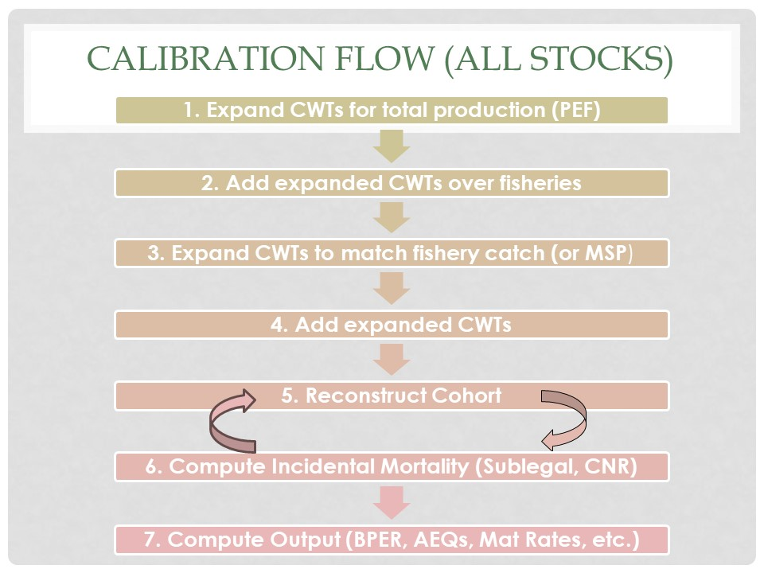

```{r page title, include=FALSE}
page_title <- "Base Period Documentation - Calibration"
```

--- 
title: `r page_title`
author: ""
date: ""
description: "Base Period Documentation"
editor_options: 
  chunk_output_type: console
  

---

<script>
MathJax = {
  tex: {
    inlineMath: [['$', '$'], ['\\(', '\\)']]
  },
  svg: {
    fontCache: 'global'
  }
};
</script>
<script type="text/javascript" id="MathJax-script" async
  src="https://cdn.jsdelivr.net/npm/mathjax@3/es5/tex-svg.js">
</script>


# Calibration Processes
The primary purpose of a calibration pass is to create a CWT recovery data set that contains the number of CWT recoveries for stocks that were tagged in the base period with a simulated number of CWT recoveries for those stocks that were not tagged during the base period.

While it is possible, and perhaps even preferable, to conduct a cohort reconstruction on a single stock basis, the original base period calibration was conceived with the goal to reconstruct observed fishery catches with the CWTs in-hand. Therefore, when summing CWT recoveries of all stocks in a fishery, the expanded CWT catch should match the observed catch. This introduces an element of realism into the calibration, but also adds a significant amount of complexity to the calibration process. In order to reconstruct the catch in a fishery, several CWT expansions are necessary. All CWTs are initially expanded to account for the sampling rate to estimate the number of CWTs that would have been recovered had 100% of the catch and escapement been sampled. The next expansion, the escapement expansion, accounts for the relationship between CWTed releases and the total production. 


## Data Cleaning and Pre-Processing
To conduct a new base period calibration a vast amount of data is compiled, processed, summarized, and analyzed. For CWT data this is described in detail in the [FRAMBuilder](#FB) paragraph.
In addition to CWT recovery data representing FRAM stocks, other key data needed for development of the FRAM base period data set includes: 1) stock abundances/recruitment to fisheries and escapements, 2) life history information on maturation, age structure, natural mortality, and growth rates, 3) fishery landings or effort indices, and 4) fishery related mortality factors for fish released or fish encountering the gear. 

### Analyzing CWT Recovery Patterns
CWT groups were identified representing 36 of the 38 FRAM stock units (Table \@ref(tab:Stocks)). White River and Strait of Juan de Fuca stocks were not marked during the base period and thus in need of alternative representation (see [White River](#WhiteOOB) and [JDF Surrogate](#JDF_Sur) paragraphs for more information). Marked CWT groups from hatcheries within a FRAM stock basin were used to represent both hatchery and naturally produced fish.  Selected CWT groups were usually from “production” or “indicator” tag groups that were considered similar to the stock ancestry and freshwater and marine life history of the local natural stock.  Estimated recoveries (observed expanded by sampling rates) from these tag groups were downloaded from the Regional Mark Information System of the Pacific States Marine Fisheries Commission website.  For each of the FRAM stock CWT group aggregates, the “raw” recoveries were run through the program [FRAMBuilder](#FB) which maps the estimated age-specific CWT recoveries to FRAM fishery and time strata. 
These mapped CWT recoveries were then summarized in a stock matrix and a fishery matrix to assess whether there were sufficient raw un-expanded CWTs when summed over all base period years in each stock/fishery/time step stratum.

CWT Stock Inventory 
```{r StockInventory, echo = FALSE, fig.cap=c("Stock Inventory"),fig.pos='H', out.height = "800px", out.width='800px'}

knitr::include_graphics("./literature/FRAM_CWTInventorySmall_updated--updated2008Jun82015.pdf")

```

General status of CWT recoveries in the new base period (stock summary): 

* Large number of pre-terminal CWTs for nearly every stock.

* 50/50 mix of better/worse cases for old versus new base period comparison; BUT all are as good or better with escapement


CWT Fishery Inventory
```{r FishInventory, echo = FALSE, fig.cap=c("Fishery Inventory"),fig.pos='H', out.height = "800px", out.width='800px'}

knitr::include_graphics("./literature/FRAM_CWTInventorySmall_updated--Fisheries.pdf")

```

General status of CWT recoveries in the new base period (fishery summary: 

* Northern Fisheries: Solid, except fisheries that are a shadow of their past.

* Puget Sound Fisheries: 

  + Sport: With the exception of Area 13 as good or better than in the past.

  + Net: Several fisheries with insufficient recoveries

* [Pacific Fishery Management Council (PFMC)](#PFMC) Fisheries: Much improved, despite the 2008-2009 restrictions.

For methods to address low or missing fishery CWT recoveries see the paragraph about [surrogate fisheries](#SurFish).


### Check Legal Status of Age Group
The calibration program eliminates CWT if a stock/age recovery is not of legal size. For each stock and age, the calibration program calculates a proportion legal given the size limit in the fishery. If the legal proportion given the stock, age, and size limit is zero, the tag recovery is purged from the data. The program creates a message to inform the user that there were instances of recoveries for stocks without a legal population size. The program also creates a summary of these recoveries in a text file, called "errfile.txt".

## [Main Calibration Procedures]{#MCP}
The purpose of a calibration is to produce base period exploitation rates for each stock and fishery in the FRAM model. To this end, marked CWTs from base period years (brood years 2005-2008) were analyzed and summarized to reconstruct cohorts.
At the completion of the base data development process, each FRAM stock-age cohort is doubled, with half the cohort being assigned to “unmarked” and the other half to “marked” components to allow for processing of mark-selective fisheries in “forward-projection” runs of FRAM used in preseason fishery modeling. 
The final step in the calibration cycle is the development of a completed “base period” input file used by FRAM.  This file contains stock abundances, time-age-fishery specific harvest rates, maturation rates, growth rates, and various fishery related parameters such as hooking mortality rates. A new calibration of FRAM is warranted when there are changes to the input data and/or model structure.  Examples include changes to stocks, fisheries, CWT groups, time structure, and growth, natural, and fishery related handling mortality rates.   All of these elements influence the estimates of the cohort sizes calculated during cohort analysis and the corresponding estimates of exploitation rates.

Cohort reconstruction involves several steps described below and illustrated by Figure \@ref(fig:cal-plot). This process is augmented for stocks with insufficient CWT recoveries in the existing base period. For these out-of-base stocks, a different range of years with sufficient CWT recoveries stands-in to provide the needed tag recovery resolution. These tag recoveries are adjusted in an iterative process to simulate the recoveries that would have occurred given the magnitude of the fisheries in the selected base period (see [Out-of-Base Procedures](#OOB)). Once adjusted, these CWTs are combined with the "in-base" recoveries and processed.

Figurexxx presents an overview of calibration steps
```{r CalOver, echo = FALSE, fig.cap=c("Figurexxx Calibration Overview"),fig.pos='H', out.height = "550px", out.width='700px'}



```

### Variables and Notation

* **a:**	Age in years (2 to 5) ‘Birthday’ is assumed to occur on October 1.

* **AEQ~s,a,t~:**	Adult Equivalence by stock, age, and time step.  The probability that a fish will survive to spawn in the absence of future fishing (output to the OUT file).

* **BPEscape~s,a,t~:**	Base period CWT recoveries by stock, age, and time step in escapement estimated using forward cohort analysis and exploitation rate scale factors.

* **BPObsCatch~f~:**	Observed catch by fishery during the base period (input from section 10 of the CAL file).

* **BPPTCatch~s,a,f,t~:** Base period CWT recoveries in preterminal fisheries by stock, age, and time step estimated using forward cohort analysis and exploitation rate scale factors.

* **BPTermCatch~s,a,f,t~:**	Base period CWT recoveries in terminal fisheries by stock, age, and time step estimated using forward cohort analysis and exploitation rate scale factors.

* **CNRLeg~s,a,f,t~:** Legal-size release mortality of a stock and age in a non-retention fishery and time step.

* **CNRMorts~s,a,f,t~:**	Non-retention mortalities by stock, age, fishery, and time step.

* **CNRSub~s,a,f,t~:** Sublegal-size release mortality of a stock and age in a non-retention fishery and time step.

* **Cohort~s,a,TerminalType,t~:**
Pre-fishing abundance of a stock at age a and time step t. If terminal type =0 then abundance is before maturation, if terminal type =1 then after maturation.

* **CV~s,a~:**	Coefficient of variation in length-at-age by stock and age.

* **CWTCatch~s,a,f,t~:**	CWT recoveries by stock, age, fishery, and timestep expanded for sampling fraction.

* **CWTEscape~s,a,t~:**	CWTs by stock, age, and time step recovered in escapement and freshwater fisheries expanded for sampling fraction.

* **DropOff~f~:** Dropoff mortality rate by fishery.

* **EncAdj~f,t~:**	Encounter Rate Adjustment factor by fishery and time step. A variable used to adjust the number of sublegal Chinook encountered in a fishery and time step. This rate is the same as the sublelgal to legal ratio. It is usually estimated from test fisheries or angler interviews.

* **ExpRate~s,a,f,t~:**	The fraction of the vulnerable cohort by stock, age, fishery, and time step, after natural mortality, taken as catch in a fishery.
f	Fishery number.  There are currently 74 “fisheries” in CHCAL where fishery 74 is the number of CWT recoveries in escapement.

* **LandedCatch~s,a,f,t~:** Estimated total catch of a stock in a fishery by age and time step. This catch is calculated by expanding CWTCatch by escapement and fishery expansion. 

* **LegalEnc~s,a,f,t~:** Legal encounters in a non-retention fishery.

* **LegalProp~s,a,f,t~:** Proportion of the cohort (terminal or preterminal) which is above the legal size limit by stock, age, fishery, and time step.

* **LegalRelaseMortalityRate_f:** Legal release mortality rate in a fishery.

* **MatCohort~s,a,t~:** The ‘mature’ cohort, i.e., the number of fish by stock, age, and time step destined to spawn in the current year in the absence of further fishing.

* **MatRate~s,a,t~:** The fraction of the cohort by stock and age that matures in a given time step.

* **Mean~s,a,t~:**	Mean fork length of a fish by stock, age, and time step.

* **MinSize~a,f,t~:** Minimum size limit in a fishery by age, fishery, and timestep.  The age subscript is carried but not used in computations. 

* **ModelRatio~f~:**	The proportion of the observed catch in a fishery that can be accounted for by stocks in the model (output to the OUT file as Recovery Adjustment Factor).

* **MSP~f,t~:** Model-stock proportion. Percentage of a fishery’s total catch that is accounted for by stocks modeled in <span title = "FRAM: Fishery Regulation Assessment Model">FRAM</span>.

* **PEF~s~:** Stock specific Production Expansion Factor. The ratio of total stock escapement to the escapement of the CWTed population.

* **PropLegCatch~s,a~** The proportion of the legal catch in a fishery and time step that is of a given stock and age.

* **PropSubCatch~s,a~** The proportion of the sublegal encounters in a fishery and time step that is of a given stock and age.

* **PTCohort~s,a,t~:**	The preterminal (immature) ocean cohort size by stock, age, and time step.

* **PTER~s,a,f,t~:** Exploitation rate in preterminal fishery by stock, age, and time step

* **PTMorts~s,a,t~:** Total mortalities of CWTed fish in preterminal fisheries by stock, age, and time step.

* **s:** Stock number. There are currently 38 stocks in the model.

* **ScaleFactor~f,t~:** Fishery and time step specific ratio of fishery exploitation rate during the CWT recovery year to the fishery exploitation rate during the base (input from the SIM file).

* **SD~s,a~:**	Standard Deviation by stock and age of the total length distribution of a fish.

* **Shakers~s,a,f,t~:**	Total mortalities of sublegal fish by stock, age, fishery, and time step.

* **ShakEnc~s,a,f,t~:** The fraction of the sublegal cohort, after natural mortality, encountered in a fishery by stock, age, fishery, and time step.

* **ShakerReleaseMortalityRate~f~:**	Fishery specific shaker mortality rate. 

* **SRate~a,t~:** 	Survival rate by age and time step. The survival rate equals 1 - natural mortality rate.

* **SublegalEnc~s,a,f,t~:** Sublegal encounters in a non-retention fishery.

* **SubLegProp~s,a,f,t~:**	Proportion of the total cohort size by stock and age (terminal or preterminal) which is below the legal size limit in a given fishery and time step.

* **t:**	Time step. There are 3 time steps per ‘year’ Oct – Apr, May – June, and July – Sept. 

* **TargEncRate~f,t~:** Sublegal to legal ratio in a fishery and time step. This rate is used to calculate the number of sublegal encounters when the legal retained catch is known.

* **TermER~s,a,f,t~:** Exploitation rate in terminal fishery by stock, age, and time step

* **TMorts~s,a,t~:**  	Total mortalities of CWTed  fish in terminal fisheries by stock, age, and time step.

* **TotalBPEsc~s~:**	Adult total escapement by stock during the base period (input from the CWT file).

* **TotalCohort~s,a,t~:**	The total cohort available at the start of each time period, before natural mortality by stock, age, and time step.

* **TotalSLPop~f,t~:**	The total number of sublegal fish, by time step, across stocks, available to a fishery.

* **TotCatch~f,t~:** Total landed catch summed over stocks and ages for a fishery and time step.

* **TotEncounters~f,t~:** Total encounters in a fishery and time step. For non-retention calculations this value can be provided as an input.


### [Expand CWTs to Total Production]{#EscExpand}
The purpose of this first step is to estimate the total size of the stock aggregate by accounting for un-tagged segments of the aggregate; i.e, the South Puget Sound Chinook stock aggregate is comprised of tagged Nisqually and Chambers hatchery Chinook, but also includes untagged Tumwater Falls hatchery and wild Nisqually Fall Chinook. To make estimates for the entire stock aggregate, the [production expansion factor (PEF)](#PEF) is calculated as the ratio of adult escapement accounted for with CWTs to the total adult escapement of a stock. <br>

Equationxxx

$$
PEF_s=\frac{TotalBPEsc_s}{\sum_{a=3-5,t=1-3}CWTEscape_{s,a,t}}
$$


Note that if a ‘large’ CWT group is used to represent the catch distribution of a ‘small’ hatchery stock, the expansion factors may be less than 1.0 ([MEW,2008](#MEW1)).  

### Expand CWTs to Match Fishery Catch
Depending on the setting of an input flag, the observed base period CWT recoveries are adjusted so that the sum across stocks in each fishery, expanded by [PEFs](#PEF) (xxx) equals the total observed catch in each fishery.  
Equation for fisheries where model stocks account for 100% of the landed catch: 

Equation \@ref(eq:CWTCatch)

\begin{equation}
CWTCatch_{f,t}=\sum_{s,a}(CWTCatch_{s,a,f,t}*PEF_{s}) (\#eq:CWTCatch)
\end{equation}

Equation \@ref(eq:FishExpansion)

\begin{equation}
FishExpansion_{f,t}=\frac{BPObsCatch_{f,t}}{CWTCatch_{f,t}} (\#eq:FishExpansion)
\end{equation}


### Fishery Model Stock Proportion (MSP)
[MSP](#MSP) (xxx) is the percentage of a fishery accounted for by stocks in the model. Chinook FRAM does not contain all the stocks impacted by FRAM fisheries. A portion of the stocks, particularly those affecting northern fisheries (Alaska, Canada) are missing from the model. For these fisheries, FRAM assigns a constant proportion of the catch to non-model stocks. 
While the calibration is conducted in a "marked frame of reference", a FRAM run requires MSPs as a proportion of the total (marked + unmarked) catch (see [Mass Marking and Mark-Selective Fisheries](#MSFpara) paragraph). For this reason an input file was created processing CWT recoveries, catches, and escapements in a "total" frame of reference. 
Additionally, for the purpose of calculating exploitation rates in a "marked frame of reference", MSP is also needed as the proportion of the marked catch.
Tables `BasePeriodCatch`\@ref(tab:MrkCatch) and `BasePeriodCatch_Tot` \@ref(tab:TotalCatch) contain model stock proportions and flags for marked and total (marked + unmarked) fisheries.

The previous calibration predominantly relied on estimating the MSP as the proportion of the catch accounted for by CWTs.

Where

Equation \@ref(eq:BPObsCatchf)

\begin{equation}
BPObsCatch_f=\sum_{t}BPObsCatch_{f,t} (\#eq:BPObsCatchf)
\end{equation}

Equation \@ref(eq:CWTCatchf)

\begin{equation}
CWTCatch_f=\sum_{t}CWTCatch_{f,t} (\#eq:CWTCatchf)
\end{equation}

Equation \@ref(eq:ModelRatio)

\begin{equation}
MSP_f=\frac{BPObsCatch_f}{CWTCatch_{f}} (\#eq:ModelRatio)
\end{equation}


The landed catch of a stock at age a in a fishery and time step becomes:

Equation \@ref(eq:StkFishLanded)

\begin{equation}
LandedCatch_{s,a,f,t}=CWTCatch_{s,a,f,t}*PEF_s*MSP_f (\#eq:StkFishLanded) 
\end{equation}

The current calibration only uses the MSP calculation as described in equation (\#eq:ModelRatio) for a few fisheries, because of the high variance associated with estimating the parameters entering the calculation of CWTCatch~f,t~. When flagged as "2", if the MSP exceeds 100% of the BPObsCatch~f~, the program scales CWTCatch~s,a,f,t~ to sum to 1.

Summary of MSP flags:

* **1**: Adjust modeled catch to equal estimated catch

* **2**: Adjust modeled catch to equal estimated catch if modeled catch exceeds estimated catch

* **3**: Use external adjustment

A flag of "1" is the default setting for all Puget Sound fisheries. Using this flag will expand CWTs such that the CWTCatch~s,a,f,t~ summed over stocks, ages, and time steps equals the BPObsCatch~f~.

For many fisheries outside Puget Sound a flag of "3" was used. This method relies on external estimates of MSP. CWT recoveries are then adjusted to sum to observed catch times MSP.

Equation \@ref(eq:MSP3)

\begin{equation}
CWTCatch_f= BPObsCatch_f * ModelStockProportion_f (\#eq:MSP3)
\end{equation}

#### External MSP Data Sources
As described above, the MSP can be calculated by the calibration program. This method was infrequently used due to the high variance associated with the estimates. The following external approaches were used depending on availability.

##### Default of 100% MSP
All Puget Sound fisheries were assumed to be completely represented by model stocks. This was also assumed for Georgia Strait net, North Washington Coast net, and Grays Harbor net.
Additionally, the marked catch in most fisheries was assumed to be completely accounted for by the hatchery stocks in the model. This was frequently not the case for unmarked stocks in a fishery, particularly if comprised of difficult to enumerate wild stocks or stock components. To achieve an MSP of 100%, a fishery expansion factor was calculated as in equation (\#eq:FishExpansion).

##### Chinook Technical Committee (CTC) MSP #####
For some northern fisheries, we used output from the 2014 calibration (CLB 1402) of the [Pacific Salmon Commission (PSC)](#PSC) Chinook model to calculate fishery model stock proportions. Details of this calibrationcan can be found in PSC Joint Chinook Technical Committee reports [TCCHINOOK (15)-1 V1] (https://www.psc.org/publications/technical-reports/technical-committee-reports/chinook/) and [TCCHINOOK (15)-1 V2](https://www.psc.org/publications/technical-reports/technical-committee-reports/chinook/).  First, for each PSC Chinook Model stock we determined whether it was represented by FRAM model stocks.  Then, for each relevant PSC Chinook model fishery, we summed the total stock specific catch across 2007 - 2013 (FRAM base period catch years) based on whether or not the stock was represented in FRAM. From this we calculated the FRAM base period fishery model stock proportion by dividing the total catch of stocks represented in FRAM by the total catch of all stocks.

##### Genetic Stock Identification (GSI)
Similar to the method evaluating the MSP using the CTC data, we allocated GSI stock assignments to FRAM and non-FRAM model stock. 
For Washington, Oregon, and California fisheries, GSI data originated from [Bellinger,2015](#Bellinger), [Moran, 2017](#Moran) and personal communication with Dr. Michael O'Farrell. We averaged fishing year 2012-2013 stock proportions for FRAM model stocks (for more information please see [FRAM-GSI MSPs new_Cent_Valley_Fix.xlsx](#xxxFisheriesServices should not be publicly accessible)). An additional adjustment was made to eliminate San Joachin stock from the GSI stock aggregate for Central Valley.  
For NCBC sport and troll we averaged 2007 to 2014 stock proportions for FRAM model stocks (for more information please see [ModelStkPPN_9.27.20](#xxx)).

**Table summarizing MSPs, flags, and data sources by fishery for "Total" and "Marked" frame of reference calibration runs.**
```{r MSPTable, echo = FALSE, fig.cap=c("MSP Summary Table. The number next to the source references associated files listed below the table."),fig.pos='H', out.height = "800px", out.width='800px'}

knitr::include_graphics("./literature/MSPSummary.pdf")

```

### Summary of CWT Expansions
Prior to the [PEF expansion](#PEFExp) and the [fishery expansion](#FishExp) described in the last two paragraph, CWTs are subjected to two other expansions. The first expansion occurs in [RMIS](#RMIS) and is called a sampling expansion. It is calculated as the total catch in a fishery/time step divided by the sampled catch in a fishery/time step. This results in the number of CWTs that would have been recovered if 100% of the fishery had been sampled. 
A second expansion, the brood year expansion, is applied within [FRAMBuilder](#xxx) to CWTs that have already received a sampling expansion. The default method gives equal weight to all brood years within the model, but users can also specify brood year weights. The brood year expansion is specific to individual brood years. To calculate the expansion rate, the total number of tags for each brood year is summed. The brood year with the largest number of recoveries is then divided by the sum of tags from the brood year of interest. This expansion factor is then applied to all the CWT recoveries of the brood year to be manipulated.

### [Backwards Cohort Reconstruction]{#CoRecon}
After all CWT expansions have been applied, Cohort reconstruction occurs “backwards” such that, for each stock, it begins with age 5 Chinook in the final time step, progressing through descending time steps and ages with the age 2, time step 1 cohort calculated last.  First, escapement of age 5 Chinook in time step 3 for a given stock is calculated by summing over escapement CWT recoveries. Note that escapement recoveries also include recoveries from freshwater fisheries (see [FRAMBuilder](#xxx)). This is used as a starting value to which terminal fishery mortalities are later added. Total pre-terminal and terminal mortalities are calculated separately by looping through every fishery within a time step and adding expanded CWTs adjusted for other mortality (dropoff/dropout; expressed as a percentage of catch; found in the [IncidentalRate](#Inc) table of the Calibration Support data base) and by adding sublegal mortalities (see [sublegal mortality](##SubRate) section below for additional details as to how this is calculated) and Chinook Non-Retention Mortality (CNR).

#### Cohort Reconstruction Steps

* Compute terminal and preterminal mortalities for each stock by summing over fisheries within an age and time step. Summation is performed on expanded CWT recoveries.<br>
Equationxxx
$$TMorts_{s,a,t} = \sum_{TFisheries} (LandedCatch_{s,a,f,t}*(1+DropOff_f)+Shakers_{s,a,f,t}+CNRMorts_{s,a,f,t})$$
Equationxxx
$$PTMorts_{s,a,t} = \sum_{PTFisheries} (LandedCatch_{s,a,f,t}*(1+DropOff_f)+Shakers_{s,a,f,t}+CNRMorts_{s,a,f,t})$$

* Compute the terminal or mature cohort by age and time step<br>
Equationxxx
$$MatCohort_{s,a,t}=TMorts_{s,a,t}+CWTEscape_{s,a,t}*PEF_s$$

* Starting with age 5 time step 3, the preterminal cohort after natural mortality is computed as: <br>
Equationxxx
$$PTCohort_{s,a=5,t=3}=MatCohort_{s,a=5,t=3}+PTMorts_{s,a=5,t=3}$$
*Assumption: 100% of the preterminal cohort matures.*

* The cohort size for all ages in earlier time steps is computed as:<br>
Equationxxx
$$PTCohort_{s,a,t}=\frac{PTCohort_{s,a,t+1}}{SRate_{a,t+1}}+MatCohort_{s,a,t}+PTMorts_{s,a,t}$$

* The cohort size for the younger ages in the final time step is computed as:<br>
Equationxxx
$$PTCohort_{s,a,t=3}=\frac{PTCohort_{s,a+1,t=1}}{SRate_{a+1,t=1}}+MatCohort_{s,a,t}+PTMorts_{s,a,t}$$

```{r CohortRecon, echo = FALSE, fig.cap=c("Table xxx Cohort Reconstruction Example"),fig.pos='H', out.height = "250px", out.width='700px'}

knitr::include_graphics("images/CohortReconExample.JPG")

```

Once an initial estimate of preterminal and terminal CWT cohort sizes have been made, sublegal (shaker) and CNR mortalities by fishery, age, and time period can be estimated.  

The sublegal and non-retention mortalities by stock and age are a function of cohort size and cohort size is a function of sublegal and non-retention mortalities, hence an **iterative process** is required to calculate cohorts and incidental mortalities by stock and age.

#### Estimating Sublegal Mortalities 
Sublegal or shaker mortalities result from the release of sublegal sized (below the minimum size limit) Chinook encountered during a fishery.
Encounters are estimated as:<br>
Equationxxx
$$Encounters_{f,t}=\sum_{s,a}CWTCatch_{s,a,f,t} * EncAdj_{f,t}$$

#### Estimating Non-Retention Mortalities (CNR)
Table `NonRetention` of the calibration database contains non-retention inputs and flagging. Depending on the value of the `NonRetentionFlag`the inputs will either be modeled using external values of legal and sublegal encounters (flag 3) or an external value of total encounters (flag 4).
CNR impacts can only be calculated if a landed catch value and associated CWT recoveries exist for a fishery. A CNR fishery without pre-existing landed catch can be modeled with a catch of 1. This will only minutely affect cohort sizes, but allow for the calculation of stock-specific BPERs.
CNR calculations assign encounter estimates to stocks and ages.
See chapter <a href="https://framverse.github.io/fram_doc/base_chin_doc_data.html#Non_Retention_Encounters"> Non Retention Encounters </a> for more information.

**Calculations when legal and sublegal encounters are provided:**<br>

* Calculate the stock-, age-composition of legal encounters<br>
Equationxxx
$$PropLegCatch_{s,a,f,t}=\frac{LandedCatch_{s,a,f,t}}{TotCatch_{f,t}}$$

* Calculate the stock-, age-composition of sublegal encounters<br>
Equationxxx
$$PropSubCatch_{s,a,f,t}=\frac{SublegalEncounter_{s,a,f,t}}{TotSublegalEncounters_{f,t}}$$

* Calculate legal mortalities by stock and age<br>
Equationxxx
$$CNRLegal_{s,a,f,t}=LegalEnc_{f,t} * PropLegCatch_{s,a,f,t} * LegalReleaseMortalityRate_{f} * MSP_f$$
* Calculate sublegal mortalities by stock and age<br>
Equationxxx
$$CNRSub_{s,a,f,t}=SublegEnc_{f,t} * PropSubCatch_{s,a,f,t} * ShakerReleaseMortalityRate_{f} * MSP_f$$
* Calculate total CNR mortality by stock and age<br>
Equationxxx
$$CNRMorts_{s,a,f,t}=CNRLegal_{s,a,f,t}+CNRSub_{s,a,f,t}$$
**Calculations when total encounters are provided:**<br>

* For each fishery/time step, calculate PropLegCatch and PropSubCatch as in equations xxx and xxx above.

* Calculate the proportion of the encounter that is legal as: <br>
Equationxxx
$$PropLeg_{f,t}=\frac{1}{1+TargEncRate_{f,t}}$$
Please see <a href="https://framverse.github.io/fram_doc/base_chin_doc_data.html#Target_Encounter_Rates"> Target Encounter Rates </a>for more information.

* Calculate legal and sublegal encounters<br>
Equationxxx
$$LegalEnc_{f,t}=TotEncounters_{f,t}*PropLeg_{f,t}$$
Equationxxx
$$SublegalEnc_{f,t}=TotEncounters_{f,t}*(1-PropLeg_{f,t})$$

* Calculate legal mortalities by stock and age<br>
Equationxxx
$$CNRLegal_{s,a,f,t}=LegalEnc_{f,t} * PropLegCatch_{s,a,f,t} * LegalReleaseMortalityRate_{f} * MSP_f$$

* Calculate sublegal mortalities by stock and age<br>
Equationxxx
$$CNRSub_{s,a,f,t}=SublegEnc_{f,t} * PropSubCatch_{s,a,f,t} * ShakerReleaseMortalityRate_{f} * MSP_f$$

* Calculate total CNR mortality by stock and age<br>
Equationxxx
$$CNRMorts_{s,a,f,t}=CNRLegal_{s,a,f,t}+CNRSub_{s,a,f,t}$$

### Calculating Exploitation Rates 
Once iterations have concluded and cohort sizes stabilized, exploitation rates can be calculated. These exploitation rates are the foundational data of a FRAM run. Preterminal ERs are calculated for preterminal fisheries and have the preterminal cohort size in the denominator. Terminal ERs are calculated for terminal fisheries and have the cohort size post maturation in the denominator. <br>
Equationxxx
$$PTER_{s,a,f,t} = \frac{LandedCatch_{s,a,f=pterm,t}}{PTCohort_{s,a,t}*LegalProp}$$
Equationxxx
$$TermER_{s,a,f,t} = \frac{LandedCatch_{s,a,f=term,t}}{MatCohort_{s,a,t}*LegalProp}$$

### Maturation Rate Calculations

Once cohort sizes are available, maturation rates by age and time step can be computed.  The maturation rate for the oldest age in the final time step is assumed to be 1.0

In the last time step, compute the total cohort after fishing mortality.

Equationxxx

$$TotalCohort_{s,a,t=3}=MatCohort_{s,a,t=3}+\frac{PTCohort_{s,a+1,t=1}}{SRate_{s,a+1,t=1}}$$
 

And the maturation rate is simply the proportion of the mature portion of the total cohort after fishing.  
Equationxxx

$$
MatRate_{s,a,t=3} = \frac{MatCohort_{s,a,t=3}}{TotalCohort_{s,a,t=3}}$$
	 

For earlier time steps, maturation rates are computed in a similar way as:
Equationxxx

$$
TotalCohort_{s,a,t} = MatCohort_{s,a,t}+\frac{PTCohort_{s,a,t+1}}{SRate_{s,a,t+1}}
$$

Equationxxx

$$
MatRate_{s,a,t} = \frac{MatCohort_{s,a,t}}{TotalCohort_{s,a,t}}$$

### Adult Aquivalency (AEQ)(xxx) Calculations
Once maturation rates are available, adult equivalence (AEQ) can be computed. AEQ is the probability that a fish of a certain age will survive to spawn, in the absence of future fishing. AEQs are a function of the maturation rate of the stock and therefore are stock specific. AEQ is defined as 1.0 for the oldest age class at the final time step ([MEW, 2008](#MEW1)). 

Equationxxx

$$
AEQ_{a=5,t=3}=1 $$

In earlier time steps, for all ages, AEQ is computed as 

Equationxxx

$$
AEQ_{a,t}=MatRate_{s,a,t}+(1-MatRate_{s,a,t})*SRate_{a+1,t}*AEQ_{s,a,t+1}$$

### Out-of-Base Procedures
For stocks without representative CWT release groups during the base period, OOB CWT 
groups were used and their recoveries were simulated back into the base period in a process of calibration. 
Calibration involves iterative passes adjusting CWT recoveries for OOB tag groups back to the base 
period using FRAM derived fishery effort scalars from FRAM “validation” runs. 


```{r OOBProc, echo = FALSE, fig.cap=c("Figure xxx Out-of-Base Procedures"),fig.pos='H', out.height = "550px", out.width='700px'}


```

**OOB Procedure Steps**

* Sum CWTs from FRAMBuilder over fisheries and escapement without further expanding (no escapement and fisheries expansions). 
* Compute sublegal mortalities

    + For OOB stocks sublegal encounters of the stock in a fishery are set at the landed catch; i.e., CWT recoveries from FRAMBuilder summed within a fishery and time step.
These encounters are then split into ages by calculating the proportion of stock/age that is of sublegal size and multiplying times the cohort size of the stock age. <br>
Equationxxx
$$Sublegals_{a} = Cohort_{a} * SubLegProp_{a}$$
Where the proportion sublegal (SubLegProp) is calculated as in chapter <a href="https://framverse.github.io/fram_doc/calcs_data_chin.html#45_Size_Limit_Evaluations"> Size Limit Evaluations </a> (equation xxx)

    + When summed over all ages, the age proportions are then calculated as:<br>
    equation xxx
$$Proportion_{a} = \frac{Sublegals_a}{\sum_a Sublegals_a}$$ 

    + Sublegal mortalities are then calculated as: <br>
    equation xxx
$$Shakers_{s,a,f,t} = Encounters_{s,f,t} * Proportion_a * ShakerReleaseMortalityRate_{f,t}$$

- Cohort reconstruction<br>
The cohort is reconstructed as described in chapter <a href="https://framverse.github.io/fram_doc/base_chin_doc_calibration.html#Backwards_Cohort_Reconstruction"> Backwards Cohort Reconstruction </a>. The cohort size is needed to calculate sublegal encounters, legal exploitation rates, and maturation rates.

- Check convergence   <br>
Computing sublegal mortalities and calculating the cohort are iterative steps, because sublegal mortalities are a function of the cohort size and the cohort size is dependent on sublegal mortalities. These steps are repeated until age-2 abundances converge. This occurs when abundances differ by less than 1%.

- Calculate maturation rates and OOB exploitation rates   
See <a href="https://framverse.github.io/fram_doc/base_chin_doc_calibration.html#Calculating Exploitation Rates"> Maturation Rates </a>(xxx) and <a href="https://framverse.github.io/fram_doc/base_chin_doc_calibration.html#Maturation Rate Calculations"> Exploitation Rates </a>(xxx) for calculations.

- Start iterative cycle to integrate OOB catches with in-base CWTs

    + Conduct a "Forward Cohort Reconstruction" <br>
The purpose of the forward cohort reconstruction (start with age 2 time 1) is to produce catches and escapements that are adjusted for in-base fishing effort (new base period) in order to combine them with in-base CWT recoveries.

      - Begin with age-2 time 1 starting cohort and remove natural mortality
    $$PTCohort_{a,t}=TotalCohort_{a,t} * SRate_{a,t}$$
      - Calculate adjusted exploitation rates (AdjustedER) <br>
    Forward cohort reconstruction requires fishery effort scalers that are derived from the new base period in a laborious iterative process.<br>
    Initialize fishery efforts scalers (FisheryScaler) with values derived from regular FRAM validation runs (using best estimates of actual catches and abundances). Runs need to be conducted for all fishing years affected by OOB brood years; i.e., if 2002-2005 brood years (BY) were selected for OOB recoveries, then 2004 (2-year-olds) to 2010 (5-year-olds) fishing years (FY) ) are required to obtain fishery effort scalers. These effort scalers are then manually transferred from the validation run database to the calibration database. Since effort scalers are a function of BPERs and OOB BPERs are influenced by effort scalers, the process is iterative, but requires a starting values for the OOB stock in the validation runs. These ERs can be initialized with a value of 1 or left at the values of the previous base period for the first model run. Subsequent runs use the OOB BPERs from the first completed calibration cycle. For more information of how fishery effort scalers are calculated see <a href="https://framverse.github.io/fram_doc/calcs_data_chin.html#42_Computational_Processes"> computational processes </a>. <br>
      equationxxx
$$AdjustedER_{a,f,t} =\frac{OOB.ER_{a,f,t}}{FisheryScaler_{Year,f,t}}$$ 
Where, the "Year" equals brood year plus age; i.e., if the CWT was recovered for a 4-year old Chinook of brood year 2004, then the fishing year would be 2008 (2004 + 4).<br>
<br>
      - Sum adjusted OOB ER's over all fisheries within an age and time step and adjust if the sum exceeds 100%. <br>
    Do this separately for terminal and preterminal fisheries.<br>
    Equationxxx
    $$AdjustedER_{a,t} = \sum_{f} AdjustedER_{a,f,t}$$
When adjusting OOB ERs in the previous step by dividing by FishScaler, it is possible that ERs exceed 100% for the OOB stock and age when summed over all fisheries within a time step. To avoid this, the component ERs are scale to sum to 95%.<br>
equationxxx
$$AdjustedER_{a,f,t}= AdjustedER_{a,f,t} * \frac{0.95}{AdjustedER_{a,t}}$$
      - Compute preterminal catch<br>
Equation xxx
$$PTCatch_{a,f,t} = PTCohort_{a,t} * LegalProp_{a,f,t} * AdjustedER_{a,f,t}$$
Where, LegalProp is computed as the <a href="https://framverse.github.io/fram_doc/calcs_data_chin.html#45_Size_Limit_Evaluations"> proportion vulnerable (PV) </a>.

      - Compute mature cohort <br>
    For an age and time step, the mature cohort is computed by subtracting the catch from preterminal fisheries from the preterminal cohort size and multipliying times maturation rate.<br>
    Equationxxx
    $$MatCohort_{a,t} = (PTCohort_{a,t} - \sum_f PTCatch_{a,f,t}) * MatRate_{a,t}$$
      - Compute terminal catch<br>
    Equation xxx
$$TermCatch_{a,f,t} = MatCohort_{a,t} * LegalProp_{a,f,t} * AdjustedER_{a,f,t}$$

      - Compute escapement<br>
<a href="https://framverse.github.io/fram_doc/calcs_glossary.html#Escapement" target="_blank">Escapement</a> is calculated by subtracting natural and fishery mortality from the mature cohort size. <br>
Equationxxx
$$Escapement_{a,t} = MatCohort_{a,t} - \sum_f TermCatch_{a,f,t}$$

      - Compute the preterminal cohort for the next time step (if time step is less than 3)<br>
    equationxxx
    $$ TotalCohort_{a,t+1} = \frac{PTCohort_{a,t} - \sum_f PTCatch_{a,f,t}}{(1-MatRate_{a,t})}$$
    
      - Compute the preterminal cohort for age+1 (if time step is 3)
    equationxxx
    $$ TotalCohort_{a+1,t} = \frac{PTCohort_{a,t} - \sum_f PTCatch_{a,f,t}}{(1-MatRate_{a,t})}$$
    
    + Merge OOB CWTs over brood years<br>
During the "Merge" subroutine OOB catches (Catch~BY,a,f,t~) will be combined over brood years (BY) for the same age, fishery, and time step. The user has the option to weight different brood years. <br>
Equationxxx
$$MergedCatch_{a,f,t}=\sum_{BY}Catch_{BY,a,f,t}*Weight_{BY}$$
Brood years can either be merged unweighted (BYFlag = 1). In this case catches will simply be summed (BYWeight = 1).
Each brood year can receive equal weights (BYFlag = 0). In this case the catch from a brood year, when summed over all fisheries and time steps, is expanded to match the catch of the brood year with the highest catch.
Or brood years can receive a custom weight (BYFlag = 2). <br>
    Equation xxx
    $$Catch_{BY,a,f,t} = Catch_{BY,a,f,t} * BYWeight$$

    + Merge OOB CWTs with inbase CWTs<br>
Combine simulated CWTs as computed in previous steps with inbase CWT recoveries.

    + Run through regular (inbase) procedures to create new base period exploitation rates<br>
This is accomplished by following the steps as outline under [Main Calibration Procedures](#MCP).
During initial calibration steps CWTs are [expanded](#EscExpand) to reflect the run size of the OOB stocks during in-base years.

    + Import BPERs into validation runs<br>
See chapter xxx for exporting base period data from the calibration database and importing the new base period into a validation run database.

    + Produce new fishery effort scalers
The new fishery effort scalers are stored in the validation run database in table "FisheryScalers" after running select years (OOB brood years plus age) of the validation runs. These scalers are copied into the calibration database.

    + Iterate<br>
Iterate until OOB ERs stabilize


