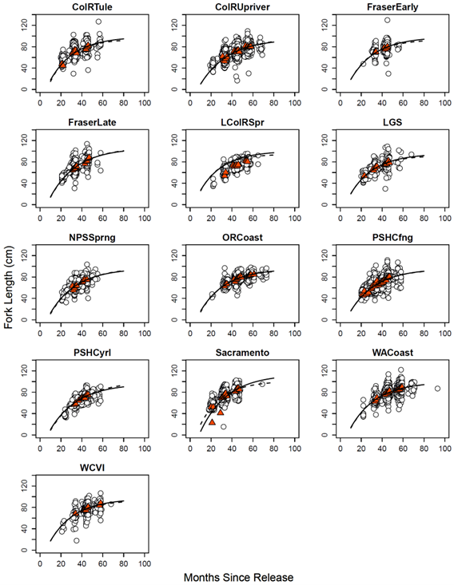
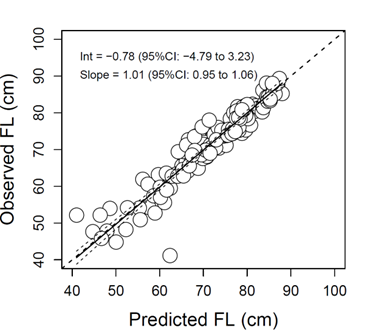

```{r page title, include=FALSE}
page_title <- "Base Period Documentation - Data"
```

--- 
title: `r page_title`
author: ""
date: ""
description: "Getting to know the Fishery Regulation Assessment Model (FRAM)"
editor_options: 
  chunk_output_type: console
---


# Model Data
A large amount of data is required to create a new base period. These input data are stored in tables of the calibration database. All calibration input and output tables can be viewed in the <a href="https://framverse.github.io/fram_doc/base_chin_doc_appendix.html" target="_blank">Appendix</a>.

## CNR
Derek<br>
Tables <a href="https://framverse.github.io/fram_doc/base_chin_doc_appendix.html#Marked_Non-Retention_Chinook_Encounters" target="_blank">Marked Non-Retention Chinook Encounters</a> and  <a href="https://framverse.github.io/fram_doc/base_chin_doc_appendix.html#Total_(Marked_+_Unmarked)_Non-Retention_Chinook_Encounters" target="_blank">Total (Marked + Unmarked) Non-Retention Chinook Encounters</a> in Appendix. 

## CWTs 
Jon<br>
Tables <a href="https://framverse.github.io/fram_doc/base_chin_doc_appendix.html#Coded-Wire-Tag_Recovery_Data" target="_blank">Coded-Wire-Tag Recovery Data</a> and <a href="https://framverse.github.io/fram_doc/base_chin_doc_appendix.html#Out-of-Base_CWTs_for_White_River" target="_blank">Out-of-Base CWTs for White River</a> in Appendix.

## Escapements
<a href="https://framverse.github.io/fram_doc/calcs_glossary.html#Escapement" target="_blank">Escapement</a> are needed to estimate the total size of the stock aggregate by accounting for un-tagged segments of the aggregate. A production expansion factor is computed that relates the run size accounted for with CWTs to the run size of the marked stock aggregate. For the purpose of calibration, escapement includes freshwater catch. Marked as well as total age 3 to 5 escapements were provided by regional experts. Escapements were averaged over base period years and compiled in file <a href="https://framverse.github.io/fram_doc/literature/Escapements%20for%20Calibration%2009302020.xlsx"> “Escapements for Calibration 09302020.xlsx” </a>. 
For a list of escapements used for the calibration see <a href="https://framverse.github.io/fram_doc/base_chin_doc_appendix.html#Base_Period_Marked_Escapements" target="_blank">Base Period Marked Escapements</a> and <a href="https://framverse.github.io/fram_doc/base_chin_doc_appendix.html#Base_Period_Total_Escapements" target="_blank">Base Period Total Escapements</a> in Appendix.

## Fisheries
A take of fish. Fisheries are generally characterized by a delineated fishing area, target species, and gear type (sport, net, troll, etc). They are frequently also differentiated by user group (Treaty, all citizen). Fisheries are often broken out into <a href="https://framverse.github.io/fram_doc/calcs_glossary.html#Time_Step" target="_blank">Time Steps</a>. The calibration has 74 fisheries covering the pacific West Coast from Alaska to California. For the purpose of the calibration, fisheries 72 (freshwater sport) and 73 (freshwater net) are combined with fishery 74 (escapement) into the escapement category. For a list of fisheries see 
Appendix <a href="https://framverse.github.io/fram_doc/base_chin_doc_appendix.html#FRAM_Chinook_Fisheries" target="_blank">FRAM Chinook Fisheries</a>.

## Fishery Scalers
A multiplier, typically based on expected fishery effort or catch relative to base period effort or catch, used to estimate fishery impacts by adjusting base period exploitation rates. Fisheries can be modeled in FRAM as either quotas or fishery scalers. If modeled as a scaler this parameter becomes an input, if the fishery is modeled as a quota, this parameter is calculated in FRAM. For the purpose of the calibration the fishery scaler is an input derived during Chinook validation runs. Fishery scalers are used to scale <a href="https://framverse.github.io/fram_doc/base_chin_doc_calibration.html#oob-procedure-steps" target="_blank">out-of-base effort</a> to effort during the base period. For a table of <a href="https://framverse.github.io/fram_doc/base_chin_doc_appendix.html#Fishery_Scalers" target="_blank">Fishery Scalers</a> see 
Appendix. For more information about the fishery scaler see <a href="https://framverse.github.io/fram_doc/calcs_data_chin.html#42_Computational_Processes" target="_blank">Computational Processes</a>.

## Growth Functions
To model fisheries with minimum size limit regulations, FRAM is parameterized with growth functions for computing mean length (fork length, FL, in mm) by age and model time step, as well as supplementary inputs (coefficients of variation, CVs) for characterizing variability around these predictions (see table <a href="https://framverse.github.io/fram_doc/base_chin_doc_appendix.html#Von_Bertalaffy_Growth_Parameters" target="_blank">`Von Bertalaffy Growth Parameters`</a>). 
Objectives of this effort: (1) Estimate parameters for stock-specific Von Bertalanffy growth functions (VBGFs), inclusive of an assessment of model fit diagnostics, etc.; and (2) Estimate stock-specific CVs associated with VBGF mean length-at-age predictions. 

The approach taken differed from what had been done for prior base period (BP) calibrations in two important ways. Firstly, whereas past BPs included separate ‘mature’ (~terminal) and ‘mixed-maturity’ (~pre-terminal) VBGFs, a single pre-terminal model was deemed appropriate for contemporary modeling due to the lack of minimum size limits in terminal fisheries. Secondly, the estimation approach employed here addressed the fact that the data used to fit VBGFs (i.e., fishery recoveries) may be positively biased due to the release of sublegal/undersized (i.e., smaller than the minimum size limit) fish in fisheries with minimum size limit regulations.

### Data Description

The analysis was based on length observations associated with the coded-wire tag (CWT) recovery dataset selected for general base period calibration (i.e., exploitation rate estimation/cohort reconstruction) purposes. 
Dataset details included:

*	CWT recoveries for brood years 2005-2008 were included for all stocks. Additional CWT data were added to expand the sample size used to estimate VBGFs for the Washington Coast regional aggregate, as well as for the Sacramento/Central Valley stock; broods 2001-2004 were included for these two groups, as well as additional facilities for Washington Coast (Grays Harbor, Quinault, and Tsoo-Yess).

*	Length data for CWTs processed via the CAS loading and FRAMBuilder mapping process were included in the analysis; ‘anomalous’ length data, such as from high-seas fisheries and/or research trawls, were excluded.

*	Data collected in freshwater or extreme terminal fisheries, within which maturation-related changes in morphometry were expected to be well under way, were excluded from all analyses. Thus, although >90% of the dataset used here consists of pre-terminal recoveries, some terminal marine net recoveries were used in the final analysis.

*	For cases in which CWT lengths were not reported in fork length (FL), conversions were made using the conversion equations of [Conrad and Gutman](#Conrad) (1996; total length) and [Pahlke](#Pahlke) (1989; other length types).

*	Data were combined across brood years and grouped into coarser regional aggregates (Table \@ref(tab:fitset)) in order to facilitate VBGF estimation (described below); aggregates were selected based on those used during the estimation of growth parameters during the last Chinook FRAM calibration groupings and based on knowledge of stock relationships.

* The final analysis used data from 658 CWT codes and N = 27,535 marine recoveries (25,606 pre-terminal; 1,929 marine terminal net). 

### Estimating Growth Curve Parameters

Growth functions for the Chinook FRAM Base Period project were estimated in a two-step approach. In the first step, mean ($μ_{sm}$) and SD ($σ_{sm}$) length-at-age individual stock aggregate–month (sm) combinations were estimated using the method of Satterthwaite et al. (2012). In brief, this approach treats individual length observations as samples from a truncated normal distribution, wherein the truncation point is governed by the minimum size limit of a fishery; accordingly, it returns mean/SD maximum likelihood estimates (MLEs) consistent with both the observed and unobserved portions of the underlying probability distribution. Thus, the probability of observing an individual length $l_{i}$ in a fishery with minimum length limit $msl_{i}$ is


$$
p(l_{i}│μ_{sm},σ_{sm},msl_i ) = \frac{Φ(l_{i}|μ_{sm},σ^2_{sm})}{1-Φ(msl_{i}|μ_{sm},σ^2_{sm})} 
$$

and the probability for observing the length dataset as a whole $\widetilde{l}$ given the collective of size regulations $\widetilde{msl}$ is simply the product of individual likelihood,i.e.,

$$
p(\widetilde{l}│μ_{sm},σ_{sm},\widetilde{msl})=∏_{i=1}^Np(l_i│μ_{sm},σ_{sm},msl_{i}) 
$$

MLEs ($μ_{sm},σ_{sm}$) were generated using this joint likelihood function and the ‘bbmle’ package in R. For estimation purposes, data were pooled across brood years without attempts to estimate $μ_{sm}$ and $σ_{sm}$ unless there were at least 20 observations per month–stock aggregate estimation stratum. The $μ_{sm}$ and $σ_{sm}$ estimates generated through analysis stage 1 are provided in Appendix A. With the exception of two suspected outliers, the MLEs were consistent with the expected growth pattern for Chinook salmon and differed in the manner expected relative to values estimated in the absence of size limit considerations.    
In the second estimation stage, the parameters of stock-specific von Bertalanffy growth functions (VBGFs) were estimated that best described variation in mean length-at-age estimates generated during stage one (i.e., $μ_{sm}$). To do this, an approach was employed wherein VGBF parameters were modeled to be stock-varying realizations from a common distribution of VBGF parameters (i.e., $L_{∞}$, k, $t_{0}$):

$$
μ_{sm}=L_{∞_s}*[1-e^{-k_s[t-t_{os}]}]+ε_{sm} 
$$

Parameters were estimated using Bayesian methods in WinBUGS with uniformative priors (see [Appendix](#WB) for code, priors, and initial values). The final values proposed for inclusion in the Chinook FRAM BP are medians from a 1-in-50 sample of N = 31,000 MCMC iterations on each of three chains, less an N = 5,000 iteration burn-in period (i.e., N = 26K total per chain; (Table \@ref(tab:VBGF)). The fitted curves appear to describe well the variability in MLEs (stage 1 results), as well as raw length observations, on both a stock-by-stock (Figure \@ref(fig:ForkLength)) and overall (Figure \@ref(fig:ObsPreFL)) basis. Finally, while retaining them for the final estimation process, the sensitivity of stock-specific VBGF parameters to the inclusion/exclusion of two outliers (i.e., mean FL during at age 21 and 29 was lower than anticipated for Sacramento/CV stock; (Table \@ref(tab:LAge)) was explored. The omission of these points caused a small increase in the length-at-age prediction (fitted curve) for young Sacramento/CV fish and negligibly affected other stocks (Figure \@ref(fig:ForkLength))).
In addition to mean length-at-age predictions, FRAM’s size limit algorithm requires an estimate of distributional spread around means. Two approaches towards fulfilling this BP information need were considered: (1) a constant CV approach, or (2) an age-varying CV approach. An inspection of stage 1 results (i.e., $μ_{sm}$,$σ_{sm}$)  revealed that the latter method best captured patterns in the data (Figure \@ref(fig:CVLengthAge)). Thus, ANCOVA was used to assess the relationship between CV(FL) and age (in months) and then the resulting model to compute CV(FL) on January 1 for age-2 to age-5 Chinook for use in modeling was used. ANCOVA results indicated that CV decreased significantly with increasing age overall (P < 0.001) and offered strong support for stock-specific intercepts (P < 0.001) but not slopes (P > 0.05). Thus, CV(FL) was computed, by age, for each regional aggregate based on an ‘equal slopes’ ANCOVA model (Table \@ref(tab:LAge)).

### Future work
While the inputs proposed here for use in Chinook FRAM BP calibration are robust descriptors of length-at-age patterns for Chinook FRAM’s model stocks, future work may consider improving on the present analysis in at least three ways. First, the estimation framework employed here necessitated that we group related stocks into larger regional aggregates, as was the case for previous base period calibrations. Although groupings were made with some consideration of stock relationships, a more objective approach guided by evidence in the length-at-age dataset may be preferable. This may, however, require an approach that avoids the two-stage analysis that introduced data restrictions here. Secondly, it may be possible to improve model accuracy, precision, and/or realism through the use of an alternative growth curve parameterization (e.g., with seasonally varying growth; [O’Farrell et al. 2012](#OF)). Although this may necessitate minor changes to FRAM algorithms, it may be beneficial, particularly if future changes alter FRAM’s temporal structure. Lastly, whereas the curves reported here describe well the length-at-age patterns Chinook ages relevant to FRAM (i.e., ages 2 to 5), their utility in describing growth patterns for younger fish remains uncertain. If future FRAM applications necessitate prediction for younger ages, other length observations (e.g., length at release, for age-1 research trawl recoveries, etc.) should either be included in the analysis or used to corroborate predictions. We suggest that improvements such as these be given consideration during the phase II of the Chinook FRAM base period calibration. 

<br>

```{r fitset,  results='asis', echo=FALSE}
growthcurvedata<-as.data.frame(read.csv("./objects/GrowthCurveData.csv", header = TRUE))|>
  DT::datatable(filter = 'top',
                extensions = 'Buttons',
                options = list(
                  dom = 'Bfrtip',
                  buttons = c('copy', 'csv', 'excel', 'pdf', 'print')))

cat("<p>", paste0("<caption>",
                      "Summary of data used to fit growth functions for FRAM model stock aggregates. Counts (N) are based on marine fishery recoveries for brood years 2005-2008 for all stocks except for Washington Coast and Sacramento/Central Valley, which include additional recoveries, and non-model stock CWT codes, for brood years 2001-2004.",
                      "</caption>"),
                      "</p>")
growthcurvedata

```

```{r VBGF, results='asis', echo=FALSE}
VBparams<-as.data.frame(read.csv("./objects/VBparams.csv", header = TRUE))|>
  DT::datatable(filter = 'top',
                extensions = 'Buttons',
                options = list(
                  dom = 'Bfrtip',
                  rownames = FALSE,
                  buttons = c('copy', 'csv', 'excel', 'pdf', 'print')))

cat("<p>", paste0("<caption>",
"Estimates of VBGF parameters by regional stock aggregate.Estimates are median values (95% credible intervals in parentheses) from a 1-in-50 sample of N = 26K MCMC iterations (i.e., 31K less 5K burn-in period) on each of three chains.",
                      "</caption>"),
                      "</p>")


VBparams
```


<br>



Growth functions for regional aggregates of FRAM model stocks. In each figure, white circles represent individual observations whereas red triangles are monthly means for (min. month N = 20). Note, monthly means were estimated via maximum likelihood assuming that tags recovered in fisheries with minimum size restrictions are a truncated sample (see ‘Stage 1 analysis’ in text for details). The dashed line in each figure reflects the VBGF parameterization resulting from withholding two Sacramento outliers.

<br>



VBGF-predicted vs. observed fork length by stock-month observation. A posterior predictive check indicated good correspondence between the model and data (Bayesian P-value = 0.52).

<br>


Coefficient of variation associated with monthly length-at-age estimates.

## Incidental Mortality
Fishery related mortality factors include hook and release mortality, hook and line drop-off, and net drop-out.  Rates associated with these factors are used for the base period data development process and the associated cohort reconstruction.  
Hook and release mortality rates can vary by region (e.g. ocean vs. Puget Sound), fishery type (commercial troll vs. sport), and gear type (barbed hooks vs. barbless).  Hook and release mortality rates are usually based on an ‘average’ value from a variety of separate studies. For Puget Sound sport fisheries the legal size release mortality is set at half of the sublegal rate (10% vs. 20%).<br>
Hook and line drop-off and net drop-out are mortality types caused by gear contact with fish that are not brought to the boat.  Drop-off and drop-out mortality may also includes marine mammal predation on gear entangled fish and loss from noncompliance with regulations.  In FRAM, drop-off and drop-out rates were primarily based on agreed values rather than specific studies.  Hook and line drop-off mortality rates are calculated as 5% of landed catch.  Net drop-out mortality rates vary between 0-3% of landed catch depending on whether gear is purse seine, gill net or reef net. 
See Appendix for <a href="https://framverse.github.io/fram_doc/base_chin_doc_appendix.html#Incidental_Mortality_Rates" target="_blank">drop-off/drop-out mortality rates</a>.
See Appendix for <a href="https://framverse.github.io/fram_doc/base_chin_doc_appendix.html#Sublegal_Mortality_Rates" target="_blank">release mortality rates</a>.

## Landed Catch
Derek<br>
<a href="https://framverse.github.io/fram_doc/base_chin_doc_appendix.html#Base_Period_Marked_Catches" target="_blank">Base Period Marked Catches</a> table for marked and <a href="https://framverse.github.io/fram_doc/base_chin_doc_appendix.html#Base_Period_Total_Catches" target="_blank">Base Period Total Catches</a> for total (marked + unmarked) in Appendix.

## Minimum Size Limit
The proportion of Chinook encounters that can legally be retained in a fishery is a function of the <a href="https://framverse.github.io/fram_doc/calcs_glossary.html#Size_Limit" target="_blank">Minimum Size Limits</a>. Minimum size limits by fishery, year, and time step are stored for all inbase and OOB fishing years in database table `SizeLimits` of the calibration database.
See Appendix for <a href="https://framverse.github.io/fram_doc/base_chin_doc_appendix.html#Minimum Size Limits" target="_blank">Minimum Size Limits</a>.

## Model Stock Proportion (MSP)
MSP is the percentage of a fishery accounted for by stocks in the model. For a detailed description of MSP consult chapter <a href="https://framverse.github.io/fram_doc/base_chin_doc_calibration.html#Expand_CWTs_to_Match_Fishery_Catch" target="_blank">Expand CWTs to Match Fishery Catch</a>.
MSPs are listed by fishery in tables `BasePeriodCatch` and `BasePeriodCatch_Tot`. Proportions are the same for all time steps of a fishery.
See Appendix for <a href="https://framverse.github.io/fram_doc/base_chin_doc_appendix.html#Base_Period_Marked_Catches" target="_blank">marked MSP</a> and <a href="https://framverse.github.io/fram_doc/base_chin_doc_appendix.html#Base_Period_Total_Catches" target="_blank">total (marked + unmarked) MSP</a>.

## Natural Mortality
Rates for Chinook are age and time period specific and yield the same total annual natural mortality rate used in the <a href="https://framverse.github.io/fram_doc/base_chin_doc_appendix.html#Pacific_Salmon_Commission_(PSC)" target="_blank">PSC</a> Exploitation Rate Analysis. Rates are constants that when summed over all time steps result in natural mortalities of 10% for age-5s, 20% for age-4s, 30% for age-3s and 40% for age-2s.
See Appendix for <a href="https://framverse.github.io/fram_doc/base_chin_doc_appendix.html#Natural_Mortality_Rates" target="_blank">natural mortality rates</a>.

## Non Retention Encounters
See Appendix <a href="https://framverse.github.io/fram_doc/base_chin_doc_appendix.html#Marked_Non-Retention_Chinook_Encounters" target="_blank">Marked Non-Retention Chinook Encounters</a> and  <a href="https://framverse.github.io/fram_doc/base_chin_doc_appendix.html#Total_(Marked_+_Unmarked)_Non-Retention_Chinook_Encounters" target="_blank">Total Non-Retention Chinook Encounters</a>.

## Stocks
39 stock groups are represented in the calibration. Unlike the FRAM model that contains marked and unmarked stock components (for a total of 78 stocks), each calibration stock is only represented by its marked component. When data is exported to FRAM, each marked stock is split into two identical units representing marked and unmarked stock components. See chapter <a href="https://framverse.github.io/fram_doc/base_chin_doc_program_desc.html#Transferring_Output" target="_blank">Transferring Output</a> for more information.

Model stocks may represent an individual salmon stock or an aggregate of stocks from the same region. Stock units represented in FRAM were chosen based on the level of management interest, their contribution to PFMC fisheries, and the availability of representative coded-wire tag (CWT) recoveries in the Regional Mark Information System (RMIS). For Chinook stock profiles listing hatcheries selected to represent the stock aggregate during calibration, tag codes, growth functions, etc, see Base Period Stock Profiles.

Chinook FRAM includes most stock groups originating from the California Central Valley (Sacramento River), Oregon coast, Columbia River, Washington coast, Puget Sound, and Southern British Columbia. However, not all stocks along the West Coast of North America are represented. Some of the stocks that are not represented in Chinook FRAM include all those originating from California with the exception of Sacramento River fall Chinook, Oregon stocks originating south of Elk River, Mid and Upper Columbia River spring Chinook, Snake River spring and summer Chinook, and Canadian stocks originating north of Georgia Strait.

See Appendix <a href="https://framverse.github.io/fram_doc/base_chin_doc_appendix.html#FRAM_Chinook_Stocks" target="_blank">FRAM Chinook Stocks</a> for a table of calibration Chinook stocks.

## Target Encounter Rates
Derek<>
Appendix table <a href="https://framverse.github.io/fram_doc/base_chin_doc_appendix.html#Target_Encounter_Rates" target="_blank">Target Encounter Rates</a>

## Terminal Fishery Flags
Terminal fishery flags designate a fishery as terminal (flag 1) or pre-terminal (flag 0). Terminal fisheries operate on "mature" abundances and are therefore processed after maturation occurs. For a definition of terminal fisheries see the <a href="https://framverse.github.io/fram_doc/base_chin_doc_glossary.html#Terminal_Fishery" target="_blank">Terminal Fishery</a> description in the Glossary. Terminal fisheries are listed in table `TerminalFisheryFlag` of the calibration database. 
See Appendix <a href="https://framverse.github.io/fram_doc/base_chin_doc_appendix.html#Terminal_Fishery_Flags" target="_blank">Terminal Fishery Flags</a> for a list of terminal fisheries.

## Time Steps
Chinook FRAM consists of four time periods. Because the fishery management cycle year (May 1 to April 30) for Chinook is out of sync with the time at which most Chinook in the model age up (October 1), Chinook FRAM both begins and ends with an October to April time step.

```{r TimeStepTbl, echo=FALSE,include = TRUE, results='asis'}
dplyr::tibble(
  `TimeSteps` = c(1, 2, 3, 4),
  `Months` = c("Preceding Oct-Apr","May-Jun","Jul-Sep","Oct-Apr")
) |>
  gt::gt() |>
  gt::cols_label(.list = list(`TimeSteps` = gt::md("**TimeSteps**"),
                              `Months` = gt::md("**Months**"))) |>
  gt::tab_header(title = "FRAM Time Steps")
```

See chapter <a href="https://framverse.github.io/fram_doc/calcs_data_chin.html#Time_Steps" target="_blank">Time Steps</a> under Model Detail for more information.

# Model Output Data
Calibration output becomes the foundational data for the <a href="https://framverse.github.io/fram_doc/calcs_glossary.html#Fishery_Regulation_Assessment_Model_(FRAM)" target="_blank">FRAM</a> model. The main purpose of FRAM is the assessment of fishery impacts on the status of individual stock units through the use of base period exploitation rates. The calibration also produces encounter rates on <a href="https://framverse.github.io/fram_doc/calcs_glossary.html#Sublegal" target="_blank">sublegal</a> fish. Since sublegal fish are released, encounter rates can be converted to exploitation rates by applying a release mortality rate. Other outputs are maturation rates, AEQ mortality rates, and base period cohort sizes. All output parameters are discussed in the <a href="https://framverse.github.io/fram_doc/base_chin_doc_calibration.html" target="_blank">Calibration Processing</a> section of this documentation.

After output parameters are computed in the calibration, they are <a href="https://framverse.github.io/fram_doc/base_chin_doc_program_desc.html#Transferring_Output" target="_blank">exported to a transfer file</a> for easy import into FRAM. During this step the **39 marked calibration <a href="https://framverse.github.io/fram_doc/base_chin_doc_appendix.html#FRAM_Chinook_Stocks" target="_blank">stocks </a> are converted into 78 marked and unmarked FRAM stocks**. This is accomplished by **duplicating** all stock specific parameters; i.e., calibration stock 1 Nooksack/Samish becomes FRAM stock 1 (unmarked Nooksack/Samish) and 2 (marked Nooksack/Samish). 

## Adult Equivalency (AEQ) Mortality Rates
AEQs provide the average likelihood for a Chinook of a given age to contribute to the mature run (spawning escapement) in the absence of fishing.  Because of natural mortality and unaccounted losses, not all unharvested fish contribute to spawning escapement. AEQs are calculated by the calibration program during cohort reconstruction. For a table of adult equivalency rates see <a href="https://framverse.github.io/fram_doc/base_chin_doc_appendix.html#AEQs" target="_blank">AEQs</a>. For the calculation of AEQs see <a href="https://framverse.github.io/fram_doc/base_chin_doc_calibration.html#Adult_Aquivalency_(AEQ)_Calculations" target="_blank">Adult Aquivalency (AEQ) Calculations</a>.

## Base Period Cohort
The base period cohort is the average run size of a stock and age during the base period prior to natural mortality. It is calculated during cohort reconstruction.
For a table of base period cohort sizes see <a href="https://framverse.github.io/fram_doc/base_chin_doc_appendix.html#Base_Period_Cohort_Sizes" target="_blank">Base Period Cohort Sizes</a>. For the calculation of cohort size see <a href="https://framverse.github.io/fram_doc/base_chin_doc_calibration.html#Backwards_Cohort_Reconstruction" target="_blank">Backwards Cohort Reconstruction</a>. 

## Base Period Exploitation Rates
Exploitation rates are the average base period mortalities of a stock and age in a fishery and time step divided by the legal-sized abundance of the stock and age in a time step. They are needed to produce stock/age specific mortalities during a fishery. When these mortalities are summed for a stock over all fisheries, ages, and time steps they can provide stock specific exploitation rates, the metric to evaluate management objectives, in FRAM.
For a table of of base period exploitation rates see <a href="https://framverse.github.io/fram_doc/base_chin_doc_appendix.html#Base_Period_Exploitation_Rates" target="_blank">Base Period Exploitation Rates</a>. For the calculation of exploitation rates see <a href="https://framverse.github.io/fram_doc/base_chin_doc_calibration.html#Calculating_Exploitation_Rates" target="_blank">Calculating Exploitation Rates</a>.

## Fishery Model Stock Proportion (MSP)
The MSP is the percentage of a fishery’s total catch that is accounted for by stocks modeled in FRAM. MSP can be calculated during the calibration or provided to the calibration program from an external data source.
For marked model stock proportions see <a href="https://framverse.github.io/fram_doc/base_chin_doc_appendix.html#Base_Period_Marked_Catches" target="_blank">Base Period Marked Catches</a> and for total model stock proportions see <a href="https://framverse.github.io/fram_doc/base_chin_doc_appendix.html#Base_Period_Total_Catches" target="_blank">Base Period Total Catches</a>. For the calculation of fishery mode stock proportion see <a href="https://framverse.github.io/fram_doc/base_chin_doc_calibration.html#Expand_CWTs_to_Total_Production" target="_blank">Expand CWTs to Total Production</a>.

## Maturation Rates
The maturation rate is the proportion of the stock and age that returns to spawn in a given year. The rate increases with the age of Chinook and is set to 1 for age 5 and older fish. Fish that don't mature age up (age = age+1) after the mature time step and can be caught in subsequent fisheries.
For a table of maturation rates see <a href="https://framverse.github.io/fram_doc/base_chin_doc_appendix.html#Maturation_Rates" target="_blank">Maturation Rates</a>. For the calculation of maturation rates see <a href="https://framverse.github.io/fram_doc/base_chin_doc_calibration.html#Maturation_Rate_Calculations" target="_blank">Maturation Rate Calculations</a>.

## Sublegal Encounter Rates
Rate at which sublegal Chinook (fish smaller than the legal size limit) are encountered during a fishery and time step. Encounter rates are by stock, age, fishery, and time step. These rates are converted to mortalities through he use of a release mortality rate.
For a table of sublegal encounter rates see <a href="https://framverse.github.io/fram_doc/base_chin_doc_appendix.html#Base_Period_Exploitation_Rates" target="_blank">Base Period Exploitation Rates</a>. For the calculation of sublegal encounter rates see <a href="https://framverse.github.io/fram_doc/base_chin_doc_calibration.html#Estimating_Sublegal_Mortalities" target="_blank">Estimating Sublegal Mortalities</a>.


<script>MathJax = { tex: { inlineMath: [['$', '$'], ['\\(', '\\)']] }, svg: { fontCache: 'global' } }; </script><script type="text/javascript" id="MathJax-script" async src="https://cdn.jsdelivr.net/npm/mathjax@3/es5/tex-svg.js"></script>