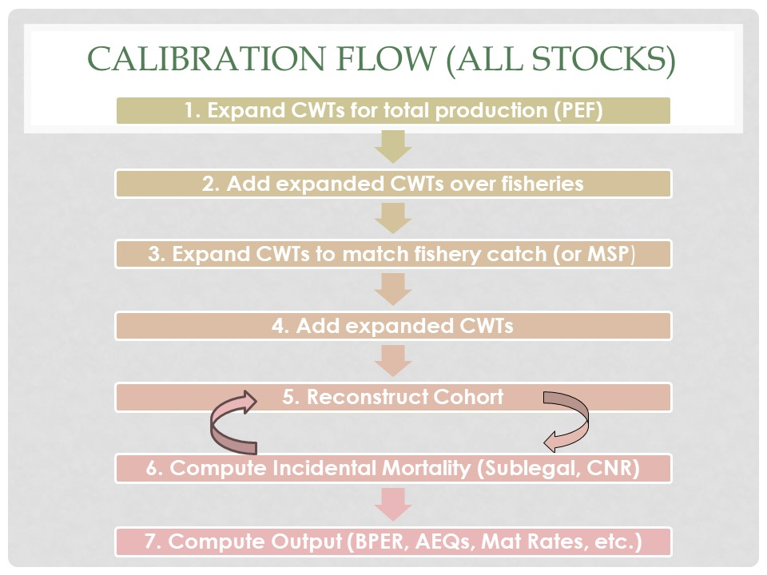

---
output:
  word_document: default
  html_document: default
---
```{r page title, include=FALSE}
page_title <- "Base Period Documentation - Introduction"
```

--- 
title: `r page_title`
author: ""
date: ""
description: "Getting to know the Fishery Regulation Assessment Model (FRAM)"
editor_options: 
  chunk_output_type: console
---


<script>
MathJax = { 
  tex: { 
    inlineMath: [['$', '$'], ['\\(', '\\)']] 
  }, 
      svg: { 
      fontCache: 'global'
      } 
    }; 
</script>
<script type="text/javascript" id="MathJax-script" async src="https://cdn.jsdelivr.net/npm/mathjax@3/es5/tex-svg.js">
</script>


# Introduction
The Chinook base period consists of foundational Fishery Regulation Assessment Model (FRAM) data. The most important parameter, base period exploitation rates, is estimated from "base years" through stock-specific <a href = "https://framverse.github.io/fram_doc/calcs_glossary.html#Coded-Wire_Tag_(CWT)" target = "_blank" title = "CWT">CWT</a> recovery analysis and a process of <a href = "https://framverse.github.io/fram_doc/calcs_glossary.html#Cohort_Analysis" target = "_blank" >Cohort Reconstruction</a>. Base period data are averaged base period years and reprent all the static information needed for a model run. Resulting base period reference parameters are used to populate the FRAM model to predict annual stock/fishery specific impacts.

Fishing years 2007-2013 were chosen as base years, because they reflected the most contemporary period at the time the project commenced and additionally had good numbers of CWT recoveries from recently implemented <a href = "https://framverse.github.io/fram_doc/calcs_glossary.html#Mark-Selective_Fishery_(MSF)" target = "_blank" title = "Mark-Selective">mark-selective</a> sport fisheries. 

The process of creating the latest base period is also called the "2014 Calibration Process". The calibration followed the existing data structure of 38 <a href = "https://framverse.github.io/fram_doc/calcs_appendices.html#Appendix_2_Chinook_FRAM_stocks" target = "_blank" >stocks</a> <a href = "https://framverse.github.io/fram_doc/calcs_glossary.html##Adipose_Mark" target = "_blank" >(adipose marked)</a>, 73 <a href = "https://framverse.github.io/fram_doc/calcs_appendices.html#Appendix_4_Chinook_FRAM_fisheries" target = "_blank" >fisheries</a>, and 3 <a href = "https://framverse.github.io/fram_doc/calcs_data_chin.html#13_Time_Steps" target = "_blank" title = "Chinook Time-Steps">time-steps</a>.

In addition to CWT recovery data representing FRAM stocks, other key data needed for the development of the FRAM base period include: 1) escapements, 2) landed catch, 3) growth rates, and 4) fishery induced mortality rates. For a complete set of input data, see the section on [data inputs](#Data). 

# Overview
The main objective of a calibration is to estimate stock-fishery specific exploitation rates by averaging CWT recoveries over base period years and conducting a cohort analysis. Exploitation rates are estimated by <a href = "https://framverse.github.io/fram_doc/calcs_data_chin.html#13_Time_Steps" target = "_blank" title = "Chinook Time-Steps">time-step</a> and age. A cohort and exploitation rate analysis necessitates full accounting of **all fishery related mortalities** along a stock's migration path. While the basic processes for a cohort reconstruction are quite simple, much of the work of constructing a new base period lies in data preparation, dealing with missing coded-wire-tag recoveries, handling exceptions, adjusting CWT recoveries to match observed catches, and incorporating non-landed mortalities.

A simple diagram of the calibration process is presented in Figurexxx. This program flow works for all stocks with sufficient CWT representation in base period years (37 of the 38 FRAM stocks). For a description of how to handle CWT recoveries from "out-of-base" years see <a href = "https://framverse.github.io/fram_doc/base_chin_doc_calibration.html#Out-of-Base_Procedures" target = "_blank" >Out-of-Base Procedures</a>.

```{r CalOver, echo = FALSE, fig.cap=c("Figurxxx Calibration Overview"),fig.pos='H', out.height = "550px", out.width='700px'}



```

These steps will be described in detail in section <a href = "https://framverse.github.io/fram_doc/base_chin_doc_calibration.html#Main_Calibration_Procedures" target = "_blank" >Main Calibration Procedures</a>.

The final step in the calibration cycle is the development of a completed “base period” input file used by FRAM. This file contains stock abundances, time-age-fishery specific harvest rates, maturation rates, growth rates, and various fishery related parameters such as hooking mortality rates covering the base period fishing years. 

# Preparation
A significant amount of effort went into planning the new Chinook base period in an environment with many stakeholders and new challenges.The original base period was over 30 years old with sparse documentation, lost institutional knowledge, and defunct and fragmented computer programs.
During the initial phase, a team of expert discussed how to conduct base period outreach and review, evaluate CWT sample sizes, address challenges due to mark-selective fisheries, outdated programs, missing CWT representation, and much more.

## Assemble a Team of Experts and Stakeholders
FRAM is used in several forums, such as the  <a href = "https://framverse.github.io/fram_doc/base_chin_doc_glossary.html#Pacific_Fishery_Management_Council_(PFMC)" target = "_blank" >Pacific Fishery Management Council (PRMC) </a>,the Puget Sound co-manager process, and by many different user groups from federal, state, and tribal organisations. Updates and changes to FRAM can have wide-ranging consequences and affect escapement estimates and management objectives for model stocks, many of them protected under the Endangered Species Act (ESA). FRAM changes, especially major modification, necessitate extensive buy-in and review. During the initial phase, a team of experts and stakeholders representing tribal, state, and federal entities was assembled. A base period work group was established that met at least monthly. 
The workgroup consisted of the following members:

- Auerbach, Dan (Washington Department of Fish and Wildlife (WDFW), lead Coho modeler)
- Bellman, Marlene (Northwest Indian Fisheries Commission (NWIFC), lead coho modeler)
- Carey, Jon (National Marine Fisheries Service (NMFS, lead FRAM modeler)
- Dapp, Derek (WDFW, lead Chinook modeler)
- Garber, Ty (WDFW, lead Coho modeler)
- Hagen-Breaux, Angelika (WDFW, modeling unit lead)
- Howard, Jilian (Muckleshoot Tribe, fisheries biologist)
- Johnson, Galen (NWIFC, statistician)
- LaVoy, Larrie (NMFS, main FRAM modeler)
- McHugh, Pete (WDFW, FRAM modeler)
- Miler, Oliver (NWIFC, lead Chinook modeler)
- Packer, James (WDFW, main FRAM coder)
- Rankis, Andy (NWIFC, lead coho modeler)
- Rose, Gordon (NWIFC, representing Strait of Juan de Fuca and Hood Canal Tribes)
- Schaffler, Jason (Muckleshoot Tribe,fisheries biologist)
- Schmidt, Casey (Suquamish Tribe, fisheries biologist)
- Shrovnal, Jeremiah (WDFW, Chinook modeler)

## [Mass Marking and [Mark-Selective Fisheries](#MSF)]{#MSFpara}

Development of exploitation rates relies on the recovery of [coded-wire-tags](#CWT). Coded micro-wire is implanted in the snout of juvenile salmon prior to release. When recovered, the binary or numeric code on the tag identifies the tag group, and thus provides information about the location and timing of release, special hatchery treatments, etc. This information is used to assign CWT recoveries to individual stocks. 
Prior to [mass marking](#MM) a missing adipose fin was a visual indicator that a salmon contained a CWT. A sampler could then remove the snout and send it to the lab for extraction and analysis of the CWT. With mass-marking, this visual indicator was re-purposed as an identifier of a hatchery salmon. Having a method to distinguish hatchery from wild salmon ushered in an era of mark selective (MSF) fisheries, where anglers are required to identify (intact adipose fin) and release wild salmon. Unmarked Chinook are sporadically tagged as control groups, acting as surrogates for wild fish, to assess impacts of mark selective fisheries and mass marking (double index tag groups).

While Washington State switched to electronic CWT detection by trained samplers a few years before full implementation of mass marking, some States and Canada were slow to adopt the new technology. Today, there are still several fisheries along the migration path of Washington native Chinook that are solely visually sampled. This results in not detecting CWT's of adipose present (unmarked) salmon and thus biases exploitation rate analyses of unmarked Chinook. Additionally, even with electronic sampling, the recovery of CWT's from unmarked fish is biased, because they are no longer retained in mark-selective fisheries.
For these reasons, similar to the previous Chinook base period, it was decided to limit CWTs to recoveries from adipose marked salmon. Therefore, marked Chinook represent both marked and unmarked components of the same stock in both base periods. 

In developing the previous base period, CWT recoveries were related to total catches and total escapements to compute exploitation rates (“Total” frame of reference). Due to the influence of mark-selective fisheries in recent years, the new base period relates CWT recoveries to marked catches and marked escapement 
only (“Marked” frame of reference). The latter data manipulation allows for calibration under contemporary fishery conditions using the same calibration algorithms and procedures that have been used in the past; it simply views everything as a non-selective fishery (NSF) in a world populated by marked fish only. Doing otherwise (i.e., using total catches in mark-selective fisheries), would necessitate time consuming changes to calibration algorithms and infrastructure (i.e., databases, pre-processing programs/files) in order to relate recoveries to encounters rather than landed catches and to incorporate mark-selective fishing parameters.

Beyond calibration logistics, the "marked" frame of reference is preferable for other reasons. First, given the existence of a mix of non-selective and [mark-selective](#MSF) regulations, the “marked” approach will yield cohort reconstructions results with less bias than the “total” approach. Second, even with full electronic sampling, sufficient DIT groups, and a means to integrate them into calibration, a “total” calibration would necessarily yield a base period built on specific MSF parameter assumptions (i.e., release mortality rates); these may or may not be consistent with future FRAM applications. Lastly, the inputs to a “marked” calibration are likely to have more certainty associated with them than those for a “total” calibration for more information also see ["Develop the new Base Period Using Marked Landed Catches and Escapements versus Total Landed Catches and Escapements.docx"](#xxx)). Consider, for example, hatchery and wild escapement estimates—the former is often a census whereas the latter is an estimate with considerable imprecision and (possibly) bias. 

Despite its merits, the “marked” calibration approach introduces its own challenges. Most significantly, upon creation, a “marked” base period must be translated into something that can be applied on a “total” basis. Although this is straightforward for exploitation rates (i.e., ER for marked stocks become exploitation rates or encounter rates for unmarked stocks in NSF and MSF, respectively), “total” applications also require an estimate of [model stock proportion (MSP)](#MSP). MSP is the expected fraction of a fishery’s total catch that is comprised of model stocks. For these reasons, the calibration was performed on "marked only" catch and escapement values for the purpose of calculating exploitation rates and on "total" catch and escapement values for the purpose of calculating MSP.

For more MSP information go to chapter [Model Stock Proportion](#MSP2).

## Updating Computer Programs

A major task of the new base period project was to create an efficient, easy-to-use programs for base period development and CWT processing. The original base period necessitated approximately a dozen programs. These programs were written in QBasic. The file editing process was prone to transcription errors and the formats of the various input files were undocumented and typically contained several disjointed sections where parameter values had to be entered. In many cases the output from one program was used to create the input file for the next program in the estimation process.  Any data or selection changes usually resulted in re-running of all components of the system.  

There are now just two programs to create a base period. Both programs are written in Visual Basic and interact with Microsoft Access databases for data storage and retrieval. The first program, [FRAMBuilder](#FB) is used to process CWT data. This program error-checks, maps tags to stocks and fisheries, and summarized CWT data for the ["Main Calibration Program"](#CP). The "Main Calibration Program" conducts cohort reconstructions, calculates base period exploitation rates, produces all parameters for a new base period, and exports output directly into the FRAM database structure.  

Both programs are described in detail in later sections of this documentation.

## Base Period Years
The Chinook FRAM base period project began in 2014 with the investigation of the feasibility of developing a dataset based on the analysis of coded-wire tag (CWT) recoveries from recent year releases of tag groups. The previous base dataset was derived from CWT recoveries and stock and fishery information from the late 1970s to the early 1980s. Significant changes have occurred in stock abundances, fishing seasons, and fishery structure since this time frame which have necessitated several ad-hoc modifications to FRAM (and/or its inputs) to keep pace. Brood years 2005 through 2008 contributing to 2007-2013 fisheries were selected as the time period most appropriate for developing a contemporary base dataset. For Central Valley Falls, brood years 2007-2009 were chosen, because of extensive fishery closures affecting this stock during 2008-2009 fishing years.
During initial feasibility assessments where CWTs by stock and fishery were enumerated, these brood years had a sufficient number of CWT recoveries on par with the previous base period for many stocks and fisheries. Additionally, many Puget Sound sport fisheries had recently re-opened under <a href = "https://framverse.github.io/fram_doc/calcs_glossary.html#Mark-Selective_Fishery_(MSF)" target = "_blank" title = "Mark-Selective">mark-selective</a> regulation, providing a valuable source of CWT recoveries.

## Stock and Fishery Profiles
For each FRAM stock and fishery, metadata are recorded on the associated information used in the calibration process. These stock and fishery profiles are in spreadsheet form and become the basis for documentation of the data and sources for the data in the calibration. Data included, but not limited to, are list of tag codes for each stock, stock abundance estimates in the river return, landed catch and size limits in fisheries, and listing of adipose mark selective fisheries. 
For a complete description of stock profiles see ["2017ChinFRAMBP_StockProfilesJul24_2017xlsx.xlsx"](#stockprofilesxxx) and ["FRAM fishery profiles summary draft 06May2020 ahb.xlsx"](#fisheryprofilesxxx).

## Sublegal Stock-, Age-Composition
Galen

## Addressing Sparse or Missing CWT Recoveries 
Developing a new base period representing the necessary, stock, age, fishery, time step resolution can be immensely challenging. 
A variety of traditional and new methods were used to address sparse and missing CWT recoveries. These methods are documented here and captured in code as well as the relevant databases for reproducibility. 

###  [Surrogate Fisheries]{#SurFish}
####  Background
Surrogate fisheries are used for fisheries with insufficient CWT recoveries. Some base period fisheries had few or no recoveries because of closures or small landed catches, poor sampling, or low tagging rates. Even for fisheries that are unlikely to allow retention, base period exploitation rates may still be needed to estimate non-retention impacts. For these fisheries (recipient fisheries), an evaluation was conducted to determine whether other fisheries or time steps could stand in as surrogates; i.e. using CWT recoveries from the surrogate fishery/time step to represent the recipient fishery.  

#### Determine Recipient Fishery and Surrogates
Raw CWT recoveries from base period years were summed over fisheries and time steps. If a fishery had a recovery during a closed period, the recovery was added to the nearest open time step. 

As a general rule, if a fishery or time step had fewer than 20 recoveries, it was evaluated for suitable surrogates. An exception to this rule was made for the Grays Harbor net fishery because there were no appropriate surrogates and the stock composition resulting from the 7 recoveries looked plausible.

CWT recoveries from Puget Sound net fisheries, with the exception of Bellingham Bay, are automatically combined by FRAMbuilder, because non-treaty net fisheries are usually too small to provide a significant number of CWT recoveries. Additionally, coding in the Regional Mark Processing System (RMIS) often does not allow a differentiation between treaty and non-treaty tag recoveries. For the purpose of the cohort reconstruction each fishery of a treaty/non-treaty pair is modeled at 50% of the combined catch. CWT recoveries are adjusted to produce the combined catch.
Unlike the previous base period that only allowed for whole-sale replacement of one fishery with another fishery, even if some of the time steps had sufficient recoveries, the new calibration programs have been adapted to allow a more flexible approach.
Surrogate fisheries were assigned using the best judgement and expertise of a group of experts. For fisheries without obvious surrogates, the group compared the stock composition from the tags on hand (if any) with the current base period before making a final determination. Generally, assignments occurred in the following order: 

- Use the same fishery, but a different time step; i. e. Bellingham Bay net time 3 for Bellingham Bay net time 1. Time steps 2 (May-June) or 3 (Jul- Sep) were used as a surrogate for each other.

- Use a fishery in the same area and time step; i.e. Area 9 sport for Area 9 net.

- Combine several fisheries or time steps rather than replacing CWTs from one fishery with CWTs from another fishery; Central Oregon Sport time 1 (9 recoveries) and time 3 (103 recoveries) were combined for a total of 112 recoveries to represent both time steps.

- Use base period exploitation rates (BPER) from the current base period to impute CWT recoveries for the new base period; i.e. WCVI net. This fishery had only 3 recoveries in the new base period. WCVI sport was deemed unsuitable as a surrogate, because the net fishery is located much more terminally than the sport fishery. Instead, the current base period stock composition based on 175 recoveries (time 2) was used as a surrogate (see methods under paragraph “Surrogate Methods”).

- Use out-of-base fishery method (OOBER) to obtain exploitation rates to impute CWT recoveries for the new base period. This method is similar to the method described above, but develops  exploitation rates from brood years that are neither part of the current nor the new base period (see Appendix C); i.e. South Puget Sound net (A13A net). There are too few recoveries in the new base period for this fishery. Base period exploitation rates from the current base period produce a Hood Canal fall fingerling impact that has been deemed too high during previous investigations. Instead a suite of recent brood years with adequate sampling was selected to represent exploitation rate patterns for this fishery.

 
```{r SurrogateCWT, echo = FALSE, fig.cap=c("Surrogate Fisheries Matrix: Average marked (mrkd) and total catches in the new base period, raw unexpanded CWT recoveries by time step (T), surrogate matrix, and comments. The surrogate matrix lists the number of CWT recoveries by time step for fisheries without a surrogate. For fisheries with surrogates the matrix lists the surrogate fishery number (F), and/or time step number (T), or “BPER” for fisheries where the current base period exploitation rate is used as a surrogate."),fig.pos='H', out.height = "800px", out.width='800px'}

knitr::include_graphics("literature/SurrogateFisheries.pdf")

```

#### Surrogate Methods
For documentation and replicability purposes all surrogate fisheries are processed in module “ImputeRecov” of the “MainCalibration” program. Instruction for surrogate fisheries are located in table “ImputeRecoveries” of the “CalibrationSupport” database (Table \@ref(tab:CWTSurrogate)). The “Type” column of the “ImputeRecoveries” table specifies the method, whereas the columns “RecipientFishery” and “RecipientTimeStep” specify the fishery number and time step receiving CWT information from a surrogate (donor) fishery (column “SurrogateFishery”) and surrogate time step (column “SurrogateTimeStep”).
Unless otherwise specified CWTs from the recipient fishery and time step are replaced with CWTs from the surrogate fishery and time step and divided by 1000. This results in a recipient fishery with an identical stock composition as the surrogate fishery but only 1/1000 of the CWT catch of the surrogate. 

$$CWT_{s, a, RecipientFishery, RecipientTimeStep} = \frac{CWT_{s, a, SurrogateFishery, SurrogateTimeStep} }{1000}$$ 

The original intent of this division was to keep the recipient catch small under the assumption that a lack of sufficient CWT recoveries is due to small catches. This provides a fishery with a stock composition for modeling, while minimally influencing the cohort reconstruction. For out of base runs (OOB) the recipient fishery is not re-adjusted and hence stays at the low value, for the “All Stocks” run CWTs from the recipient fishery are later adjusted so that the CWT catch matches the estimated catch in the fishery. This produces a model stock proportion of 100% for all recipient fisheries. For this calibration, algorithms were further adjusted to allow the incorporation of an external model stock proportion (see paragraph [“Surrogate Fisheries and Model Stock Proportion”](#SurrogateMSP)).
The following surrogate methods are available:

- **Type 0:** This is currently the only method for out-of-base stocks. It results in the replacement of the recipient fishery and time step with the surrogate fishery and time step and uses the divide by 1000 equation to scale recoveries (equation \@ref(eq:surrogate)).
- **Type 1:** Combines recoveries for a fishery from different time steps and/or fisheries. The surrogate fishery and/or time step is deleted. Recipient CWTs are not divided by 1000. This method is commonly used to edit CWT recoveries in cases where recoveries were reported in the wrong time step. These recoveries are added to the correct time step and zeroed out in the incorrect time step. This method is also used to combine recoveries from multiple fisheries and time step to gain an adequate number of recoveries for analysis; i.e. deep SPS (Area 13+) net and sport. 
- **Type 2:** This is the same method as 'Type 0', but used for CWTs in the base period. Allows for replacement of a fishery and time step with another time step and/or fishery and uses the divide by 1000 equation to scale recoveries (equation \@ref(eq:surrogate)). Zeroes out the original fishery/time step. This method is used for most fisheries and conforms to the standard surrogate fishery replacement concept.
- **Type 3:** This method eliminates a fishery and time step
$$CWT_{s, a, RecipientFishery, RecipientTimeStep} = 0$$

- **Type 9:** This method uses base period exploitation rates from the previous calibration or the out-of-base fishery method (Table \@ref(tab:CWTSurrogate)) to impute CWT recoveries for the recipient fishery. These base period exploitation rates are stored in table “SurrogateFishBPER” (Table \@ref(tab:SurrogateBPER)) of the “CalibrationSupport” database. The “ImputeRecoveries” table designates the surrogate fishery and time step for use of base period exploitation rates. The base period exploitation rates are applied to the legal cohort sizes of the exploited stocks in the fishery.
For Type 9 the following equations are applied:
Equation \@ref(eq:Type91)
\begin{equation}
CWT_{s,a,RecipientFishery,RecipientTimeStep} = Cohort_{s,a,t} * SurrogateFishery BPER_{s,a,SurrogateFishery,SurrogateTimeStep} * LegalProportion_{s,a,f,t} (\#eq:Type91)
\end{equation}
For a recipient fishery and time step the imputed CWT recoveries are summed over stocks and ages to compute the CWTCatch.

$$CWTCatch_{f,t} = \sum_{s,a}CWT_{s,a,f,t}$$


#### [Surrogate Fisheries and Model Stock Proportions]{#SurrogateMSP} 
In the previous base period, CWT recoveries for recipient fisheries were either set to very small values (divide by 1000 in the out-of-base run) or adjusted to match base period catch ('All-Stocks-Run'). As long as recipient fisheries were small, this resulted in a small error. Some recipient fisheries are quite large and have significant non-model stock proportions. In the new calibration program, the user has the option of externally assigning non-model stock proportions for these fisheries.  
Handling of CWTCatch is described in paragraph [Fishery Model Stock Proportion](#MSPpn) and specified in tables 'BasePeriodCatch' (Table \@ref(tab:MrkCatch)) for marked and 'BasePeriodCatch_Tot' (Table \@ref(tab:TotalCatch)) for marked plus unmarked. 

#### [Out-of-Base Fishery Method]{#OOBFish}
The Out-of-Base Fishery Method was used for fisheries where none of the previously discussed approaches were feasible; i.e. no suitable surrogates in the new base period. This method can only be applied to create CWT recoveries for missing fisheries (as opposed to missing stocks) and requires new base period abundances to convert exploitation rates to CWT recoveries.
South Puget Sound Area 13 sport and Area 13A net fisheries (FRAM fishery ID 67 & 70) have very few CWT recoveries in base period years due to sporadic sampling and tagging.
This method develops exploitation rates for select fisheries from brood years that differ from base period years using the following steps:
1.	Select brood years with an adequate number of CWT recoveries (BY 2002-2004). See <a href="literature/“SouthSoundSurrogateTagWorkup.xlsx"> “SouthSoundSurrogateTagWorkup.xlsx” </a> for more information.<br>
2.	Identify FRAM stock aggregates contributing to the recoveries from step 1. Marked recoveries were used for all stocks except White River Yearlings, because this stock was not marked. <br>
3.	Select tag groups for brood years and stocks identified.<br>
4.	Impute missing freshwater sport recoveries.<br>
5.	Summarizes CWTs with FRAMbuilder (manual summary for White Yearlings) and import into main calibration database table (Table \@ref(tab:CWTSPS)).  <br>
6.	Run recoveries from main calibration database table `CWTforSPS_SurrogateMethod`.  Select run option for “Cohort Reconstruction w/o Expansions”. This produces a cohort reconstruction without escapement expansions (production expansion factors) , fishery expansions, incidental mortalities (routines not set up for single stock runs), and surrogate fishery methods (not needed for this method).<br>
7.	Paste exploitation rates produced during previous step for selected fisheries and time steps into table `SurrogateFishBPER` (Table \@ref(tab:SurrogateBPER))
8.	Set flagging in table `ImputeRecoveries` (Table \@ref(tab:CWTSurrogate)) to “Type 9”.
These ERs (SurrogateFishBPERs) are then used by the calibration program to compute CWT recoveries (CWT_{s,a,f,t}) in subroutine `ImputeOldBPERs`.

Equation xxx
$$CWT_{s,a,f,t} = Cohort_{s,a,TerminalType,t} * SurrogateFishBPER_{s,a,f,t} * LegalProp_{s,a,f,t}$$
where,

- <a href="https://framverse.github.io/fram_doc/calcs_glossary.html#Terminal_Type" target="_blank">TerminalType</a>

- <a href="https://framverse.github.io/fram_doc/base_chin_doc_calibration.html#LegalProp~s,a,f,t~:" target="_blank">LegalProp</a>

A somewhat simpler version of this approach was used for fisheries with adequate representation in the previous base period. For these fisheries (<a href="https://github.com/FRAMverse/fram_doc/tree/bp_documentation/docs/base_chin_doc_appendix.html#FRAM_Chinook_Fisheries" target="_blank">FRAM Chinook Fisheries </a> 4, 5, 6, 48, 49, 68, 69) the exploitation rates came directly from the previous base period. These rates are entered in table `SurrogateFishBPER` and are used by the calibration program to compute CWT recoveries in subroutine `ImputeOldBPERs` using above equation.

### [Processing White River Spring Chinook Out-Of-Base CWT Recoveries]{#WhiteOOB}
White River Spring Chinook fingerlings and yearlings were not marked during the base period (brood years 2005-2008). Therefore, an alternative time period (1991-1996) was selected that contained a sufficient number of CWT recoveries from marked White River Chinook. These recoveries were then adjusted to estimate the number of recoveries that would have occurred given base period fishing effort in a process called [out-of-base simulation](#OOBxxx). 

Table xxx Raw and Expanded (for sampling rate) White River Fingerling and Yearling CWT Recoveries
```{r WhiteCWT, echo = FALSE, fig.cap=c("Stocks/Fisheries/TimeSteps with Adjusted Age-5 BPERs"),fig.pos='H', out.height = "800px", out.width='800px'}

knitr::include_graphics("literature/WhiteNoCWTs.pdf")

```

Prior to performing out-of-base procedures a couple of additional CWT adjustments were required.

**Apportion escapement CWTs into time 2 and 3** <br>
White River Fingerlings and Yearlings <a href="https://framverse.github.io/fram_doc/calcs_glossary.html#Maturation" target="_blank">mature</a> in time step 2 (May-June) and time step 3 (Jul-Aug). 
Trap counts from 2002 to 2012 pre July 1 and post July 1 where used to apportion escapements CWTs into time 2 and time 3 (see tab `WhiteR_EscAdj` in file ["Calibration_CWT_Inputs; Rnd7_9.30.20.xlsx"](xxx)).

**Incoporate White River recoveries into Area 13 sport**<br>
Unmarked White River brood year 2002-2004 yearlings were recovered in Area 13 sport, a fishery modeled using the [OOB fishery](#OOBFish) method.
See <a href="literature/“SouthSoundSurrogateTagWorkup.xlsx"> “SouthSoundSurrogateTagWorkup.xlsx” </a> tabs `WhiteMerged`, `WeightWhite`, and   `RecWhite`for more information. The White River yearling exploitation rate was added to table `SurrogateFishBPER` (Tablexxx) of the CalibrationSupport database.
The ER was simply calculated as the sum of brood year weighted CWT recoveries (2002-2004 fishery 67) divided by abundance (CWT~f~ + CWT~esc~).

**Adjust Area 8 sport recoveries**<br>
A single recovery of brood year 1996 White River Spring fingerlings in the marine Area 8 sport fishery in 1999 received a large expansion when it was expanded to base period fishing effort (divided by fishery scaler). This recovery was adjusted using the average expansion White River CWT recoveries with different href="https://framverse.github.io/fram_doc/calcs_glossary.html#Tag_Code" target="_blank">tag codes</a> received in the same fishery. The average expansion accounted for base period fishing effort and brood year weight.
(see tab `WhiteR_A8Sport` in file ["Calibration_CWT_Inputs; Rnd7_9.30.20.xlsx"](xxx)).

**White River in Canadian Fisheries**
<a href="literature/“WhiteRiverWriteUp.docx"> “WhiteRiverWriteUp.docx" </a>

### Impute FW sport
Jon

### Age 5 Recoveries in Fisheries and Escapement
Age-5 Chinook are the oldest age class in the FRAM model. Depending on a stock's run size and age composition, CWT recoveries can be rare and thus subject to the low statistical power of small sample sizes.

If the age-5 base period exploitation rate in a pre-terminal fishery/time step was greater than 10% and the number of escapement recoveries smaller than 20, a stock became a candidate for an <a href="https://framverse.github.io/fram_doc/calcs_glossary.html#Exploitation_Rate_(ER)" target="_blank">ER</a> adjustment. Based on these criteria 11 stocks with improbably high exploitation rates were selected for CWT adjustments (see Table \@ref(tab:Age5BPER))xxx. 

Age-5 CWTs were adjusted based on the relationship between age 4 and 5 <a href="https://framverse.github.io/fram_doc/calcs_glossary.html#Base_Period_Exploitation_Rate_(BPER)" target="_blank">BPERs</a>. The initial dataset used to generate the age-4 to age-5 BPER relationship included all age-4 and age-5 BPERs for stocks where there were greater than 100 age 5 escapement recoveries. The dataset was then filtered to instances where both the age-4 and age-5 BPER was greater than zero for any given stock-fishery-time step. A regression analysis was performed using log-transformed age-4 BPERs as the predictor variable and log-transformed age-5 BPER as the response variable. Using the resulting intercept and slope, an Age-5 exploitation rate target (ER.Target) was computed. In an iterative process expanded CWT recoveries (CWTCatch) were adjusted in the `Catch` column of the `CWTAll` table of the Calibration Support database. After approximately five iterations the resulting BPER matched the ER target to the fourth decimal.
The adjustment was calculated as:

Equation \@ref(eq:CWTAdjust)xxx

\begin{equation}
AdjustedCWTCatch_{s,age=5,f,t}=\frac_{ER.Target_{s,a=5,f,t}}{CWTCatch_{s,a=5,f,t}} (\#eq:CWTAdjust)
\end{equation}

Figure xxx. Age-5 BPERs Pre- and Post Adjustment and CWT Recoveries in Fisheries and Escapement 

```{r Age5BPER, echo = FALSE, fig.cap=c("Stocks/Fisheries/TimeSteps with Adjusted Age-5 BPERs"),fig.pos='H', out.height = "800px", out.width='800px'}

knitr::include_graphics("literature/Age5BPERAdjustments.pdf")

```

For more information see ["Age 5 BPER Adjustment_9.30.2020.xlsx"](xxx) and ["Age 5 BPER Adjustment.docx"](xxx).

Four stocks also received Age-5 escapement adjustments, because they entirely lacked escapement recoveries for this age group. These stocks were Tulalip, Oregon Tules, Bonneville, and Central Valley. For these stocks age-5 escapement recoveries (AdjustedCWTEscapement) were imputed using the ratio of age-4 to age-5 Chinook <a href="https://framverse.github.io/fram_doc/calcs_glossary.html#Terminal_Run_Size" target="_blank">terminal run sizes</a> (TRSEst) times age-4 CWT recoveries.

Equation \@ref(eq:EscAdjust)xxx

\begin{equation}
AdjustedCWTEscapement_{s,age=5,esc}=\frac_{TRSEst_{s,a=5,esc}}{TRS_{s,a=4,esc}}* CWTEscapement_{s,age=4,esc}(\#eq:EscAdjust)
\end{equation}

Table xxx. Age-5 Adjusted Escapements and Age-4 to Age-5 TRS Ratios

```{r Age5Esc, echo = FALSE, fig.cap=c("Age-5 Adjusted Escapements"),fig.pos='H', out.height = "800px", out.width='800px'}

knitr::include_graphics("literature/Age5EscAdjust.pdf")

```

For more information see <a href="literature/Calibration_CWT_Inputs; Rnd7_9.30.20.xlsx"> Calibration_CWT_Inputs; Rnd7_9.30.20.xlsx </a>) tab `ImputeAge5Esc`.

### Missing Canadian Catches 
Derek
For more information see <a href="literature/
2020-06-19 BC_Data_Request_With_pre-2012.xlsx
RE BC Data Request - Update.msg
short description Chinook Canadian catch imputation for post-season runs_Updated_For_Documentation_in_6.2023.docx

### Grays Harbor
The majority of the catch in Grays Harbor net fisheries is comprised of the local Chehalis and Humptulips stock. These two stocks are part of FRAM's Washington North Coast stock aggregate. This aggregate is represented by Queets CWT recoveries which are rarely recovered in Grays Harbor net. While Queets may provide good representation of Washington North Coast exploitation in pre-terminal fisheries, it is inadequate for these terminal net fisheries, because Queets Chinook have already segregated from the local stocks.
During the base period years, there were zero Queets recoveries in Grays Harbor net fisheries.
For Grays Harbor non-treaty net, local stock CWTs were imputed assuming that any catch not accounted for by non local stocks should be assigned to the Washington North Coast stock.
$$GH.Net.Mrkd.Landed_{f,t} - GH.Mrkd.Landed_{nonlocal.stock,f,t} = GH.Mrkd.Landed_{local.stock,f,t}$$
The marked landed catch is an input located in the Access database, the marked landed catch of the local stock can be computed from output of the calibration program.
Treaty net fishery CWTs for the Washington North Coast stock where computed by assuming that the non-local stock proportion is half (4.3%) of the non-treaty value (8.6%). For more information see <a href="literature/Calibration_CWT_Inputs; Rnd7_9.30.20.xlsx"> Calibration_CWT_Inputs; Rnd7_9.30.20.xlsx </a> tab `Impute WNC in GH Net` and ["Modeling Grays Harbor Net Fishery and Washington North Coast stock BkFRAM Abundance (2).docx"](xxx).

### [Stock Surrogate for Elwha]{#JDF_Sur}
Elwha Hatchery (ELW) CWT releases that occurred during brood years (2005-2008) were not adipose clipped, in order to minimize exposure to mark-selective fisheries and reduce ocean interception rates during the early restoration phases for Elwha and Dungeness Chinook (Strait of Juan de Fuca stock aggregate). Therefore, CWTs could be used for cohort analysis/calibration purposes (i.e., due to the lack of CWT recoveries, not impacts, in many northern fisheries for which catch is sampled visually only). Further, due to poor CWT survival and limited ocean recovery data, relatively few <a href="https://framverse.github.io/fram_doc/calcs_glossary.html#Out-of-Base_(OOB)" target="_blank">out-of-base</a> AD+CWT code options existed that could inform stock inclusion via existing OOB procedures. 1990, 1992, and 1993 brood Elwha CWT recoveries could not be used for OOB procedures, because FRAM validation runs do not go back this far in time. However, these recoveries could be used to investigate similarities to other stocks for a potential stock surrogate in outside fisheries.  

Using multivariate statistical methods, surrogate stocks were identified by exploring similarity in the harvest distribution patterns for individual stock-brood year observations. Specifically, principal components analysis (PCA) and cluster analysis were selected to identify the stock groups with harvest patterns most similar to those of ELW for the three brood years in question. Visualizing patterns based on PCA illustrated that ELW are indeed unique among the stocks considered, reflecting a variable presence in both NBC, SEAK, and WCVI fisheries. However, PCA results also suggested, and cluster analysis results further confirmed that among Salish Sea stocks the Stillaguamish (STL) indicator stock was the closest in multidimensional ‘harvest space’.

Using STL as a surrogate for ELW assumes that the overall harvest distribution and maturation pattern for the two CWT indicator stocks is comparable. However, a priori, it was expected there would be inside (i.e., within US and Canadian Salish Sea net and sport fisheries) fishery impact differences (and by extension, possibly total ER differences) given that STL and ELW originate and return to different portions of the Salish Sea. Accordingly, to use STL CWT data as surrogate for ELW in the FRAM calibration process, it was necessary to account for this differential.

It was decided to	modify STL recoveries for inside fisheries to reflect the expected ELW equivalents. This was achieved using a combination of the historic/OOB relationship between ELW and STL (i.e., estimated from the same broods reviewed above, 90, 92-93 brood years) tag recoveries in inside fisheries in the historic data and subsequently applying these values to contemporary STL recoveries. Importantly, for the ratio adjustments to work properly in a surrogate context, OOB ELW CWTs first needed to be re-scaled so that the total ELW fishery+escapement CWT abundance was on equal footing with the OOB STL dataset. Alterations to inside fishery recoveries in the surrogate STL dataset were mirrored by a commensurate alteration to surrogate CWT escapement. For more information see <a href="literature/FRAMbp_ElwhaSurrogate.docx"> McHugh 2015 </a>.

For a long-term solution, beginning with the 2012 brood year, fingerling releases were marked and coded-wire-tagged. When a sufficient amount of CWTs are recovered for analysis, Elwha should be incorportated into the base period with a standard <a href="https://framverse.github.io/fram_doc/calcs_glossary.html#Out-of-Base_(OOB)" target="_blank">OOB</a> procedure.

#### Method for Creating Surrogate Elwha CWT Recoveries
- Select OOB years with good recoveries of STL and ELW (1989, 1990, 1992, 1993, 1997, 2002).
- Designate fisheries as 'inside' and 'outside' fisheries. North and south Georgia Strait sport, British Columbia Juan de Fuca sport, and all Puget Sound fisheries (FRAM Fishery ID 36-72; Tbl. (xxx)) were assigned to 'inside' fisheries.
- Convert STL and ELW recoveries into rates by dividing recoveries in a fishery by abundance (recoveries in all fisheries plus escapement).
- For inside fisheries calculate a ratio as:
$$ ELW.STL.Ratio_f = \frac{ELW.ER_f}{STL.ER_f}$$
Calculate Elwha recoveries as:
$$ELW.CWT_f = STL.CWT_f * ELW.STL.Ratio_f $$
- For outside fisheries (use STL directly for Elwha): 
$$ELW.CWT_f = STL.CWT_f$$
- Recompute Elwha escapement CWTs:
Assumption: Adopting outside fishery CWTs for ELW without manipulations from STL CWTs assumes that both stocks are exploited equally in outside fisheries. This can only occur if ELW abundance equals STL abundance. <br>
Thus, ELW escapement is calculated as STL abundance minus ELW fisheries.
$$ELW.CWT_{esc} = \sum (STL.CWT_f+STL.CWT_{esc}) - ELW.CWT_f$$
Calculate an escapement CWT scale factor for Elwha as:
$$ELW.Esc.Scaler = \frac{ELW.CWT_{esc}}{STL.CWT_{esc}}$$
Adjust Elwha escapement CWTs as:
$$New.ELW.CWT_{esc} = Orig.ELW.CWT_{esc} * ELW.Esc.Scaler$$
For more information see ["ELDU_CalibInputsRd7_GR-1-28-2020"](xxx)

#### Elwha Age Composition
After the new base period was first implemented, it was discovered that ELW exploitation rates differed from STL exploitation rates, although STL CWTs were used as a surrogate for ELW. This was due to differing age compositions of the abundances going into FRAM. The original cluster and principal components analysis (<a href="literature/FRAMbp_ElwhaSurrogate.docx"> McHugh 2015 </a>) and the historic ratio of simple ERs were not stratified by age or time-step, although the calibration inputs were.
To meet the primary assumption of the surrogate procedure that STL 'outside' ER equals ELW 'outside' ER, ELW's age composition in FRAM was adjusted to reflect average STL age comp.  
Terminal run size forecasts of ELW were re-distributed to a static age composition using the average STL 2007-2013 age composition from validation runs. 
For more information see <a href="literature/ProposalForELDU_7-10-2019.docx"> ProposalForELDU_7-10-2019.docx </a> and <a href="literature/draft_revised_stilly_age_comp.xlsx"> draft_revised_stilly_age_comp.xlsx </a>.

```{r JDFAgePPN, echo=FALSE,include = TRUE, results='asis'}
dplyr::tibble(
  `Age` = c(3, 4, 5),
  `Proportion` = c("38.2%","58.0%","3.8%")
) |>
  gt::gt() |>
  gt::cols_label(.list = list(`Age` = gt::md("**Age**"),
                              `Proportion` = gt::md("**Proportion**"))) |>
  gt::tab_header(title = "JDF Age Comp using STL as Surrogate")
```


### 10E Net 
Sinclair Inlet fisheries encounter predominantly Gorst Creek hatchery Chinook. This stock is part of the the mid-Puget Sound (MPS) stock aggregate. Gorst Creek fish were not tagged during the base period, resulting in an improbably low MPS fishery contribution. An external 2012-2015 fishing year CWT based-analysis resulted in a MPS stock contribution estimate to Sinclair Inlet fisheries of 97%. Please see file ["10E_NewBPadjustmentWriteup_GordonRose11_4_2016.docx"](xxx) for more information.
CWT output from Frambuilder was externally manipulated in ["Calibration_CWT_Inputs; Rnd7_9.30.20.xlsx"](xxx) to achieve this ratio for MPS by adjusting non-MPS CWTs to 3% of the contribution. All non-MPS stocks were divided by the same ratio (0.019) to achieve the desired result. These manipulations were performed on tab `10Enet_CWTadj`.

### Tulalip Net CWT Shifts to Time Step 3
Tulalip Chinook are an early timed run. The Tulalip Bay net fishery occurs as early as May which is part of time step 2. This fishery is considered to be a terminal fishery, operating on abundances after maturation. Several stocks caught in this fishery, such as Stillaguamish and Snohomish Chinook, do not mature until time step 3 (July-August). Thus, there would be no abundance to apply base period exploitation rates to. Therefore, all CWTs retrieved from Tulalip net are assigned to time 3. Additionally, all Tulalip stock escapement recoveries are also allocated to time 3. For more information see <a href="literature/Calibration_CWT_Inputs; Rnd7_9.30.20.xlsx"> Calibration_CWT_Inputs; Rnd7_9.30.20.xlsx </a> tab `TulalipNet_T2intoT3`.

### WCVI Sport Inside Outside

### Upper Columbia River Summer Chinook in Central Oregon Troll