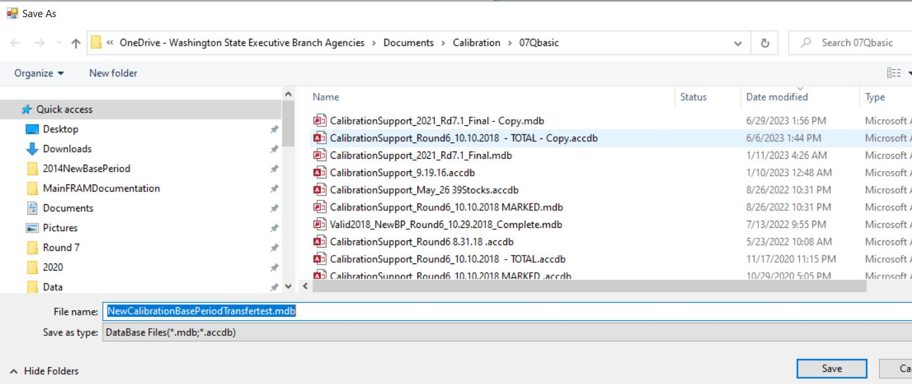

```{r page title, include=FALSE}
page_title <- "Base Period Documentation - Program Descriptions"
```

--- 
title: `r page_title`
author: ""
date: ""
description: "Getting to know the Fishery Regulation Assessment Model (FRAM)"
editor_options: 
  chunk_output_type: console
---

```{r, include=FALSE, results = 'hide', warning = FALSE, message = FALSE}
knitr::opts_chunk$set(warning = FALSE, message = FALSE, fig.height=9, fig.width=9)
```

# Program Descriptions

## FRAMBuilder

### Background and purpose 

Considerable processing is required to translate coded-wire tag (CWT) data from the Regional Mark Processing Center’s (RMPC) Regional Mark Information System (RMIS) database into meaningful units within a FRAM base period (BP) calibration context. Individual tag groups must be associated with a specific FRAM model stock, and tag recoveries at a particular time, location (indicated by RMIS location code), gear type must be mapped to one of FRAM's fisheries and time steps. The FRAMBuilder program and workflow described here was developed to fulfill these needs, among others.

Early in the development of FRAMBuilder and the overall CWT mapping workflow, the base period workgroup (BPW) identified distinct advantages/benefits to leveraging the Pacific Salmon Commission’s Chinook Technical Committee’s (CTC) CWT analysis tools: the Cohort Analysis System (CAS) mapping program and companion database. The BPW ultimately decided to tie FRAMBuilder to the CTC world because this connection: (1) allows for the seamless integration of CTC ‘Auxiliary’ CWT files, agency-supplied/prepared files that supplement or correct known errors/gaps in RMIS’s CWT recovery information; (2) facilitates the efficient inclusion of screened/vetted CWT release groups (i.e., selected by CTC members with regional expertise) into the calibration database; and (3) increases the overlap in information driving models supporting the management decisions of the PSC, the Pacific Fishery Management Council (PFMC), and state–tribal co-managers. Additionally, given partial overlap in the fishery assessment units used by the CTC and in FRAM, the integration of CAS into the FRAM calibration workflow offered efficiency in the form of an initial stage of RMIS-to-FRAM mapping. 

The following provides

- a roadmap of the process from raw RMIS CWT release/recovery data to something useable in a FRAM calibration
- basic documentation on the structure/function of the FRAMBuilder program, its companion FRAM-CAS database, and the ruleset it follows to get CWT recoveries from the initial CAS stage of mapping to a final FRAM fishery/time step state. As for the tools ‘borrowed’ from the CTC (i.e., CAS.exe), we provide only a brief sketch here and refer the reader to CTC resources for further documentation.


### Overview

The procedures to map an individual CWT recovery to a FRAM stock and fishery are conceptually straightforward: in screening candidate codes, make a determination regarding which tags are suitable representatives for model stocks, and then, given recovery details such as RMIS location codes, gear codes, dates, etc., make a determination regarding the model fishery/time step to which the recovery belongs. 

In practice, however, this task is made difficult by the thousands of tag codes representing unique hatchery release groups that are available for consideration. This means that the hundreds of thousands of individual tag recoveries from these groups must all be mapped from the thousands of unique time-location-gear code combinations to one of FRAM’s fisheries. The FRAMBuilder workflow addresses this challenge via to the following steps: 

  1. Select tag groups.
  2. Query RMIS for release/recovery data.
  3. Load RMIS query results into the CTC Filter database, and query it to create CAS input files.
  4. Load tags into CAS (i.e., stage 1 of mapping – to CTC fishery strata).
  5. Run FRAMBuilder (i.e., map/process recoveries).
  6. Export data for any necessary post-FRAMBuilder processing to create calibration input files.

```{r fb_overview, echo = FALSE, out.width='100%'}
knitr::include_graphics("images/fb_overview.png")
```

In addition to these steps, a handful of other functions can be invoked during step 5, depending on a user’s needs. These are also described further below. The remainder of this document is organized around each of these steps, where each subsection offers both ‘how to’ details and documentation on processing decisions, algorithms, etc. where necessary. 

### Required programs and data files 

**Data files**

  - A list of tag codes: A list of tag codes is needed for the purposes of querying RMIS (release/recovery), as well as for populating the CTC Filter database’s ‘STKCDS’ table.
  - CWT release data: These are the raw release details for the chosen codes, acquired from RMIS via a ‘Tagged Releases’ query; query results are downloaded as a CSV, with the headings specified under Step 2 below.
  - CWT recovery data: These are the raw recovery details for the selected codes, acquired from RMIS via a ‘Recoveries By Tag Code’ query; query results are downloaded as a CSV, with the headings specified under Step 2 below.
  - Auxiliary files (or ‘auxiliaries’): These are text files (*.csv or *.txt), prepared by CTC members from a variety of agencies/jurisdictions, that contain supplementary CWT recovery information that is meant to augment (or revise) the CWT information acquired from RMIS for some stocks; these files are typically created on a stock/code basis and are necessary to ensure the calibration process includes the most accurate information. For example, CWT recoveries in escapement—a major anchor point for the type of backwards cohort reconstruction underlying FRAM calibration—are not available via RMIS for many Canadian stocks.

**Microsoft Access Databases**

  - The CTC’s Filter Database: This is a Microsoft Access database into which the RMIS release/recovery query results (above), combined with a tag list (‘STKCDS’) are loaded. Using two custom queries, this database returns RELEASES.txt and RECOVERIES.txt files which can be imported directly to the FRAM-CAS database. 
  - A FRAM-modified CAS database (FRAM-CAS hereafter): This Access database is an adaptation of the CTC CAS database (final preseason 2019 version), which includes several tables (and added fields to existing tables) designed to (1) cross-walk CTC fishery strata to FRAM fisheries or (2) to house/contain mapped outputs for direct export/use in CAS. (The FRAM-CAS fishery crosswalk adheres strictly to the CTC’s ‘fine scale’ fishery strata from 2019; any attempt to create an updated FRAM-CAS database will require an updated FRAM to CTC crosswalk (database table ‘FRAM_Fishery’). Versions of FRAMBuilder databases and outputs created prior to 2019 were based on the final preseason CTC CAS database from 2013 and the ‘fine scale’ fishery strata contained therein.)

**Programs & companion files**

  - FRAMBuilder 2.0: Because FRAMBuilder is very much an interactive program subject to ad hoc changes/revisions to fulfill the BP team’s evolving needs, it hasn’t yet been developed into a distributed, fully compiled .exe file (i.e., ‘production mode’). Thus, the ‘program’ is actually a Microsoft Visual Studio solution (.sln) file that is operated within the development environment (i.e., Visual Studio, version 2008+). The code base and history of modifications can be found at: https://github.com/jon-carey/FRAMBuilder.
  - The CTC’s CAS (and dll): CAS_1.9.exe and CASLib.dll (2019 versions; Versions of FRAMBuilder databases and output created prior to 2019 used the 2013 version of CAS: CAS1.5_No_Restrictions.exe)
  - Visual Studio, version 2008+: To operate FRAMBuilder ‘in the environment’ you will need a compiler; Visual Studio Express for desktops is a good free option (if Professional isn’t on your list of programs).
  - Others: Although they aren’t tied explicitly to the mapping procedures outlined here, there are both R and OpenBUGS programs that estimate parameters for growth functions from CWT length observations (i.e., mapped to FRAM fishery and size limit regulation) summarized by FRAMBuilder. Jon Carey also has an R program (and input template/files) that estimates missing recoveries for freshwater sport (Puget Sound, Willapa Bay tribs) and estuary sport (Willapa Bay).


### Main workflow

#### Select tag groups

The full rationale surrounding the final decisions to include/exclude tag codes is beyond the scope of this document, but the basic selection guidelines are as follows.

Preference was given to CWT codes associated with CTC ER indicator stocks, as these have already been screened by CTC members with regional expertise and deemed to best represent natural and hatchery Chinook stocks within their jurisdiction. 

For stocks/regions beyond the CTC’s scope, selection was guided by the following criteria/considerations:

  - For nearly all stocks, tag selection was limited to **brood years (BY) 2005-2008**
    - additional brood years were included for special calibration analyses (e.g., out-of-base procedures relied on brood years 2002-2004, growth functions)
    - due to the ‘collapse years’, Sacramento/Central Valley fall Chinook include 2009 brood releases and omit 2005-06 broods

  - Only stocks belonging to the ‘5000’ series of marks (i.e., adipose-fin clipped) were included; unmarked fish could not be used due to their absence in (1) CWT samples for visually sampled fisheries and (2) mark-selective fishery catches.
  - CWT release groups were generally avoided
    - from ‘experimental’ production groups (e.g., novel stock crosses),
    - with questionable warning flags (e.g., BKD outbreak), 
    - that were released at stages earlier than the fingerling stage, and/or 
    - that were released at locations with difficult/poor escapement enumeration (e.g., acclimation ponds). 

For further detail on codes selected for particular stocks, please refer to the Chinook FRAM stock profile spreadsheet, available for download at: https://github.com/jon-carey/FRAMBuilder.

#### Query RMIS for release/recovery data

Given a set of codes, the next task is to query RMIS for the necessary release and recovery information. The online system requires a user account and can be accessed by visiting https://www.rmpc.org and selecting ‘RMIS Standard Reporting.’ Release data are acquired via the ‘Releases: Tagged Releases’ query form, which requires your tag list. When pasting in your list of tag codes, it is important to ensure that any leading zeros are maintained, otherwise the system will not recognize the tag codes. After entering the list of tags and clicking ‘Retrieve’, you’ll have to choose the type of report (CSV via email is preferred) and specify the fields returned in the query results. Loading the Filter Database requires a specific User List of fields (copy/paste the list from here):

tag_code_or_release_id
species
run
brood_year
release_location_code
first_release_date
last_release_date
cwt_1st_mark
cwt_1st_mark_count
cwt_2nd_mark
cwt_2nd_mark_count
non_cwt_1st_mark
non_cwt_1st_mark_count
non_cwt_2nd_mark
non_cwt_2nd_mark_count
hatchery_location_code
stock_location_name
related_group_type
related_group_id

Upon validating the user list and clicking the ‘Run’ button, results will be returned to your screen/email.

These should be saved for importing to the Filter Database, preferably programmatically (i.e., via a call to a suitable tool such as `readr::read_csv("report_url_from_RMIS_email.csv"))`).

```{r fb_rmis_tagged_rel, echo = FALSE, out.width='100%', fig.cap='RMIS’s ‘Tagged Releases’ query form'}
knitr::include_graphics("images/fb_rmis_tagged_rel.png")
```

```{r fb_rmis_report, echo = FALSE, out.width='100%', fig.cap='Form for specifying query result specs, specifically report type (CSV)'}
knitr::include_graphics("images/fb_rmis_report.png")
```

```{r fb_rmis_fields, echo = FALSE, out.width='100%', fig.cap='Sub-form for setting a User List of fields to be included in query results'}
knitr::include_graphics("images/fb_rmis_fields.png")
```

The steps to run the custom ‘Releases: Tagged Releases’ query are now repeated for the ‘Recoveries: By Tag Code’ query, but with a custom User List of the following fields:

recovery_id
recovery_date
period_type
period
species
sex
length
length_code
tag_code
tag_status
estimation_level
recovery_location_code
fishery
estimated_number
sample_type
run_year
recorded_mark
catch_sample_id
detection_method
sampled_maturity
reporting_agency
adclip_selective_fishery

Query results can now be saved as a CSV imported into the Filter Database. *Be careful when opening/viewing these query results before importing into Filter Database; CSVs open readily in Excel and can be unintentionally reformatted upon opening (e.g., text to numeric will drop leading zeros on some codes).*

#### Filter RMIS data for importing to CAS

The release and recovery CSV files constructed in Step 2 can now be imported directly into the Filter Database. This is achieved via the Microsoft Access functions under External Data > Import & Link > Text File. This allows you to specify the appropriate Releases.CSV or Recoveries.CSV file in the ‘File Name field’ (browse and point to accordingly) and append records to the appropriate database table (RELEASES or RECOVERIES). To minimize potential error, it is generally advisable to start with a clean Filter Database for these steps.

After loading RMIS query results, the Filter Database’s ‘STKCDS’ table (Figure 6.1) must be populated with the tag codes contained in the release and recovery datasets. The three letter abbreviations in the STOCK field must follow existing conventions (i.e., be in the CAS ‘SpeciesStock’ table), otherwise records will be rejected [Note: although all FRAM stocks are already covered, new stocks can be added via steps contained in CTC CAS help files]. 

```{r fb_filter_mdb, echo = FALSE, out.width='100%', fig.cap='The Filter Database’s ‘STKCDS’ table, which requires tag code, jurisdiction, brood year, stock acronym, and marking status'}
knitr::include_graphics("images/fb_filter_mdb.png")
```

After the Filter Database is loaded with necessary content, these data are ‘filtered’ via two queries (releases, recoveries) that are saved as .txt files for import into CAS. The ‘ERARECOVERIES’ filter query eliminates 
  1. recovery observations that cannot be used in a quantitative analysis (i.e., RMPC ‘sample type’ = 5), 
  2. high seas fishery recoveries,  
  3. some recoveries that are dealt with as auxiliaries (e.g., Canadian escapements), 
  4. the handful of recoveries in Alaska that occur outside of Southeast (i.e., location codes for all recoveries from Alaska should begin with ‘1M1…’)

See Appendix A for SQL query details. The ‘ERARELEASES’ filter query, in contrast to recoveries, does minimal joining (STKCDS to Releases) and reformats the release data in prep for CAS import. Step 3 should yield two text files: ERARELEASES.TXT and ERARECOVERIES.TXT

### Load filtered CWT data into CAS

Using the CAS_1.9.exe program (CAS program or CAS.EXE hereafter), the ERARELEASE.TXT and ERARECOVERIES.TXT files can now be imported into the FRAM-CAS database. 

Depending on the application, you may want to first clear out the entire FRAM-CAS database, using the CAS program (Figure 7.1). First, however, you must connect your CAS program to the FRAM-CAS database with which you’re working (you will be prompted to do so upon opening the program). Once connected, you can clear things out as needed (Figure 7.1) and then you’re ready to import filter database output releases (Figure 7.2), recoveries, and/or any auxiliary files (discussed further below).

```{r fb_cas_settings, echo = FALSE, out.width='100%', fig.cap='The CAS program’s Settings menu, the location in which loaded data can be deleted'}
knitr::include_graphics("images/fb_cas_settings.png")
```

The procedure for each file type is the same, you first point the program to the appropriate release, recoveries, or auxiliary text file (.TXT or .CSV) and menu, then you click ‘Load’ and wait for the process to complete. Once CAS has finished loading the data, you should examine the running CAS error log (‘CASErrors.TXT’, this is written where the program occurs) and the ‘*.BAD’ (a text file) associated with each input you’ve attempted to load. These will describe which (if any) records were rejected and offer clues regarding why this occurred.

```{r fb_cas_releases, echo = FALSE, out.width='100%', fig.cap='The CAS program’s Releases loading menu'}
knitr::include_graphics("images/fb_cas_releases.png")
```

#### Troubleshooting rejected releases and recoveries

Typically a handful, and sometimes many, records will be rejected during the FRAM-CAS database loading process. This can feel like the most cumbersome step of the FRAM-CAS database loading process, but with some patience and insight is relatively easy to work through. The good news is that, generally speaking, once a solution to a parsing problem or release rejection problem is resolved in the FRAM-CAS database, it will address all future instances subject to the same circumstances (and/or future reloads).

Common problems and solutions include (solution in italics):

  1. For releases, this can arise because the stock code isn’t included in the ‘SpeciesStock’ database table (this shouldn’t happen, but if it does, see CTC help file guidance)
    - *upon adding the new stock’s details, it should load correctly*
  2. For recoveries, the recovery location may not be parsing in such a way that can get a recovery from an RMIS location code all the way to a CTC fine-scale fishery
    - *in this case, you’ll have to manually add a parsed location (with fine-scale fishery mapping) to the FRAM-CAS database ‘FisheryLookup’ table, and reload the associated BAD records*
    - For example RMIS Location Code: “3F10510  080122 R” parses to the fields in green, and you must supply the red info (Fishery = CTC Fishery Stratum, CWDBFishery = RMIS Fishery Code, Species = 1 for Chinook; gray fields can be left empty)

```{r fb_cas_trouble_loc, echo = FALSE, out.width='100%', fig.cap='The parsing rules from RMIS Location Code to field values are: Char(1) = StateProvince; Char(2) = WaterType; Char(3) = Sector; Char(4-6) = Region; Char(7-9) = Area; Char(10-16) = Location; Char(17-19) = Sub-Location.'}
knitr::include_graphics("images/fb_cas_trouble_loc.png")
```

  3. In other cases, the recovery location might be parsing correctly, but a fishery really isn’t part of the FRAM (or CTC universe). In rare cases, for example, Chinook FRAM’s stocks have been recovered in net fisheries in Cook Inlet and Prince William Sound. 
    - *These rarities are not included and treated as though they’re ‘natural mortality’.*
  4. On rare occasions, RMIS contains records with a valid sample type, but no ‘estimated number’ for a particular tag recovery. 
    - *In these cases, the user must decide what to do, i.e., to enter a value or omit altogether.*
    - For example, if it’s likely a data error and in fact each fish represents an individual (e.g., censused escapement at a hatchery), then these records could be given an estimated number of 1.0 and reloaded. It is on the BP team, however, to make the call given whatever information is available (regional expertise/contacts, etc.).
  5. A portion of the auxiliary data you’re supplying isn’t part of the tag set of interest. For example, a CTC member from Canada may supply escapements for all of their stocks for all years in a single file, whereas you’re only interested in 2005-2008 broods.
    - *If this is the basis for rejection, there’s nothing more that you need to do.*

### What are auxiliaries?

As noted above, so-called auxiliary CWT recovery files are also loaded into the FRAM-CAS database during this stage of the overall process, and are denoted as such in the ‘CWDBRecovery’ table (‘Auxiliary’ = T/F field). These files, which are supplied by regional experts who steward CWT recovery data for particular stocks or fisheries, are meant to either augment or correct the data acquired via RMIS for the tag groups in question. While the deficiencies/errors in RMIS content and/or the basis for auxiliary file creation are beyond the scope of this manual, these files are necessary to ensure that all observations of tagged model stock cohorts are correctly captured in the FRAM BP dataset. Because these datasets are routinely updated, it is important to acquire the latest versions from the appropriate CTC point(s) of contact prior to completing a full FRAM-CAS loading process. Finally, similar input files may need to be created for any non-CTC stocks necessitating similar supplementary or revisionary data (e.g., for unsampled freshwater sport fisheries in Puget Sound and Willapa Bay). Because the CTC’s fine-scale fishery change routinely, if not updating to the current version of the CAS database, it may be necessary to modify auxiliaries to revert to the 2019 convention before using.

For further documentation on the CAS program and database, see the design specs document prepared by Wostman and Associates, Inc. for ADFG and the CTC, as well as the CAS help files located here: https://github.com/jon-carey/FRAMBuilder/tree/master/CTC%20CAS%20Documentation. For more information on the FRAM-CAS database, and more specifically how it has been modified to integrate FRAM functionality, see Appendix B. 

#### Run FRAMBuilder

When the FRAM-CAS database has been successfully loaded with the CWT data needed for running the BP calibration, we have just a few additional (albeit very important) steps to (1) complete the RMIS to FRAM fishery mapping work, (2) process the selected tags/broods for the selected stocks so they correspond to a single ‘super code’, and (3) format and write calibration input files to the FRAM-CAS database. This section covers the rationale and sequence of steps underlying this process.

##### Mapping/adjustment rules

Before diving into the ‘how to’ details, here we summarize the main rules/processing tasks that FRAMBuilder executes to map CWT recoveries from CAS fishery purgatory to their final FRAM fishery/time step/age stratum (within code, see the subroutine ‘BGworker_output_DoWork’ in ‘OutputOptions.vb’ for further detail). Note that the following special mapping rules were revised in 2019 in accordance with updating from the 2013 CAS database and fishery structure to the 2019 CAS database and fishery structure. Whenever specific criteria invoke special processing rules, FRAMBuilder does the following: 

  1. Split CAS Puget Sound Areas 10/11/13 Net (Fishery = 2315) and Terminal Net (Fishery = 2316) into FRAM 10A, 10E, 10/11, 13A, and SPS Net fisheries; this is done using the RMIS recovery location code. Also assign 13C (Chambers) to freshwater net, consistent with TAMM treatment of the fishery.
  2. Split CAS Puget Sound Areas 10/11/13 Sport (Fishery = 3311) and Terminal Sport (Fishery = 3315) into FRAM Areas 10, 10A, 10E, 11, and 13 Sport fisheries; this is done using the RMIS recovery location code. Recoveries are only assigned to 10A and 10E during July – September, consistent with fishery regulations. Note that due to suspected errors in data coding in RMIS, it is not possible to perfectly separate 10A/10E from general Area 10 in some base period years.
  3. Assign recoveries mapped to CAS Puget Sound Area 8-2 Sport (Fishery = 3308) during the summer to FRAM 8D (Tulalip Bay) sport, as general Area 8 is closed to Chinook retention during the summer; this is done using the recovery month.
  4. Assigned CAS Puget Sound Stilly/Sno Net (Fishery = 2313) and Terminal Net (Fishery = 2314) recoveries that occur in 8D (Tulalip Bay) to FRAM Tulalip Bay Net; this is done using the RMIS recovery location code.
  5. Separate the KMZ component of CAS California Troll (Fishery = 1314) and assign to FRAM KMZ Troll; this is done using the RMIS recovery location code.
  6. Separate the KMZ component of CAS California Sport (Fishery = 3331) and assign to FRAM KMZ Sport; this is done using the RMIS recovery location code.
  7. Assign CAS Hood Canal Net (Fishery = 2318) and Terminal Net (Fishery = 2319) recoveries that occur in 12H (Hoodsport) to FRAM freshwater net, consistent with TAMM treatment of the fishery.
  8. Correct Washington Area 1 Troll recoveries that have historically (incorrectly) been mapped (by CAS) to Oregon Area 3 Troll (Fishery = 1309).
  9. Separate the combined Bellingham Bay (Areas 7BCD) treaty/non-treaty net fishery recoveries into separate treaty/non-treaty components. Unfortunately, this ‘processing rule’ can’t be fully implemented in code because a non-distinct (indiscernible treaty/non-treaty) fishery/gear code combination precludes assignment with certainty for a non-trivial percentage (>20%) of 7BCD recoveries. Thus, 7BCD net recoveries are pre-processed externally (see supplemental file ‘BellinghamBayEvaluation_2019.xlsx’) to make individual tag ‘Tr/NT’ assignments based on fishery/gear codes in RMIS and/or annual treaty/non-treaty catch proportions (see Appendix C). Once this pre-processing step has been completed, FRAMBuilder will assign recoveries to the appropriate FRAM fishery based on the values entered in the ‘Tr_NT’ field of the CWDBRecovery table.
  10. Map recoveries assigned to CAS Washington Coast Net (Fishery = 2321) that occur in Area 4B to FRAM JDF net.
  11.	Map recoveries assigned to CAS Washington Area 2 Sport (Fishery = 3319) that occur in Willapa Bay and are of Willapa stock to freshwater sport (because the model does not contain a Willapa Bay sport fishery).
  12.	Map all freshwater fishery recoveries, i.e., sport, net, B10 sport, Col R Net, to the escapement fishery (fishery 74); this step facilitates calibration in ETRS units, as desired under the new BP framework.
  13.	Make and modify time step (TS) assignments as needed; TS assignments are made initially based on the calendar month in which a recovery occurred (month <4 & >=10 is TS1; 5&6 = TS2; 7-9 = TS3), but in several instances things will have to be shifted slightly to reflect the timing rules and biological assumptions built into the calibration’s cohort reconstruction. For instance, since fall Chinook are only allowed to mature in TS3, recoveries in freshwater sport/net/escapement during TS1/4 are assigned to TS3. 
  14.	Determine the FRAM age equivalent for each fish. This is initially done as ‘age = run year - brood year’, with subsequent adjustments to reflect (a) fish having birthdays on Oct 1, (b) Willamette and Cowlitz/Kalama/Lewis spring Chinook (yearling releases) having ages treated as true age - 1 in FRAM, and (c) min (age 2) and max (age 5) age constraints imposed by the model/cohort reconstruction. The origin of this decrementing is undocumented (precedes FRAMBuilder 2.0) and only applies to these two yearling release stocks; assumedly, this is because they’re yearling releases with maturation in TS1/4.
  15.	Identify sublegal recoveries for exclusion, as they should not be used in the calculation of legal exploitation rates. This is done by identifying recoveries that have reported lengths (from RMIS) that are less than the lower bound of the size limit in the given fishery/time-step. For southern US and Alaskan fisheries, size limit regulations are in terms of total length. These are converted to fork length for modeling purposes, using the total length to fork length conversion from Conrad & Gutmann (1996). For fisheries where this conversion was applied, the lower bound of the size limit was set to 2.8 cm and based on the sum of the 95% prediction interval for the conversion (1.8 cm) and an estimated measurement error (1 cm). Size limit regulations for Canadian fisheries are in terms of fork length, thus the lower bound was set to 1 cm and represents only measurement error. 

*Note, whenever any of these special processing rules is invoked for a particular recovery, a record detailing related adjustments is added to the FRAM-CAS database’s ‘FRAM_ProcessLog’ table*

##### Merging & weighting

Beyond applying mapping/adjustment rules, a secondary function of FRAMBuilder is to merge CWT data for a given stock within selected BP broods and ultimately across broods to create a synthetic all-broods ‘super code’. The program is flexible and can accommodate a few different merging approaches. Within brood years, merging can be done either (1) on an unweighted basis (default) or (2) using user-specified weights which are generated on a stock/code/BY basis and added to the ‘FRAM_Weights’ table. The first option treats all CWT release groups within a stock/BY as though they’re equivalent and simply lumps them together accordingly. Thus, if several hatcheries/groups make up a single FRAM stock, they’re essentially self-weighting within BYs as a function of the number of fish released and early marine survival. The latter option allows users to specify weights that up/down weight particular CWT codes/groups according to any rationale. For example, the Skagit spring yearling model stock is actually a composite fingerling/yearling stock for which user-supplied weights have been developed to achieve a 50:50 representation of the two life history variants in the pool of recovered CWTs. 

Once codes are merged within BYs for a given stock, FRAMBuilder merges the within-BY-merged CWT recovery data across BYs using one of three approaches: (1) unweighted merging, (2) recoveries-weighted merging [the default], or (3) user-specified weighting (Note that user-specified between BY merging hasn’t been fully tested/vetted). The first option is equivalent to the default within-year method in that BYs are pooled as-is and thus self-weighting; this essentially means that BYs with better survival and/or abundance will have greater influence in the calibration dataset. The second and default option (‘recoveries weighted’) is designed to rescale recoveries (i.e., R’FAT-b = Wb*RFAT-b) within each brood year so that all BYs have equal influence on the calibration dataset, i.e., for brood year b the weighting/scaling factor (Wb) is computed as Wb = max(all Rb) / Rb, where Rb = RFAT-b and Rb and RFAT-b are the estimated recoveries total for brood year b and the fishery-age-time step-specific recoveries total within brood year b. As above, the last option permits the user to specify (again, within the ‘FRAM_Weights’ database table) any weighting scheme that’s desired. This latter option might apply, for example, when there’s an anomalous year in the data series for a stock, exploitation or survival/abundance wise, that contains some useful information but needs to be down-weighted to avoid giving it undue influence on the final calibration dataset.

*Note, the default weighting scheme emulates what’s historically been assumed/done for Washington’s Puget Sound stocks within the PSC Chinook Model calibration procedure*

##### Output file creation and database population

Once data processing is complete, FRAMBuilder writes several results to the FRAM-CAS database, with specific RunID attribution (a unique date-time based stamp). The main outputs of interest are:

  1. The ‘FRAM-OUT_CWTAll’ table; this contains the results for the processing run in a format (merged, etc.) that can be fed directly into the main calibration program. Note that some post-processing is currently needed to create the full 39/78 stock structure dataset (see Apendix C), which occurs in an excel file called ‘Calibration_CWT_Inputs; MM.DD.YY.xlsx’ and requires output from the ‘FRAM_star_CWT’ table.
  2. The ‘FRAM_star_CWT’ table; this contains mapped/summarized results for various stages in the processing sequence, i.e., mapped stock-fishery-age-TS totals by code (indicated by raw code ID), by BY (Xyy.STK where yy and STK are the BY and 3-letter stock ID), and ‘super code’ (ABmm.STK, AB for ‘all broods’ and mm is the merging method ID and STK is as above)
  3. The ‘FRAM_ProcessLog’ table contains info about what special rules (listed above) were invoked in a given processing run for a particular recovery ID;
  4. The ‘CWDBRecovery’ table, the main recovery table feeding the entire process, has a field (‘finalFmap’) that gets populated with the numerical ID for the fishery to which a given recovery was ultimately mapped; this result is quite useful for both error checking and post-run summarization (e.g., for other purposes).
  5. If summary files for estimating growth functions are necessary (and this processing option is selected), FRAMBuilder will also write results to ‘FRAM_GrowthData’;
  6. If ‘old school’ outputs are needed (e.g., *.CWT files, text based process logs, etc.), the checkbox allowing for this feature will need to be reactivated so that these text-based calibration inputs are created. 

### Running the full processing sequence

Now, with a clear understanding of what’s needed to get data from RMIS to FRAM-CAS in a state that’s ready for processing, it’s time to actually run the program. First, open the FRAMBuilder program by running it in debugging mode once you’ve opened the VB.NET solution, and then connect it to your FRAM-CAS database by clicking ‘Select CWT Database’ when you reach the Welcome Screen.

```{r fb_sln_welcome, echo = FALSE, out.width='100%', fig.cap='FRAMBuilder welcome screen. After selecting a database (uppermost button), move sequentially down the buttons'}

```

Second, once you’ve connected, click the second button (‘Select and View CWT Data’) on the welcome screen. This will take you to a form in which you’ll actually choose the specific CWT codes that you’re interested in mapping/processing for the calibration process. Upon reaching this screen, the subset (if appropriate) of tags contained in the database desired for viewing/editing must be selected using the toggle list and ‘Load ‘em up’ button. Next, selecting particular codes is achieved by clicking check boxes (leftmost column, ‘Include?’) or by clicking select/unselect all. Thereafter, the FRAM-CAS database will be queried for the relevant content, which you can view prior to processing

Upon selecting desired codes/stocks via this screen, you’ll get a chance to view raw recovery data (click ‘Import and view’ upon selecting) prior to initiating the processing sequence Note, this query-to-view step is rather slow (10s of seconds for a few 100K records), because things get bogged down query-wise on the MS Access side — be patient!

```{r fb_sln_tag_select, echo = FALSE, out.width='100%', fig.cap='FRAMBuilder tag selection screen.'}

```

The next window will show you the raw recoveries, which are now queued for processing. This is a quick stop between selecting codes and moving into processing the queued dataset. You can basically click ‘Confirm Selection’ as soon as you arrive here, or peruse data to your heart’s content. After returning to the main menu, you’ll navigate to the processing menu by clicking ‘Set Output Options and Run’.

```{r fb_sln_view, echo = FALSE, out.width='100%', fig.cap='The view/verify codes screen'}
knitr::include_graphics("images/fb_sln_view.png")
```

Now you’re ready to set the specifications for the particular mapping and data processing/prep run, which you’ll do in the ‘Output Options’ form. For most runs, you’ll want to process things according to the defaults, which are already checked when the form loads. The output options include:

  - Merging and Mapping Options
    -	‘Create mapped table in DB’ [Default = True]. [note that this is in contrast to the old ‘*.CWT’ calibration file format, which can still be created using a disabled feature]
    - ‘Merge Codes w/in BY’ [Default = True].
    - ‘Merge Codes b/n BY’ [Default = True].
    - ‘Use db wts + rules for w/in BY merge?’ [Default = False].
    - ‘Use db wts + rules for b/n BY merge?’ [Default = False].
  - Output Format Options
    - ‘Write to database’ [Default = True]. [Note, this should generally be left checked, perhaps even locked, as without it and the *.CWT out file format being deactivated, the mapping sequence will produce little of use]
    - ‘Write to CWTAll table’ [Default = True]. [Note, this should generally be left checked, perhaps even locked, as without it and the *.CWT out file format being deactivated, the mapping sequence will produce little of use]
    - *.CWT text file. [this is the old calibration program’s preferred format]
  - Other Processing Options
    - ‘Include draft fisheries’ [Default = False]. [Note, this was a field we added to inventory and explore possibilities of breaking apart a handful of fisheries, e.g., 3/4/4B troll into separate 3 and 4/4B fisheries; if it’s invoked, it includes both the original fishery mapping, plus the experimental mapping]
    - ‘Prepare length file too’ [Default = False].
    - ‘Prepare length file ONLY’ [Default = False]. [use this option if you just want to use FRAMBuilder to create summary files for estimating growth function parameters]

```{r fb_sln_options, echo = FALSE, out.width='100%', fig.cap='The set output specifications screen—the last stop before creating calibration inputs'}
knitr::include_graphics("images/fb_sln_options.png")
```

Once you’ve selected the specifications desired for the run, click ‘Create Mapped Output Files’ on the Output Options form to initiate the mapping/merging/output creation procedures described above. If you have checked either the ‘Use db wts + rules for w/in BY merge?’ or ‘Use db wts + rules for b/n BY merge?’ boxes, a dialog box will appear displaying the user specified flags and weights provided in the ‘FRAM_Weights’ table of the database. To confirm these values, click the ‘Wts Confirmed. Process Tags’ button. 

```{r fb_sln_weights, echo = FALSE, out.width='100%', fig.cap='The weighting confirmation screen which displays tag-code-specific flags and weights included in the ‘FRAM_Weights’ table of the database'}

```

Following this (or if you did not select either of the two above boxes) the view will shift to the ‘StatusAndSummary’ form screen which will display a scrolling green bar until the run is complete, at which point it will shift to a status of ‘Processing complete’. Note that the full processing sequence, although conceptually simple, may take several minutes when it’s run for the entire base period dataset at once; again, this is due to the slow nature of MS Access queries (of which there are multiple in this sequence) in VB.NET applications.

```{r fb_sln_finish, echo = FALSE, out.width='100%', fig.cap='The ‘Be Patient I’m Working’ processing screen (top panel) and what you’ll see when things are complete (bottom panel)'}
knitr::include_graphics("images/fb_sln_finish.png")
```


#### Export data

Aside from generating old-format (.CWT) text files and populating the FRAM-CAS database, FRAMBuilder does not produce any files extending beyond these stages. Thus, the end user must work directly within the FRAM-CAS database in order to acquire/use processing results in subsequent calibration procedures. The ‘FRAM-Out_CWTAll’ and ‘FRAM_star_CWT’ tables contain the primary data of interest to the Main Calibration Program. To extract results for further use, first filter data on the FRAMBuilder run of interest (filter on ‘ID’ field) and simply copy-paste it into an Excel spreadsheet (or export in any format as desired). The current template for this is called ‘Calibration_CWT_Inputs; MM.DD.YY.xlsx’ and includes a few notes about the post-processing steps needed (see Appendix C for details) to generate a final dataset for input into the Main Calibration Program’s database. Otherwise, further review of processing results can be achieved by looking at the raw recovery level (‘CWDBRecovery’ table) or by viewing mapped code-, merged-within-BY-, or merged-across-broods-specific results in the ‘FRAM_star_CWT’, which correspond to the pieces that have been rolled up into the final composite ‘FRAM-Out-CWTAll’ table. Beyond these components, the length-at-age prep (‘FRAM_GrowthData’) file can be exported for further processing/review in Excel, R, etc.

### FRAMBuilder’s growth function input file preparation feature

In addition to creating input files for the Main Calibration Program, FRAMBuilder also has the ability to prepare files for use in estimating the model’s stock-specific von Bertalanffy growth functions (VBGFs). The approach used to estimate VBGF parameters requires (1) that fish lengths are standardized to a particular format (i.e., fork length), (2) an estimate of a fish’s age in months (not FRAM age) at the time of recovery, and (3) knowledge of size limit regulations for fishery-dependent recoveries, for each individual CWT recovery for which length has been measured. The first two requirements are fulfilled through a series of calculations/processing rules in code, whereas the latter is achieved through the help of an addition database table (FRAM_SizeLimits) that is populated with the historic series of size limits for each time/area/run year fishery stratum. Because item #3 also has a mapping dependency (i.e., length limit in fishery), these processing steps are also implemented within the ‘BGworker_output_DoWork’ subroutine in ‘OutputOptions.vb’. 

For further detail on the analysis methods, etc., refer to the PFMC analysis review document at http://www.pcouncil.org/wp-content/uploads/2015/10/D2_Att2_FRAM_Growth_Meth_Nov2015BB.pdf.

### Limitations to FRAMBuilder and opportunities for enhancement

Like any program that’s been designed to automate and streamline an unwieldy and complex data processing task that necessarily requires some expert oversight and occasional ad hoc revisions, FRAMBuilder is far from a distributable, production-grade program. Rather, it’s a tool for streamlining one of the more cumbersome tasks that the BP calibration team has to complete in order to create a new base period dataset. Accordingly, there are (and will always be) opportunities for enhancing the program, both in basic ways that pertain to its current structure/algorithms and through the addition of new/different processing features. A few low-hanging fruits that may be worth considering are: 

  - Offer a means to do some of the post-processing required to replicate ‘FRAM-OUT_CWTAll’ content for some stocks as required for surrogate or other purposes (e.g., NF Nooksack for both SF and NF; also in surrogate cases; see Appendix C for more on these).
  - Automate, to the extent possible, the processing required to split 7BCD Net data into treaty and non-treaty components; the current external procedure, although straightforward, opens the door to errors and is easy to forget if new databases are being updated/created. This workflow could be modeled after the companion spreadsheet described in Appendix C.
  - Automate the development of ‘user-supplied’ weights for within BY merging; as described in Appendix C in the case of Skagit spring fingerlings and yearlings, the process is more complicated than one might think (i.e., you’re working backwards to determine needed weights/scalars to achieve a target 50:50 representation in CWT recoveries).

Beyond these minor enhancements, IF calibration becomes a routine/updateable process, some bigger-picture enhancements worthy of consideration are:

  -(**higher priority**) Update the FRAM to CAS linkage so that FRAMBuilder is not stuck in static ‘old CTC’ [currently 2019] fishery mappings; this could be achieved in a number of ways, ranging from relatively simple (e.g., update crosswalk table) to more complicated (e.g., integrating CAS.exe’s parsing/mapping code directly into FRAMBuilder to ‘cut out the middle man’); the former probably makes the most sense so that annually developed auxiliaries are readily usable in the FRAMBuilder workflow. In 2019, work was completed to update the FRAM-CAS database and FRAMBuilder 2.0 application code for compatibility with the 2019 version of the CTC’s CAS database and fishery strata (See Appendix D for details). Versions of FRAM-CAS database, application code, and output data created prior to 2019 were based on the 2013 version of the CTC’s CAS database and fishery strata (see also Appendix D notes on this subject).
  - (low priority, given how infrequently calibrations occur) Marry FRAMBuilder directly to the Main Calibration Program and the FRAM-CAS content to the Calibration Database’s architecture (or the reverse). This would streamline things on the implementation front, which may not be a huge priority since calibrations occur infrequently.
  - (low priority, given how infrequently calibrations occur) Identify ways (MS Access query structure, program architecture, or otherwise) to speed the program up. As noted previously, this isn’t worth losing much sleep since it’s not THAT slow in the grand scheme and calibrations occur intermittently at best. But something to ponder anyway.


### Appendix A: CTC Filter Database Recoveries Query Details/notes
```{sql,eval = FALSE}
SELECT RECOVERIES.recovery_id, RECOVERIES.recovery_date, RECOVERIES.period_type, RECOVERIES.period, RECOVERIES.species, RECOVERIES.sex, RECOVERIES.length, RECOVERIES.length_code, RECOVERIES.tag_code, RECOVERIES.tag_status, RECOVERIES.estimation_level, RECOVERIES.recovery_location_code, RECOVERIES.fishery, RECOVERIES.estimated_number, RECOVERIES.sample_type, RECOVERIES.run_year, RECOVERIES.recorded_mark, RECOVERIES.catch_sample_id, RECOVERIES.detection_method, RECOVERIES.reporting_agency FROM RECOVERIES INNER JOIN STKCDS ON RECOVERIES.tag_code = STKCDS.CODE
```

\#across all subsets, the 'not like 1M1DF\*' and 'not like 1M2\*' statements filter out AK recoveries outside of Southeast \#
\#across all subsets, sample_type <> 5 excludes voluntary recoveries with no awareness \#

\#no high seas recoveries included for WA/ColR/OR/CA {164,878 recoveries}\#
```{sql,eval = FALSE}
WHERE (((RECOVERIES.recovery_location_code) Not Like '1M1DF\*' And (RECOVERIES.recovery_location_code) Not Like '1M2\*') AND ((RECOVERIES.fishery)<"60") AND ((RECOVERIES.sample_type)<>"5") AND ((STKCDS.REGION) In ("WASH","COLUMBIA","OREGON",”CALIFORNIA”))) 
```

\#no Canadian escapements (they’re entered as auxiliary data) {3,164 recoveries}\#


```{sql,eval = FALSE}
OR (((RECOVERIES.recovery_location_code) Not Like '1M1DF\*' And (RECOVERIES.recovery_location_code) Not Like '1M2\*') AND ((RECOVERIES.fishery)<"50") AND ((RECOVERIES.sample_type)<>"5") AND ((RECOVERIES.reporting_agency)="CDFO") AND ((STKCDS.REGION)="CANADA"))
```

\# [not relevant as FRAM contains no stocks originating from AK] For AK, include standard fisheries and marine trap (net) \#


```{sql,eval = FALSE}
OR (((RECOVERIES.recovery_location_code) Not Like '1M1DF\*' And (RECOVERIES.recovery_location_code) Not Like '1M2\*') AND ((RECOVERIES.fishery)<"49" Or (RECOVERIES.fishery)="94") AND ((RECOVERIES.sample_type)<>"5") AND ((RECOVERIES.reporting_agency) In ("ADFG","NMFS")) AND ((STKCDS.REGION)="ALASKA")) 
```


\# recoveries of Canadian stocks outside of Canada {1,847 recoveries} \#


```{sql,eval = FALSE}
OR (((RECOVERIES.recovery_location_code) Not Like '1M1DF\*' And (RECOVERIES.recovery_location_code) Not Like '1M2\*') AND ((RECOVERIES.fishery)<"60") AND ((RECOVERIES.sample_type)<>"5") AND ((RECOVERIES.reporting_agency)<>"CDFO") AND ((STKCDS.REGION)="CANADA"))
```

\# [not relevant as FRAM contains no stocks originating from AK] \#


```{sql,eval = FALSE}
OR (((RECOVERIES.recovery_location_code) Not Like '1M1DF\*' And (RECOVERIES.recovery_location_code) Not Like '1M2\*') AND ((RECOVERIES.fishery)<"70" Or (RECOVERIES.fishery)="94") AND ((RECOVERIES.sample_type)<>"5") AND ((RECOVERIES.reporting_agency) Not In ("ADFG","NMFS")) AND ((STKCDS.REGION)="ALASKA")) 
```

\#recoveries of Canadian stocks in SUS test fisheres {0 recoveries}\#


```{sql,eval = FALSE}
OR (((RECOVERIES.recovery_location_code) Not Like '1M1DF\*' And (RECOVERIES.recovery_location_code) Not Like '1M2\*') AND ((RECOVERIES.fishery)>="60" And (RECOVERIES.fishery)<"70") AND ((RECOVERIES.sample_type)<>"5") AND ((RECOVERIES.reporting_agency) Not In ("ADFG","NMFS","CDFO")) AND ((STKCDS.REGION)="CANADA")) 
```


\#recoveries of SUS stocks in SUS test fisheres {68 recoveries}\#
```{sql,eval = FALSE}
OR (((RECOVERIES.recovery_location_code) Not Like '1M1DF\*' And (RECOVERIES.recovery_location_code) Not Like '1M2\*') AND ((RECOVERIES.fishery)>="60" And (RECOVERIES.fishery)<"70") AND ((RECOVERIES.sample_type)<>"5") AND ((RECOVERIES.reporting_agency) Not In ("ADFG","NMFS","CDFO")) AND ((STKCDS.REGION) In ("WASH","COLUMBIA","OREGON",“CALIFORNIA”)));
```


### Appendix B: Overview of the FRAM-modified CAS database

The FRAM-CAS database (and filter database) is an adaptation of the PSC Chinook Technical Committee’s 2019 final preseason CAS database (available through the CTC sharepoint site [Analytical Work Group -> Exploitation Rate Analysis -> 2019], however, this requires a username and password – feel free to contact your friendly neighborhood CTC member for help). Thus, it’s rooted in the CTC’s fishery mappings in effect at that time (e.g., maybe escapement code = 4008 is a memory jogger for those who follow details of CTC fishery mappings). Beyond what that base CAS contained, several tables were added to fill FRAMBuilder’s mapping needs. All of these have a naming convention of ‘FRAM_...’ so that they can be easily distinguished from the base CAS content (Figure B1). While the details associated with these additions and modifications are summarized here, the user is referred to the CTC’s CAS documentation for detail on the other database content/schema, etc., which is available at:  https://github.com/jon-carey/FRAMBuilder/tree/master/CTC%20CAS%20Documentation

The main database tables that help FRAMBuilder in either the CAS-to-FRAM fishery or stock crosswalk/mapping process are:

  1. `FRAM_Fishery` – this table provides the FRAM equivalent fishery or fisheries (there are some one-to-many cases to the CTC fishery strata) that records are initially mapped to when loaded using CAS.exe; this table is crucially important to FRAMBuilder’s ability to leverage CTC resources to get CWTs ultimately to FRAM fisheries. [Note, if there’s ever a desire to update FRAM-CAS to a new set of CTC fishery mappings, a similar crosswalk will need to be built off of the ‘Fishery’ table in a newer version of CAS and code changes (within special rules) will also be required].
  2. `FRAM_Stocks` – this table is the primary means to collapse CTC (or other) stocks from finer stocks (e.g., specific hatcheries) into FRAM stock aggregates, as appropriate. The ‘FineStock’ field here corresponds to the ‘Stock’ field in both of the CAS’s ‘WireTagCode’ and ‘SpeciesStock’ tables; ‘Stock’ in ‘FRAM_Stocks’ corresponds to higher-level aggregates to which ‘FineStocks’ will be collapsed (e.g., GRN, Green River is part of ‘SPS’, etc.); note also that this table provides (a) the numerical mapping of stock codes to numerical FRAM stock ID values and (b) a means to filter what’s accessed (‘Include’ field) during data viewing/processing via FRAMBuilder.
  3. `FRAM_Weights` – this table contains the user-specified weights and flags (wnBYmeth 1 = unweighted, 2 = user specified; bnBYmeth 1 = unweighted, 2 = recoveries weighted, 3 = user specified) for any CWT codes that will be modified according to user-specified weights during either the within- or between-brood merging process. Whenever user-specified rules are desired, values must be provided for all codes or the procedure will crash; [Note, this table only needs information for an individual stock that requires special weighting; defaults are applied if left alone for all other stocks/codes]

Beyond these key mapping tables, FRAMBuilder’s key output tables are described in the main document and further identified visually in Figure B1. Note also, however, that the FRAM-CAS database tables ‘CWDBRecovery’ and ‘WireTagCode’, both base tables from the original CTC CAS database, include new fields that permit either processing or summarization. ‘CWDBRecovery’ includes the fields ‘finalFmap’ and ‘Tr_NT’ which were described previously; ‘WireTagCode’ includes the Boolean field ‘FRAM_OOB’ which is used to identify which codes/releases should be treated as Out-of-Base codes and ‘BP_Notes’ which is available for adding notes indicating special attributes about a particular code; the ‘BP_Stock’ field is available for additional notes but to date has not been used. Lastly, there are a handful of ‘FRAM_...’ tables included that were either initially created for lookup purposes or to fulfill add-on needs. These include: (1) FRAM_CatSamDat, (2) FRAM_code_rules, (3) FRAM_fwspt_ratios, and (4) FRAM_TStep. And there’s a single table created by a make table query (Petes FRAM Stock Inventory, plus variations for different years) for inventory purposes called ‘FRAM_Inventory’; this is deleted and recreated every time the query is run, so delete as you like.

```{r fb_cas_fram_tables, echo = FALSE, out.width='100%', fig.cap='FRAM-related tables that have been added to the CAS database to support FRAMBuilder’s mapping/processing tasks'}
knitr::include_graphics("images/fb_cas_fram_tables.png")
```


### Appendix C: “Don’t Forget” external data pre-processing steps

In no particular order, this is a list of a few processing/data modification steps that need to be taken before data can be fully ground through the FRAMBuilder mill.

  1. There are a number of ‘post-FRAMBuilder’ processing steps that need to occur after the successful completion of a FRAMBuilder run but before the CWTAll and CWT_OOB outputs get loaded into the Calibration support database. These steps are detailed in the accompanying spreadsheet titled ‘Calibration_CWT_Inputs; MM.DD.YY.xlsx’, available at https://github.com/jon-carey/FRAMBuilder. These steps include, but are not necessarily limited to:
    a.	Duplicated stock data (NFNK Sp for SFNK Sp, SkagFF for Skag FYr, SPS FYr for UWAcc)
    b.	JDF Surrogate CWT data (modified from STIL)
    c.	Imputed Age 5 escapement
    d.	Tulalip Net recoveries from TS2 pushed into TS3
    e.	Modified 10E Net recoveries (to achieve 97% MPS contribution)
    f.	Modified CWT recoveries to address unrealistic Age 5 BPERs
    g.	Imputed WA North Coast recoveries in Grays Harbor Net
    h.	White River OOB escapement tags apportioned into TS2 and TS3
    i.	Modification to White R recovery in 8-1 sport with unrealistic expansion
  2. Any auxiliary records (particularly those generated by the CTC) obtained in 2020 or beyond will potentially require reverting fishery mappings to the 2019 CAS fishery strata, for compatibility with the ‘FRAM_Fishery’ lookup tabe.
  3. To create an LCN stock base CWT file, a composite Oregon and Washington LRH stock CWT input files (releases, recoveries) needs to be duplicated and given dummy codes to be used to parameterize the LCN stock; this modification applies to both data downloaded from RMIS AND Auxiliary files involving LRH fish. 
  4. User-specified weights need to be generated to create the 50:50 merged Skagit spring fingerling/yearling stock (stock ID #12); an example of how this is done is contained in the supplied companion spreadsheet called ‘SkagitSp_FingYrlWeighting_Rnd7_5.14.2019.xlsx’, which is available at https://github.com/jon-carey/FRAMBuilder. Note also that the ‘Stock’ and ‘FRAM_StockID’ fields in ‘FRAM_Stocks’ need to be concurrent for the two stocks (e.g., assign ‘Stock’ = SKS and ‘FRAM_StockID’ = 12 for both).
  5. Perhaps the most clunky (annoying?) external data preparation step, you will need to populate a field within ‘CWDBRecovery’ for all Areas 7BCD Net fishery recoveries so that Treaty/Non-treaty recoveries can be distinguished during processing [note, aside from Treaty Troll and 7BCD, no attempt is made to parse Treaty/NonTreaty within FRAMBuilder ]. Unfortunately, this cannot be automated within FRAMBuilder because CAS does not get loaded with sufficient information to make the distinction, where such a distinction is possible, and a non-trivial percentage of 7BCD recoveries cannot be assigned even if CAS had all of the RMIS data on earth (~30% of recoveries receive a non-descript net fishery recovery code, one that’s not attributable to a fisher type); thus, within the external preparation spreadsheet, the original 7BCD data loaded into FRAM-CAS are removed, parsed out (by additional details, either supplementary RMIS data or catch fractions), and placed back into CWDB with a newly populated ‘Tr_NT’ field. Note that recoveries that cannot be distinguished are split fractionally based on run year catch fractions (i.e., treaty % of landed, non-treaty % of landed) which necessarily means that those records have to be duplicated and have their associated recovery total split accordingly; this is all completed and illustrated in the companion spreadsheet file ‘BellinghamBayEvaluation_2019.xlsx’ which can be downloaded at https://github.com/jon-carey/FRAMBuilder.

### Appendix D. Updates for compatibility with 2019 CAS fishery strata

In 2019 work was completed to update both the FRAM-CAS database and the FRAMBuilder 2.0 application code for compatibility with the 2019 version of the CTC’s CAS database and fishery structure. The impetus for this update stemmed from the desire to re-query recovery data from RMIS in 2019, as there were numerous known (and likely numerous unknown) updates that had occurred since the data were previously queried in ~2014 (i.e., updates to Columbia River Summer Chinook escapement expansions, GMR updates to Stillaguamish escapement expansions, etc.). Additionally, it had been a number of years since the CTC’s auxiliary data had been updated. With that, the decision was made to start from scratch, building off of the CTC’s final preseason 2019 CAS database. The steps were as follows:
[Note: these steps are also detailed in the file ‘FRAMBuilder DB Updates_2019.xlsx,’ which, in addition to the other files referenced below, can be downloaded at https://github.com/jon-carey/FRAMBuilder]

  1.	Obtain the complete list of base period tag codes from the most recently used version of FRAM-CAS database (in this case, ‘2016 FRAMBuilder_Rnd6.mdb’).
  2.	Query RMIS for the necessary release and recovery data, per the instructions contained in Section 5 (Step 2) of the main body of this document.
  3.	Obtain a blank filter database, load in the release and recovery data, and update the ‘STKCDS’ tables as necessary. Run and export the ‘ERARELEASES’ and ‘ERARECOVERIES’ queries, per the instructions in Section 6 (Step 3) of the main body of this document.
  4.	Note that there are 64 recovery records in the resulting ‘ERARECOVERIES’ table that have sample_type = 2, recovery_location_code that begins with ‘6F…’ and no estimated_number. The estimated_number for these records was updated to 1.
  5.	Obtain a copy of the 2019 final preseason CAS database, rename as desired (2019 FRAM-CAS herafter) and delete all records from the ‘CWDBRecovery’ and ‘WireTagCode’ tables.
  6.	Copy the following tables from the previous FRAM-CAS database (see step 1) into the 2019 FRAM-CAS database:
    •	FRAM_CatSamDat		•	FRAM_GrowthData
    •	FRAM_code_rules		•	FRAM_Inventory
    •	FRAM_Fishery		•	FRAM_ProcessLog
    •	FRAM_FishList		•	FRAM_SizeLimits
    •	FRAM_fwspt_Ratios		•	FRAM_star_CWT
    •	FRAM_Stocks		•	FRAM-OUT_CWTAll
    •	FRAM_Tstep		•	RelLoc
    •	FRAM_Weights		
  7.	Add the following record to the ‘Fishery’ table in the 2019 FRAM-CAS database (this record was identified as necessary during the iterative process of loading records into the database using CAS_1.9.exe and examining the records that did not map correctly in the ‘.bad’ file):

```{r fb_appD_step7, echo = FALSE, out.width='100%'}
knitr::include_graphics("images/fb_appD_step7.png")
```
  
  8. Add the following records to the ‘FisheryLookup’ table in the 2019 FRAM-CAS database (these records were identified as necessary during the iterative process of loading records into the database using CAS_1.9.exe and examining the records that did not map correctly in the ‘.bad’ file; note that there are additional fields to the left of ‘SubLocation’ in the table, however, they are blank for each of these records, so they were omitted here):
  
```{r fb_appD_step8, echo = FALSE, out.width='100%'}

```

  9. Add the following record to the ‘RelLoc’ table in the 2019 FRAM-CAS database (this record was identified as necessary during the iterative process of loading records into the database using CAS_1.9.exe and examining the records that did not map correctly in the ‘.bad’ file):

```{r fb_appD_step9, echo = FALSE, out.width='100%'}

```

  10.	Ensure that all records in the ‘SpeciesStock’ table of the previous FRAM-CAS database are present in the 2019 FRAM-CAS database. There will be some FRAM-specific stocks that will need to be added to the 2019 database. There may also be some records in the 2019 database that are not present in the previous FRAM-CAS database – these are stocks used by the CTC but not FRAM and can either remain in the table or be deleted.
  11.	Delete records in the ‘StockBrood’ table of the 2019 FRAM-CAS database and replace with the records contained in the ‘StockBrood’ table of the previous FRAM-CAS database.
  12.	Use the CAS program (in this case CAS_1.9.exe) to load the releases and recoveries files that were produced by the filter database queries (‘ERARELEASES_5.2.19.txt’ & ‘ERARECOVERIES_5.2.19.csv’; see steps 3 & 4 above).
  13.	Load in CAS auxiliary records produce by the CTC. Rather than loading using the CAS program, this was accomplished by querying the 2019 CAS database for all records in the ‘CWDBRecovery’ table with the ‘Auxiliary’ field equal to TRUE, then filtering the records to only those with tag codes used in the FRAM base period. These records were then pasted into the ‘CWDBRecovery’ table of the 2019 FRAM-CAS database (see file ‘2019_CAS_Auxiliaries_7.31.19.xlsx’ for details).
  14.	Use the CAS program (in this case CAS_1.9.exe) to load additional, non-CTC auxiliary recoveries including those that account for lack of sampling in WA freshwater sport fisheries (‘WA_FWspt_CAS_load.csv’) and inter-dam loss (‘IDL_Aux_CASload_10.3.19.csv’).
  15.	Beginning in 2019, WSH freshwater sport and escapement auxiliaries were handled via a CAS query rather than by generating and loading separate auxiliary records. Ensure that these expansions are properly accounted for (see WSH_Aux tab in ‘FRAMBuilder DB Updates_2019.xlsx’).
  16.	Update fields in the CWDBRecovery table to reflect those in the previous FRAM-CAS database:
    - There are three fields that will need to be deleted (the three rightmost columns: ERAAge, SSMA_TimeStamp, AuxLoadID)
    - Two fields will need to be added (finalFmap, Tr_NT)
  17.	Update fields in the WireTagCode table to reflect those in the previous FRAM-CAS database:
    - Three fields will need to be added (FRAM_OOB, BP_Stk, BP_Notes – see previous FRAM-CAS database for tag code specific values
  18.	There are 14 White River tag recoveries that need to be removed from the CWDBRecovery table – see the ‘Removed White Tags’ table in the previous FRAM-CAS database for a list of RecoveryIDs.
  19.	Create a ‘dummy stock’ for LCN that is a combination of the WA and OR tule stocks (LRH, LCW, KAL, CWF, and WAS). See the ‘LCN_WireTagCode’ and ‘LCN_CWDBRecovery’ tabs in ‘FRAMBuilder DB Updates_2019.xlsx’.
  20.	Assign Bellingham Bay net recoveries to treaty or non-treaty (see item 5 in Appendix C and ‘BellinghamBayEvaluation_2019.xlsx’).

### Requirements

## Main Calibration Program
For the development of the new base period, the original calibration programs were rewritten using "Visual Studio.net". The original programs were developed in QBasic and fragmented into many separate programs, requiring substantial user effort to create and edit program input files. Various processes were undocumented and disjointed.  In many cases the output from one program was used to create the input file for the next program in the estimation process. Any data or selection changes usually resulted in re-running all components of the system. The new program was written in Visual Basic and consolidated the entire calibration into one application. Input and output is now stored in the same Access database. Data editing between runs is kept to a minimum. Once the required data is updated in the database, a new base period can be created in minutes.
The new program has two main functions:

* Produce all the output data needed to populate the FRAM model with a new base period<br>
The program can be run with 4 different options

    - Out-of-Base (OOB) run
    
    - First OOB then all-stocks run
    
    - All-stocks run
    
    - Run without escapement and fishery expansions
    
* Create a transfer database for easy import of base period data into the main FRAM database
The user has several options to create output

### Requirments
The code for the program is posted in a [GitHub repository](https://github.com/FRAMverse/CalibrationProgram). <!-- taking this off Angelikas personal github account --> <br>
To produce a new base period two files are required:

* Executable: MainCalibration.exe <br>
Please see [the GitHub repositiory](https://github.com/FRAMverse/CalibrationProgram/raw/master/bin/x86/Debug/MainCalibration.exe) to download the executable.

* Access Calibration Database: CalibrationSupport_xxx.mdb. <br>
Please see chapter <a href="https://framverse.github.io/fram_doc/base_chin_doc_appendix.html#13_Database_Tables" target="_blank">Database Tables </a> for a description of the tables.
Please contact a member of the FRAM team at WDFW or NWIFC for assistance with
obtaining this file.

To transfer calibration output into FRAM an additional transfer database is required.

* Access Transfer Database: NewCalibrationBasePeriodTransfer.mdb<br>
Please contact a member of the FRAM team at WDFW or NWIFC for assistance with
obtaining this file.

### Prerequisites
Update all input database tables of the calibration database. These are listed in Appendix table <a href="https://framverse.github.io/fram_doc/base_chin_doc_appendix.html#Table_Description"> Table Description </a>.

Make sure that tables `CWT_AllOOB` and `CWTAll` contain the latest FRAMBuilder output.

### Considerations

For an OOB run the `FishScaler` table is updated in an iterative process whereupon calibration output is imported into FRAM, FRAM is run (see chapter <a href="https://framverse.github.io/fram_doc/base_chin_doc_program.html#Instructions_for_Producing_a_New_Base_Period_(specific)"> Instructions for Producing a New Base Period </a>) and updated fish scalers from these runs are pasted into the calibration database.

In order to update the <a href="https://framverse.github.io/fram_doc/calcs_glossary.html#Model-Stock_Proportion_(MSP)">MSP</a> conduct a "Total Run". There are three tables in the calibration database that exisit in a "marked version" and a "total version". These tables are `BasePeriodCatch`, `BasePeriodEscapements`, and `NonRetention`. When running a "TotalRun", the tables with the total (marked + unmarked) values, need to have these names, when running a "Marked Run" the marked tables need to have these names. This will sometimes require renaming `BasePeriodCatch_Tot` to `BasePeriodCatch`, `BasePeriodEscapements_Tot` to `BasePeriodEscapements`, and `NonRetention_Tot` to `NonRetention`. <br>
Run the calibration program. This will updated `ModelStockProportion` in table `BasePeriodCatch`. Before running the main (marked only) calibration, rename the tables with the marked values to the original table names. For more information visit sections <a href="https://framverse.github.io/fram_doc/base_chin_doc_calibration.html#Expand_CWTs_to_Match_Fishery_Catch">Fishery Model Stock Proportion</a> and <a href="https://framverse.github.io/fram_doc/base_chin_doc_program_desc.html#Instructions_for_Producing_a_New_Base_Period_(specific)">Instructions for Producing a New Base Period</a>.

### Conducting a Run (generic)

Upon selecting the executable, the program opens to the Main Menu also titled "Start Form".

```{r MainMenu, echo = FALSE, fig.cap=c("Figure xxx. Main Menu"),fig.pos='H', out.height = "300px", out.width='400px'}

knitr::include_graphics("./images/CalProg1.JPG")

```

The user is presented with four run options.<br>

* Process only Out of Base Stocks
When this option is selected the program only processes OOB stocks. The user selects the database table with the OOB Frambuilder recoveries. The program runs <a href="https://framverse.github.io/fram_doc/base_chin_doc_calibration.html#Out-of-Base_Procedures" target="_blank">OOB procedures</a> to the step where OOB recoveries are merged over brood years. At this point the user has the option to provide brood year weights. If no weights are provided each year receives the same weight.
```{r Calib13, echo = FALSE, fig.cap=c("Figure xxx. Brood Year Weighting Menu"),fig.pos='H', out.height = "300px", out.width='400px'}

knitr::include_graphics("./images/CalProg13.JPG")

```
Selecting `Update` processes the new weights, `Cancel`clears out updated weights, and `Close`uses the existing (not updated) weights. Please see chapter <a href="https://framverse.github.io/fram_doc/base_chin_doc_calibration.html#Merge_OOB_CWTs_over_brood_years" target="_blank">Merging OOB CWTs over brood years</a>for more information about merging CWT recoveries.
After merging estimated CWT recoveries over brood years, the program saves them in table `CWTOOBMerged` of the calibration database. 

* Process Out of Base Stocks then All Stocks<br>
This option represents a typical calibration cycle that contains in-base as well as OOB stocks. The program first processes OOB recoveries, before merging them into the dataset with the in-base recoveries and conducting a calibration as described in the <a href="https://framverse.github.io/fram_doc/base_chin_doc_calibration.html" target="_blank">calibration </a> section of this documentation.

* Process only All Stocks<br>
If the calibration does not contain OOB stocks, then this option will produce a complete base period without running OOB procedures. 

* Cohort Reconstruction w/o expansions<br>
Selecting this option produces cohort reconstructions and base period exploitation rates without escapement and fishery expansions; i.e., expansions are set to 1. **Each stock can be processed independent of other stocks** as the program does not expand recoveries to match the catch of all the stocks in a fishery. This procedure is akin to how the <a href="https://framverse.github.io/fram_doc/calcs_glossary.html#Chinook_Technical_Committee_(CTC)" target="_blank">CTC</a> conducts its exploitation rate analysis. 

After selecting a run option the user presses the "Run" button. This will open the file selection menu.
```{r Calib2, echo = FALSE, fig.cap=c("Figure xxx. File Selection Menu"),fig.pos='H', out.height = "300px", out.width='400px'}

knitr::include_graphics("./images/CalProg2.JPG")

```

Select `Open Support File`. This brings up a file explorer. Navigate to the directory with the calibration support database, select, and press `Open`. You will be prompted to select the table with the CWT recoveries for the desired run type. 

```{r Calib3, echo = FALSE, fig.cap=c("Figure xxx. Prompt to Select CWT Table"),fig.pos='H', out.height = "400px", out.width='500px'}

knitr::include_graphics("./images/CalProg3.JPG")

```

The database table names and fields are loaded into the screen. Select the table and hit `Run`.

```{r Calib4, echo = FALSE, fig.cap=c("Figure xxx. Populated File Selection Menu"),fig.pos='H', out.height = "400px", out.width='500px'}

knitr::include_graphics("./images/CalProg4.JPG")

```

While the program runs, it may provide several feedback messages. The first message results from error check procedures. The program eliminates CWT recoveries of stocks without a legal population size for the age, fishery, and time step combination the recovery was made. The warning message prompts the user to examine an output file, errfile.txt, for more information about eliminated recoveries.

```{r Calib5, echo = FALSE, fig.cap=c("Figure xxx. Warning Message No Legal Population Size"),fig.pos='H', out.height = "200px", out.width='500px'}

knitr::include_graphics("./images/CalProg5.JPG")

```

Another warning message occurs if catch is missing for a fishery and time step that has actual or surrogate recoveries. Without catch, the program cannot produce base period exploitation rates. A small catch will remedy this situation and provide an exploitation rate without greatly affecting cohort sizes. This situation can occur for non-retention fisheries, where catch is illegal to retain, but BPERs are desirable to model non-retention impacts. These fisheries are usually modeled through the use of surrogate fisheries that provides the necessary CWT recoveries.

```{r Calib6, echo = FALSE, fig.cap=c("Figure xxx. Warning Message Missing Catch"),fig.pos='H', out.height = "200px", out.width='500px'}

knitr::include_graphics("./images/CalProg6.JPG")

```

A message is also produced for fisheries and time steps where base period catch exists, but CWT recoveries are lacking. These are usually fisheries that have designated surrogates. If this is not the case, a surrogate needs to be introduced.

```{r Calib7, echo = FALSE, fig.cap=c("Figure xxx. Warning Message Missing CWTs"),fig.pos='H', out.height = "200px", out.width='500px'}

knitr::include_graphics("./images/CalProg7.JPG")

```

When the run has completed in returns to the main menu where the user can exit the program or produce output for the newly created base period.

### Transferring Output

When selecting `Export` on the main menu screen, the program transfers new base period output into a separate database used to easily import the new base period into a FRAM database. At this stage, model output is converted from a marked 39 stock structure to a marked and unmarked 78 stock structure. Each stock is divided into an unmarked (uneven stock ID) and a marked (even stock ID) component, effectively doubling the number of stocks. The transfer function re-numbers the stocks such that the new stock number equals old stock number * 2 -1 for unmarked, and old stock number * 2 for marked. The new unmarked cohort size is the same as the marked cohort size, thus doubling cohort sizes. This is un-problematic as cohort sizes are recomputed at the beginning of every FRAM run. All other variables that have a stock-specific parameter (BPERs, growth functions, maturation rates, etc.) are also doubled to have values for unmarked stock components. The values are again recycled from the marked stock components. This handling follows one of the main modeling assumptions; that marked stock components are acceptable surrogates for unmarked populations. 

Select the name of an empty transfer database
```{r Calib8, echo = FALSE, fig.cap=c("Figure xxx. Transfer File Selection Menu"),fig.pos='H', out.height = "400px", out.width='600px'}

knitr::include_graphics("./images/CalProg8.JPG")

```

The program prompts the user to select the calibration database containing the base period data to be exported.
```{r Calib9, echo = FALSE, fig.cap=c("Figure xxx. Propmpt to select the calibration database"),fig.pos='H', out.height = "150px", out.width='300px'}


```

Select the desired base period and press `Transfer Selection Done`.
```{r Calib10, echo = FALSE, fig.cap=c("Figure xxx. Base Period Selection Screen"),fig.pos='H', out.height = "300px", out.width='400px'}

knitr::include_graphics("./images/CalProg10.JPG")

```

The user is prompted to rename the transfer database.
```{r Calib11, echo = FALSE, fig.cap=c("Figure xxx. Prompt to name the new transfer database"),fig.pos='H', out.height = "150px", out.width='300px'}


```

Enter a new filename into the name field of the file dialog screen and press `Save`.
```{r Calib12, echo = FALSE, fig.cap=c("Figure xxx. File Dialog Rename and Save Screen"),fig.pos='H', out.height = "350px", out.width='600px'}



```


#### Importing Base Period Data Into FRAM
A new base period can be imported into a FRAM Access database by selecting `FRAM Utilities` on the `Main Menu`. Next choose `Get Base Period Transfer`, select the transfer database and press `Open`. <br>
This opens the following window:
```{r BPImport, echo = FALSE, fig.cap=c("Figure xxx. Base Period Import Screen"),fig.pos='H', out.height = "300px", out.width='500px'}

knitr::include_graphics("./images/BPTransfer.JPG")

```

Fisheries and Time Steps are identical between the new and old base period. However, there are differences in Base Period Size Limits and Stocks.  Check the boxes for “Base Period Size Limits” and “Stocks” to also import this information, then select `Done`. <br>
The new base period will be added to the existing base period tables with a new (incremented by 1) base period ID. When data import is completed the "FRAM Utilities" page will reappear.<br>
To ensure the import was successful, it is good practice to check whether data exists for the new BasePeriodID in the appropriate tables.  The following tables include data from the base period dataset:

* AEQ

* BaseCohort

* BaseExploitationRate

* EncounterRateAdjustment

* FisheryModelStockProportion

* Growth

* IncidentalRate

* MaturationRate

* NaturalMortality

* ShakerMortRate

Now there are just a few additional steps needed to update the `StockVersion` and link runs to the newly imported base period.<br>
Retrieve the stock version number from FRAM's database. This number is located in the `Stock` table `StockVersion` field.<br>
Next, in the Access database, open the `BaseID` table and identify the `BasePeriodID` for the record that was just added (check the `DateCreated` field for help).  For this record, update the value in the `StockVersion` field to the value from the `Stock` table.<br>
Open the `RunID` table.  For any existing model runs stored in the database that you wish to run with the new base period data set, update the value in the `BasePeriodID` field to the new BaseID.<br>

### Code Description

#### General Overview
The primary objective of the calibration program is to use externally provided inputs, such as coded wire tag (CWT) recoveries, fishery catch estimates, and incidental mortality rates, to calculate stock/age specific exploitation rates for each FRAM fishery and time step. 
It is important to note that the calibration program can be run on either the “marked only” portion of a stock and catch, or on the “total” portion (marked + unmarked) portion of a stock and catch. There are strengths and weaknesses to each approach and more information is available on this topic in the  <a href = "https://framverse.github.io/fram_doc/base_chin_doc_intro.html#Mass_Marking_and_Mark-Selective_Fisheries_(MSF)" target = "_blank" >Mass Marking and Mark Selective Fisheries</a> chapter. In general, “total” runs are used to designate MSPs, whereas “marked only” runs are used to calculate BPERs, base period cohort sizes, AEQ rates, and maturation rates.

#### Program Flow

1. Load Data: <br>
After the calibration run is initialized, the program proceeds to loading essential data from the `Calibration Support` database.
2. Error Check (ChDat): 
    a. Impute CWT recoveries using surrogate fisheries and methods outlined in <a href = "https://framverse.github.io/fram_doc/base_chin_doc_intro.html#Addressing_Sparse_or_Missing_CWT_Recoveries" target = "_blank" >Addressing Sparse or Missing CWT Recoveries</a> according to instructions in the `ImputeRecoveries` table.
    b. Eliminate CWT recoveries for stocks and ages within fishery/time steps without a legal population size size (e.g., if all age 2s are sublegal in a fishery, remove any age 2 recoveries from the fishery) using the `CheckLeg.vb` module.
3. OOB Calculations:     <br>
OOB stock calculations are completed prior to “all stock” calculations in the `MainForm.vb` module.  <br>
    a. Calculate escapements: <br>
Escapement (defined as escapement + freshwater sport catch + freshwater net catch) is calculated for each OOB stock-age-time step combination within the `CompEscape()` subroutine. 
    b. Add catches: <br>
`AddCatch()` is called to calculate OOB catches using CWTs that have received sampling and brood year expansions, but not fishery, escapement, or OOB expansions. <br>
    c. Cohort reconstruction: <br>
`CompCohort()` is called and calculates a cohort using catch values that have not received fishery, escapement, or OOB expansions.  <br>
    d. Calculate incidental mortalities: <br>
An iterative process is initiated, where `IncMort()`, `CompCohort()`, and `CohortCheck()` are called several times until convergence is achieved <br>
    e. Calculate maturation rates: <br>
`MaturationRate()` is called to get maturation rates for OOB stocks within the OOB brood years.  
    f. Calculate exploitation rates:<br>
`ExploitationRate()` is called to compute exploitation rates for OOB stocks within the OOB brood years.   
    g. Compute simulated CWT recoveries:         
The last module called to process OOB stocks is `Forward()`. It uses CWT recoveries in conjunction with fishery scalars from the out of base years to simulate the number of CWT recoveries that would have occurred given base period fishing effort.  Fishery scalars used in this calculation must be derived from post-season FRAM runs.  `The Forward()` module also ensures that OOB exploitation rates do not exceed 100% and saves OOB exploitation rates to a list for later use. A Forward Cohort reconstruction, starting with age-2 time pre-fishing abundance and working forward through age-5 escapement, is conducted in order to translate exploitation rates into simulated base period CWT recoveries. After `Forward()` is complete a list of OOB CWTs representing catches and escapements that have been adjusted to the base period are saved in table `CWTOOBMerged` of the calibration data base.<br> 
*Note: Fishery scalars are computed iteratively by providing calibration output parameters (base period exploitation rates, maturation rates, etc.) to post-season FRAM runs. The new base period exploitation rates will affect fishery scalars (fishing effort) needed to achieve estimated post-season catches. The new fishery scalars will in turn affect simulated CWT recoveries and consequently base period exploitation rates, etc. Iterations are terminated manually when fishery scalars vary no more than approximately 1% between iterations.*    

4. "All Stocks" Calculations: <br>
After the OOB calculations are complete, computations for the “all stocks” run begin in the `MainForm.vb` module.  
    a. Merge OOB and in-base CWTS: <br>
First, simulated OOB CWTs are merged with base period CWTs. 
    b. Calculate escapement expansions:<br>
The program calculates escapement expansions as the ratio of Observed Escapement to CWT Escapement using the `CompExpFact()` subroutine.  The escapement expansion is applied to all CWT recoveries in order to account for the entire stock, rather than just the CWT’ed component. 
    c. Add catches:<br>
The `Addcatch()` subroutine is called, which computes catch by stock/age/fishery/time step specific subgroupings.  The first call of `Addcatch()` is used to get “Annual Catch”.
    d. Adjust catches:<br>
The `Adjcatch()` subroutine is used to get fishery expansion factors as the ratio of "Observed Catch" to “Annual Catch”. Note that "Observed Catch" may be adjusted according to the information provided in chapter <a href="https://framverse.github.io/fram_doc/base_chin_doc_calibration.html#Fishery_Model_Stock_Proportion" target="_blank">Fishery Model Stock Proportion</a>. 
    d. Add catches:<br>
`Addcatch()` is called again, to calculate fisheries catch using CWTs that have all expansions applied (sampling, brood year, escapement, fishery).  
    e. Cohort reconstruction:<br>
The `CompCohort()` subroutine is called to calculate terminal and pre-terminal cohort sizes in a process referred to as backwards cohort reconstruction – starting with age-5 escapement and working backwards to age-2 pre-fishing abundance.
    f. Calculate incidental mortalities: <br>
See chapters <a href="https://framverse.github.io/fram_doc/base_chin_doc_calibration.html#Estimating_Sublegal_Mortalities" target="_blank">Estimating Sublegal Mortalities </a> and <a href="https://framverse.github.io/fram_doc/base_chin_doc_calibration#Estimating_Non-Retention_Mortalities" target="_blank">Estimating Non-Retention Mortalities </a> about detailed calculations.<br>
Incidental mortalities are computed in subrountine `IncMort()` which calls subroutines `CompShakers()` for sublegal mortality estimates and `CompCNR()` for non-retention mortality estimates. As sublegal mortality and fisheries catch computations are updated, the cohort size must be updated.  After the cohort size is updated, sublegal mortality and fisheries catch must be updated. This necessitates multiple iterations of this calculation loop to ensure accurate sublegal mortality, and fishery catch results.
During this iterative portion of the calibration program a convergence criteria is used to terminate calculations. First, catch is imputed for fishery-time steps that use surrogate exploitation rates from the old base period.  Next, incidental mortalities within each fishery-time step are recalculated.  The current cohort is saved within the `SaveCohort()` subroutine so that it can be compared to a newly calculated cohort later in the program.  Then, `CompCohort()` is called and recalculates the cohort using new estimates of catch and incidental mortality. The `CohortCheck()` subroutine is called, checking the newly calculated age 2 cohort size for each stock and comparing them against the cohort sizes saved prior to catch and incidental mortality updates.  If differences in age 2 cohorts across all stocks are less than a specified allowable tolerance (the default tolerance is set at 1% within the SummaryInfo table of the Calibration Support data base), then the calibration program proceeds to the next step.  If the difference is greater than the allowable tolerance, the program loops back through the processes described in this paragraph until tolerance thresholds are met.
    g. Compute calibration output:<br>
Subsequent to iterations, the main calibration outputs such as AEQ values, maturation rates, base period cohort sizes, MSPs, and BPERs are calculated in subroutine `SaveDat()`.  
5. Save output to calibration database:<br>
Parameters from step 4g get saved into their associated tables in the Calibration Support data base within the “MainForm.vb” module.

```{r Calib111, echo = FALSE, fig.cap=c("Figure xxx. Calibration Program Flow"),fig.pos='H', out.height = "600px", out.width='600px'}

knitr::include_graphics("./images/ProgramFlow.JPG")

```

### Instructions for Producing a New Base Period (specific)
The following instructions are specific to the steps needed to produce base period 7.1.

#### Compile and update data
Update all data needed for calibration and FRAM validation databases.

#### Produce Validation Runs
Validation runs must be completed with the newest year first, going backwards consecutively, because the 2s from 3s method designates abundance values for 2 year olds for a given year based upon the abundance values of 3 year olds in year + 1.

##### Normal Running Procedures

1. Open FRAM 

2. Click the green `Open Database` button. Select the desired validation run database and click `Open`. Select the desired year to run.

3. Click the green `Run Model` button. Ensure that the `Size Limit Fix` box is checked. Click the green `Run Model` button

4. Click the green `Post Season Run` button. Edit the number of iterations as you see fit (40 iterations is normally acceptable, but always double check results). Click the green `Start Iterations` button. Use TAMI Catches if this is your first set of validation runs for the data base.  Otherwise, do not use TAMI catches.

5. After BKFRAM is complete (this process generally takes 1-5 minutes), complete the “BKFRAM Targets vs. Outputs” QAQC as described [below](#QAQC).  If there were no errors during BKFRAM QAQC, continue to the next step. If there were errors, see the [Errors](#errors) section below.

6. Click the green `Save Model Run Inputs` button and on the next screen click the green `Replace Current Model Run` button.

7. Click the green `Run Model` button. Ensure that the `Size Limit Fix` box is checked. Click the green `Run Model` button.

8. Next, we must perform the age 2s from 3s procedure. If this is the first (i.e., most recent) year in the validation runs, press the green `FRAM Utilities` button.  Press the green `Compute 2s From 3s (Chin)` button. When the pop up appears, click `Yes`.  On the next pop up, click the green `Replace Current Model Run` button.  In the next window click the green `EXIT` button. Proceed to the next step.
If the year you’re currently on is NOT the most recent year in validation runs, age 2s from 3s should be calculated using the age 3 abundances from year +1. We recommend using the supplied R code. See <a href="literature/“BY Age 2 from 3.R"> “BY Age 2 from 3.R” </a> for more information. To use the code properly, make sure the file path and name in code line 22 matches the location and name of the validation data base.  Also, ensure that the year in line 19 correctly matches the year you’re on. 

9. Click the green `Run Model` button. Ensure that the `Size Limit Fix` box is checked. Click the green `Select TAMM` button.  Choose the TAMM associated with the year being run. Click the green `Run Model` button. When the pop up appears, click `Yes` to paste values into the TAMM.

10. After the run is complete, open the TAMM on your task bar, and navigate to the `ER_ESC_Overview(ifanyMSF)` tab.  Check for ER differences with the previous run in cells AC7:AF35.  If ER differences are minor (I usually aim for less than 5 thousandths of a percent in all stocks), move to the next year (year = year - 1).  If they are greater than 5 thousandths of a percent, cells B7:E35 should be copied and pasted into cells AH6:AK35. Then steps 4-10 should be repeated until ER differences are less than 5 thousandths of a percent for all stocks.

11. Implement additional TAMM procedures<br>

* South Puget Sound Iterations 
* North of Ayock/South of Ayock Splits 

See <a href="https://framverse.github.io/fram_doc/user_main_menu_full.html#Chinook70" target="_blank">User Manual </a> for more information.

##### New Base Period Running Procedures

Complete steps above, but do not check size limit box.  

##### [QAQC]{#QAQC}

* Check BKFRAM Targets vs. Outputs 
* Check 2s from 3s 
* Check TAMM ERs vs. Last Iteration 

##### [Errors Encountered]{#errors}

The purpose of this section is to describe errors encountered during post-season runs, potential causes, and potential solutions.  This is an incomplete list and it is possible to experience problems that differ from those described below.

1.)	Error message while conducting a forward run with TAMM 

TAMM values not converging<br>
This situation is typically caused by a fish scalar of zero during a time with catch in the validation run database/TAMM. To identify where the issue occurs, see the FRAMcheck.txt file in the folder where the validation run database is located.  By scrolling through the text file, it is possible to identify the fishery for which values do not converge. Once the fishery has been identified, ensure that the fishery flags are correct in the validation run database and that the scalar is not equal to 0 (for a fix set to 1).

2.)	Terminal run size does not converge with the terminal run size inputs during BKFRAM

This is typically caused by incorrect BKFRAM flags. For the stock that does not converge, identify the stock ID in terms of its BKFRAM stock ID. This is done by taking the stock number in the 39 stock format and multiplying it by 3 (total; times 3+1 for unmarked; times 3+2 for marked).  For example, Willapa is stock 37 and becomes stocks 111-113 in BKFRAM.  Convergence issues can generally be fixed by changing the BKtarget flag from a 3->1 within the validation run database.  If the flag is already a 1, and there are convergence issues, replace it with a 3.


