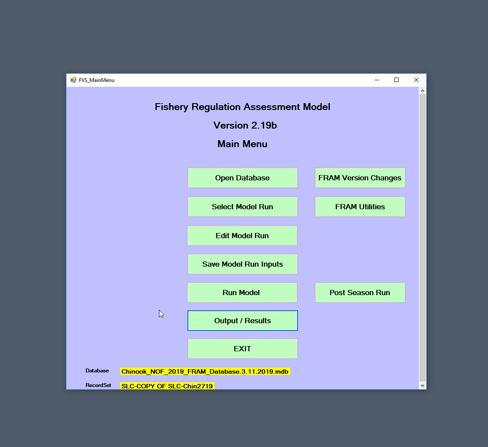

```{r include=FALSE}
page_title <- "User Manual Basic Forward Run"
```

---
title: `r page_title`
output:
  rmarkdown::html_document:
    theme: yeti
    number_sections: true
    toc_depth: 3
    toc_float:
      collapsed: false
    css: rmarkdown.css
    highlight: textmate
    mathjax: null
    df_print: paged
editor_options: 
  chunk_output_type: console
---

```{block, startblock1, type='rmdcaution'}
This example assumes the current FRAM executable and a suitable database are available. Please ensure that you have these [Prerequisites](user_prereq.html). 
```

\

A forward <span title = "FRAM: Fishery Regulation Assessment Model">FRAM</span> model run simulates how a given set of fishing regulations will interact with the annual abundance levels of modeled stocks. 

# Perform a new run

Begin by launching <span title = "FRAM: Fishery Regulation Assessment Model">FRAM</span> and continuing to the main menu.

Now, select a [Project database] by clicking "Open database". After navigating to and selecting a project database .mdb file, click "open". <span title = "FRAM: Fishery Regulation Assessment Model">FRAM</span> will then prompt for a second selection from among the model runs included in the database. The selected `RunID` index tells the application which values to read into memory from across the various tables, thereby setting up any further work for that specific model run. Note that the project database name (Database) and model run (RecordSet) are now listed in the lower section of the main menu view.

*Attempting to select a [Model run transfer file] or [Base period transfer file] is a common pitfall and will prompt a warning. Transfer files, which are typically indicated as such by name, contain only portions of a subset of the tables needed to run <span title = "FRAM: Fishery Regulation Assessment Model">FRAM</span>.* 


\

# Make a run copy

Initializing a new, copied run preserves the old values while exploring new ones. 

If you change inputs to an existing model run and re-run it, <span title = "FRAM: Fishery Regulation Assessment Model">FRAM</span> will overwrite the prior results. Thus, it is common practice to copy an existing run, re-name it, change input parameter values, and generate updated model results from the new run.

Click "<span title = "FRAM: Fishery Regulation Assessment Model">FRAM</span> utilities" from the main menu, and then "Copy model run" to reach the copied recordset screen.^[Note that creating a completely *de novo* "new" blank run is not actually possible from the <span title = "FRAM: Fishery Regulation Assessment Model">FRAM</span> application, but would require using other tools to initialize a new .mdb with the necessary lookup and parameter tables.]

In addition to specifying an informative `RunName` and `RunTitle` in the respective fields, the free-text "Comments" field is an important place to document the planned changes, the original run it is based on, the date a change was made and by whom, etc. This is also easily updated later with any further changes (see [Edit model run info]). After entering a good description of what will change, click "Ok - done" to complete the process and return to the <span title = "FRAM: Fishery Regulation Assessment Model">FRAM</span> utilities menu, with the newly copied run loaded into memory. *Note that this step involves writing to disk and may take a few seconds - no need to panic if <span title = "FRAM: Fishery Regulation Assessment Model">FRAM</span> hangs momentarily.* Exit to the main menu to continue working on this run.


When an analysis will include exploring many changes, it may make sense to create multiple new runs that include different subsets of these adjustments, making it easier to isolate the effects of particular new values. However, this choice is also influenced by whether the runs will be shared (by [Model run transfer file]) or informally examined. This is ultimately a matter of balancing the relative ease of sharing a single run with the potential for greater clarity of separate runs that involve only a few adjustments.


# Make a <span title = "TAMM: Terminal Area Management Module">TAMM</span> copy

In many cases, it will be necessary or useful to associate the newly copied <span title = "FRAM: Fishery Regulation Assessment Model">FRAM</span> run with a new copy of the <span title = "TAMM: Terminal Area Management Module">TAMM</span> file linked to the prior run. Outside of <span title = "FRAM: Fishery Regulation Assessment Model">FRAM</span>, navigate to the appropriate <span title = "TAMM: Terminal Area Management Module">TAMM</span> file and save a copy with a filename clearly related to the new run name. This file can then be used when running the modified inputs without over-writing the prior run values.

# Edit input parameter values

Now that a fresh run exists, clicking the "[Edit model run]" button opens a submenu further divided into "Stock" and "Fishery" buttons. For this example, click the "Quota/Scalers" button in the Fishery section to reach the screen displaying values for each fishery in each time step.


Fishery impacts in <span title = "FRAM: Fishery Regulation Assessment Model">FRAM</span> are controlled by "quotas" and/or "scalers", and these are in turn controlled by the value of a per-timestep `fishery flag` (note the meaning of the control flag values are displayed in the lower left of the interface). 

A single fishery can be controlled as either a quota or scaler within a given time step. If flagged as a quota, <span title = "FRAM: Fishery Regulation Assessment Model">FRAM</span> will ignore updates to scalers and vice versa. Great care is necessary to assure that values are only changed in the scaler or quota field corresponding to the specified flag. Once run, <span title = "FRAM: Fishery Regulation Assessment Model">FRAM</span> will update the corresponding value; i.e. the quota resulting from the modeled scaler. Two digit combo flags are used to model mark-selective and non-selective fisheries in the same time step; i.e. a flag of 18 designates a non-selective scaler and a mark-selective quota fishery.

When selecting the “Quota/Scalers” screen, <span title = "FRAM: Fishery Regulation Assessment Model">FRAM</span> will first present the non-selective fishery control screen. Upon clicking “OK-Done”, <span title = "FRAM: Fishery Regulation Assessment Model">FRAM</span> will progress to the mark-selective fishery control screen. *Note that fishery flags for mark-selective fisheries are initially entered on the non-selective screen. This will result in the addition of the fishery on the mark-selective control screen.*

In <span title = "FRAM: Fishery Regulation Assessment Model">FRAM</span> nomenclature, a `scaler`^[sometimes also misspelled "scalar"] refers to a parameter that acts as a linear coefficient to "scale" another value, often a parameter calibrated to the base period. For example, a `recruit scaler` is multiplied against a `base cohort` abundance value, with the resulting stock abundance for the model run year reflecting any changes relative to the base period (e.g., a scaler of `1` would produce an equal abundance, `0.5` a halving, and `2` a doubling). Similarly, a `fishery scaler` is multiplied against a fishery specific `base period exploitation rate` to capture increased or decreased intensity of effort relative to the base period years.

Altering a fishery `quota` has fairly intuitive implications - it determines the catch associated with the fishery during the time step. Adjusting `fishery scalers` is similarly possible, but likely requires more prior knowledge of the base period fishery. 

The Chinook example below demonstrates a sequence to modify several fishery input quota values.

First, to edit a non-selective quota, for Southeast Alaska troll during the July to September time step 3, 

  - from the main menu click “Edit Model Run”
  - then click “Quota/Scalers” (under Fishery)
  - then navigate to the specific fishery (row) and time-step (column), to change the input value in TS3Quota (ensure that the flag = 2 for Fishery Quota),
  - click twice on the cell and modify the value, then click any other cell in the interface to move “off” your changed cell. 
  
Next, to edit a mark-selective quota, for Area 10E Sport during the July to September time step 3,

  - make sure the fishery has a mark-selective flag on the non-selective control screen,
  - click “OK- Done” to continue on to the second fishery input screen specific to editing mark-selective fisheries, 
  - navigate to the specific fishery and time-step (both in a single row), 
  - change the input value in Quota (ensure that the flag = 8 for <span title = "MSF: Mark-selective fisheries">MSF</span> Quota) by clicking twice on the cell, modifying the value, and clicking any other cell in the interface to move “off” your changed cell.
  
Then, click “OK- Done” to return to the Input Menu and then exit to the main menu. 

During this sequence, the <span title = "FRAM: Fishery Regulation Assessment Model">FRAM</span> application acts as a convenient interface to the project database. For some analyses, it can also make sense to edit values within the appropriate table(s) via another non-<span title = "FRAM: Fishery Regulation Assessment Model">FRAM</span> application such as Microsoft Access (e.g., scripting or copying over numerous consistent changes such as "zeroing out" a set of fisheries). 


# Run the model

At this point, the new fishery input parameter values are in memory but have not been written to the project database tables, and the output values associated with the run are still those of the original from which it was copied. Accordingly, the next step is to “Save Model Run Inputs” from the main menu, which will prompt to either "Replace Current Model Run" or "Save New Model Run". Because this example is already using a copied model run, it is appropriate to replace the current model run. 

Note that the <span title = "FRAM: Fishery Regulation Assessment Model">FRAM</span> application monitors when a user exits the "Edit model" screens via an "Ok done" button, and will prompt to save changes (not shown below). ^[Note that prompts to save will occur even if no values have actually changed. If only using edit screens to view current values, then exiting via "cancel" will avoid prompts.] Editing and then saving as a new run at this stage provides an alternative to the copy-first-then-edit approach shown here, but this requires care to avoid accidentally overwriting the old one. It is also worth keeping in mind that changes saved to the underlying database from another external application *after* the run has been selected will not be in-memory until the run is re-selected.

Now, the next step is to actually run the model and recalculate model outputs by selecting “Run Model” from the main menu. 

Reaching the "Model Run Specification" submenu presents a number of additional options as buttons and checkboxes (see the [Run Model] section of the [Edit, save and run model] chapter). The "Select <span title = "TAMM: Terminal Area Management Module">TAMM</span>" button enables <span title = "FRAM: Fishery Regulation Assessment Model">FRAM</span> to operate in conjunction with a <span title = "TAMM: Terminal Area Management Module">TAMM</span> selected from the resulting dialogue box. After navigating to the new copy of the associated <span title = "TAMM: Terminal Area Management Module">TAMM</span> file created earlier, this file name should now appear under the project database name and model run name. See the [<span title = "TAMM: Terminal Area Management Module">TAMM</span>] section for more background and details on how the <span title = "TAMM: Terminal Area Management Module">TAMM</span> file sends additional input data to <span title = "FRAM: Fishery Regulation Assessment Model">FRAM</span> and receives output data from <span title = "FRAM: Fishery Regulation Assessment Model">FRAM</span> once the model is run.

For Chinook, most model runs will not involve additional checkboxes, as these relate to non-standard <span title = "FRAM: Fishery Regulation Assessment Model">FRAM</span> modeling purposes.

For Coho, a commonly used checkbox is “Run Coastal Iterations”, which allows for iterations between <span title = "FRAM: Fishery Regulation Assessment Model">FRAM</span> and a Coho <span title = "TAMM: Terminal Area Management Module">TAMM</span> file for Washington coastal terminal fishery inputs.

When "Run model" is clicked from the Model Run Specifications menu, the <span title = "FRAM: Fishery Regulation Assessment Model">FRAM</span> application will quickly cycle through a series of in-memory calculations for each time step, before performing several slower writes to the project database. In particular, the database tables with [Output values] are updated for the current `RunID`. The process will complete and automatically return to the main menu.

When the model is starting to run, it will ask “Do you want to SAVE <span title = "TAMM: Terminal Area Management Module">TAMM</span> Transfer Values into <span title = "TAMM: Terminal Area Management Module">TAMM</span> spreadsheet?”. Selecting "Yes" will be appropriate in most cases (and is needed to overwrite [TAMX] and <span title = "TAMM: Terminal Area Management Module">TAMM</span> results based on the new run). <span title = "FRAM: Fishery Regulation Assessment Model">FRAM</span> will open the <span title = "MS: Microsoft">MS</span> Excel <span title = "TAMM: Terminal Area Management Module">TAMM</span> file, even if the program was not open before.  Once the model run is complete, the <span title = "TAMM: Terminal Area Management Module">TAMM</span> file used will be open on your computer and will have completed values for the model run.  **Be sure to navigate to the open <span title = "TAMM: Terminal Area Management Module">TAMM</span> file and save it to retain the modeled values. Another common pitfall is to complete a model run successfully and overwrite the <span title = "TAMM: Terminal Area Management Module">TAMM</span> values but then forget to save these updates.**


# View the results

The two most common places for viewing results are the “Mortality” table in the [Project database tables] and the [<span title = "TAMM: Terminal Area Management Module">TAMM</span>]. The “Mortality” table consists of mortalities by type (non-selective and mark-selective landed catch, drop-off, non-retention, and shaker) at the finest possible scale (stock, age, fishery, and time step). <span title = "TAMM: Terminal Area Management Module">TAMM</span> includes many tabulations of impacts, particularly for Puget Sound fisheries and stocks.

Output can also be viewed or created on the “Output/Results” menu. Checking mortality per fishery can offer a first look at the effects of adjusting a quota. From the main menu, selecting "Output/Results" leads to a submenu with a "Screen Reports" option, which in turn offers a set of possible reports. Selecting the "Fishery Mortality" checkbox will produce an output window that initially displays landed catch by age, summed across all stocks for each fishery and time step. For Chinook, the "Sum Age Only" button filters the view accordingly. The upper left drop-down menu provides options to view separate components of mortality, including <span title = "AEQ: Adult equivalent">AEQ</span> or "adult-equivalent" values for Chinook.



In this example, note that the July to September time step 3 Southeast Alaska troll and Area 10E Sport landed catch mortality values now match the previously adjusted fishery quota - the changes were correctly incorporated into the run! A typical modeling exercise will include checking several different results, and the [Outputs] section describes the various reports available within the <span title = "FRAM: Fishery Regulation Assessment Model">FRAM</span> interface.

<br>

To cite this page: <br>
`r paste("Salmon modeling and analysis workgroup.", format(Sys.Date(), "%Y."), page_title, "*in* FRAM Documentation. https://framverse.github.io/fram_doc/ ", paste("built", format(Sys.Date(), "%B %d, %Y.")))`

<br>