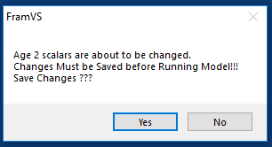

The FRAM utilities submenu contains several frequently used functions, with button color indicating related items.

```{r utils, echo = FALSE, out.width='100%'}
knitr::include_graphics("images/fvs_utils.png")
```

 - [Edit model run info] accesses metadata associated with a model run
 - [Copy model run] makes a copy of currently selected model run and updates metadata
 - [Delete model run] removes single or multiple model runs from the project database
 - [Transfer model runs] makes copy of selected model run(s) to transfer to another project database in a particular “template” .mdb file
 - [Get model run transfers] imports data from the “template” Model Run Transfer file for one or more model runs 
 - [Read old base period] imports old format CMD files of base period tables (.OUT text formats) into the current project database structure
 - [Delete/Transfer/Get base period] for selected base period(s) removes, makes a tranferable copy, or imports data from the “template” Transfer Base Period file for one or more model runs
 - [Compute 2s From 3s (Chin)] calculates the starting cohort of age 2s as a function of the 3s
 - [Read old CMD file] reads old format CMD files into database tables (i.e. model runs)
 - [Read TAA/ETRS file] reads old format Coho TAMM file for table TAAETRSList
 - [Automate pass 1 pass 2 (Chin)] automates computation of non-retention impacts in Puget Sound marine Chinook sport fisheries
 - [Update Coweeman sheets] revises Columbia River Chinook MS Excel file (PFMC process)

# Edit model run info

Selecting this option provides an interface to alter some of the metadata associated with an existing run, particularly the name, title, year and comments (stored in `RunID` table in the database [Lookups]). Best practices encourage entering careful, comprehensive notes for future reference.

When changes are cumulative across numerous runs, such as in a preseason or "forward" context, comments may often refer to prior runs for ease of reading (i.e., "started with run N, changed X, Y, and Z"). Preseason model runs often start with the beginning model run notes and add sequentially above those as the preseason progresses, so that the newest changes describing the run are at the top for easy viewing. The Comments field cannot be deleted and left blank or FRAM will throw an error message. If this happens, click “Quit” and re-try. 

```{r utils_edit_info, echo = FALSE, out.width='100%'}
knitr::include_graphics("images/fvs_utils_edit_info.png")
```

# Copy model run

As shown in the [Make a run copy] section of [A basic forward run], this option conveniently provides the starting point for further work to examine scenarios for the FRAM management units. Recall that a given "run" is spread across numerous tables in a project database and involves many rows within some tables. Consequently, this utility helps save time and avoid error by ensuring that all necessary steps to create a new model run are completed. ^[Note that creating a completely *de novo* “new”, blank run is not actually possible from the FRAM application, but would require using other tools to initialize a new project.mdb with the necessary lookup and parameter tables.]

It is common practice to copy an existing run, re-name it something new, make input changes, and generate updated model results from the new run.

Having reached the "NEW Copied Recordset Information" screen, specify an informative `RunName` and `RunTitle` in the respective fields. In addition, the free-text "Comments" field is an important place to document the planned changes, the original run it is based on, the date a change was made and by whom, etc. This is also easily updated later with any further changes (see [Edit model run info]). After entering a good description of what will change, click "Ok - done" to complete the process and return to the FRAM utilities menu, with the newly copied run loaded into memory. *Note that this step involves writing to disk and may take a few seconds - no need to panic if FRAM hangs momentarily.*

```{r utils_copy_run, echo = FALSE, out.width='100%'}
knitr::include_graphics("images/fvs_utils_copy_run.png")
```

# Delete model run

**Note that this process cannot be reversed. If it is necessary to remove a run from a database while preserving it for later use, then creating a model run transfer is likely a good option.**

This option provides a convenient means to comprehensively remove one or several runs from a database. Selecting the "Delete Model Run" button prompts a screen listing available runs. After selecting a single model run name in the list, a confirmation prompt again displays what will be removed. If you are certain you wish to delete the model run, click “Yes” - or - click “No” to return to the FRAM Utilities menu. The currently active model run cannot be deleted with this utility, and attempting to do so will produce an error prompt. Simply return to the main menu, select a different run, and re-try the deletion. (Note it is also possible to delete runs directly from the main model selection window.)

```{r utils_del_erro, echo = FALSE, out.width='100%'}
knitr::include_graphics("images/fvs_utils_del_error.png")
```

To remove and delete more than one model run from a project database, select the “Delete Model Run” button and then the “Delete multiple runs” button found at the lower right (not the list of runs in the interface).  This will then prompt the user with a separate window for Delete Multiple Model Runs, with another list of model runs in the project database.  In this separate window, the user checks the boxes next to individual model run names and once multiple runs (or even a single run) have been checked, click the “Delete Selection Done” button. There will be no additional confirmation prompt displayed, rather the model runs will be deleted.

```{r utils_del_mult, echo = FALSE, out.width='100%'}
knitr::include_graphics("images/fvs_utils_del_mult.png")
```

# Transfer model runs

Model run transfer files, which are typically indicated as such by name, contain only portions of a subset of [Project database tables]. They enable sharing the relevant values for a single run without transmitting an entire [Project database]. 

Clicking the “Transfer Model Runs” button in FRAM Utilities will prompt a message box “Please select the Transfer Database” and the user clicks “OK”.  At that point, a file selection dialogue appears for a “template” model run transfer .mdb file into which the transferred values will be written. Be sure to utilize a “blank” template model run transfer file, or any model runs will be added to those that are already stored in the file. The current version of this template is generally provided on the [Fisheries Services](https://fisheriesservices.nwifc.org/fram-model-runs/pre-season-fram-model-files/annual-pre-season-model-files/) site.

After an appropriate template is chosen, a “Model Run TRANSFER Selections” window appears with the list of available model runs in the project database. When the desired run or multiple runs (Cntl+click) are highlighted in the interface list and the “Transfer Selection Done” button is clicked, the application will prompt for a new file name. After entering an informative name, the new values are written into the template and the user returns to the FRAM Utilities submenu. 

*Note that the actual file creation may take a few seconds during writes to disk.*

```{r utils_make_transfer, echo = FALSE, out.width='100%'}
knitr::include_graphics("images/fvs_utils_make_transfer.png")
```

# Get model run transfers

Complementing a transfer write out, this option reads in one or several runs from an existing model run transfer file. The straightforward process simply involves clicking the “Get Model Run Transfers” button, selecting the desired model run transfer file, clicking “Open”, and waiting for the application to complete the read and subsequent write of values into the project database. Then exit out of the FRAM utilities menu, and click the “Select Model Run” button on the main menu to load a newly transferred run, which should be found at the end of the available list.

Note that inadvertently reading in a duplicative run should not generally cause great harm, as the "new" run will be assigned whatever `RunID` is incrementally next and will not overwrite existing elements of the project database.

# Read old base period

Prior to 2011, base period data were stored in a text file with a `.out` extension, commonly referred to as outfiles. These historic outfiles are associated with `*.cmd` "command files". The outfile information is equivalent to data stored in FRAM [Project database tables] containing a ‘BaseID’ field; i.e base period exploitation rates, maturation rates, growth functions, etc.

The “Read Old Base Period” utility reads the outfile and places the information in the relevant model run Access database tables; i.e. base period exploitation rates are stored in the “BaseExploitationRate” table. 

However, importing an old model run (command file) and associated outfile into a modern FRAM database can be problematic, as some of the existing tables need to be compatible with the old data. The existing “Stock” table in the database has to include the stock version of the old outfile; i.e. version 1 for the old 76 stock structure of Chinook. Ideally, the “ChinookBaseSizeLimit” table should contain size limits from the old base period. Since the FRAM Access database currently only accommodates size limits from one base period, it is not advisable to load runs from more than one base period.

Generally, the chance of run errors increases significantly with older model runs (command file) and the associated base period (outfile). Nevertheless, being able to quickly produce output summaries through Access queries is a huge advantage over the old method of retrieving output through driver files. It is highly advisable to compare TAMX output from the original run with output produced using the current version of FRAM before taking advantage of this functionality.

To import an old base period into a FRAM database, select “Utilities”, “Read Old Base Period”, pick the desired outfile and then press “Yes” when prompted to confirm that the base period is for Chinook.

# Delete/Transfer/Get base period

Much as the above delete, transfer and get model run functions manipulate multiple tables throughout the project database, these options provide a similar means to handle entire base periods. Not all project databases will have more than one set of base period parameters, but these functions are important when this is the case.   

**Until additional features are implemented for Chinook, a single base period should be utilized in a project database.  This is due to some tables in the project database containing values unique to an individual base period, but the table is not tied to a unique BaseID.  Once they are tied to a unique BaseID, then more than one base period can be utilized in a Chinook project database.  Please consult with a lead FRAM modeler if you need assistance.**

# Compute 2s from 3s (Chin)

The abundances of 2 year olds are often not forecasted. Selecting this button will result in FRAM calculating the starting cohort of age 2s as a function of the 3s; i.e. produce a recruit scaler of 2 year olds that roughly produces the age 3 starting cohort. 
This is desirable for two reasons:

 - On average (over time), age 2 scalers should be of a magnitude that is related to age three abundance, because age 2 fish will mature to become age 3 fish.

 - In FRAM, age 2 fish will become age 3 fish in time 4. Having age 2 abundances that are incompatible with age 3 abundances can result in large and undesirable exploitation rate swings.

When selecting this utility, FRAM applies a constant to the 3 year old starting cohort to calculate the 2 year old cohort. This links the age 2 and 3 recruit scalers similarly as a cohort reconstruction would. Most constants are close to 1.0 resulting in new age 2 scalers that are almost identical to the age 3 scalers.

To compute age 2 starting scalers, after clicking the “Compute 2s From3s (Chin)” button, the following window will pop up.

```{r utils_age2s3s, echo = FALSE, out.width='70%'}

```

After selecting “Yes” the “Save Model Run Input” screen will open, allowing selection of either “Replace Current Model Run” or “Save New Model Run”. These steps return the user to the “FRAM Utilities” menu. Age 2 recruit scalers have been updated and saved. If desired, this can be verified by opening the “Input Menu”, selecting [Stock recruits] and examining the new age 2 scalers.

# Read old CMD file

Prior to 2011, annual FRAM inputs were stored in a text file with a `.cmd` extension, commonly referred to as command files. This information is equivalent to data stored in all FRAM Access database tables containing a ‘RunID’ field; i.e annual model run information. These text files were opened, modified, and run in FRAM version “FRAM555” or earlier. These versions of FRAM were coded in Visual Basic and preceded the currently in use FRAM Visual Studio.net versions with ADO.net database programming. The “Read Old CMD File” utility reads the command file and places the information in the relevant model run Access database tables; i.e. forecast information is stored in the “Cohort” table, retention fisheries inputs are placed in the “FisheryScalers” table. These historic command files are usually linked to old base periods which were stored in text files as well, with a *.out extension, commonly referred to as outfiles. Please refer to the Read Old Base Period paragraph for instructions on how to import an outfile into a FRAM Access database and [Linking a model run to a base period] for instructions. 

To read an old model run into FRAM, first make sure the base period associated with the command file is loaded in the ACCESS database. The base period name can be found on the fifth line of the command file. Then, after clicking the “Read Old CMD File” button, navigate to and select the desired command file. Finally, select "yes" from the following pop up window.

```{r utils_read_old_cmd, echo = FALSE, out.width='70%'}
knitr::include_graphics("images/fvs_utils_read_old_cmd.png")
```

# Read TAA/ETRS file

The “Read TAA/ETRS File” button in the FRAM Utilities is a seldom-used option to import old format CMD files (TAAETRSnum.txt) of the TAAETRSList table into the current project database structure.

The TAAETRSList table contains definitions (by unique TaaNum) for terminal run parameters, including stocks, fisheries, and time steps (only 4=Sept, 5=Oct-Dec).  These terminal definitions are used in the TAMM (sheet Tami) and FRAM program code for certain algorithms.  The TAAETRSList table is not tied to a specific model run (by unique RunID), and thus changes to this table over time will influence model run results from prior years if model runs are in the same project database, but had different terminal run parameter definitions each individual year.  In addition, the TAAETRSList table is not included in a model run transfer file and thus definitions are not updated for each model run loaded into a project database.

Thus, the modeling strategy is to create new definitions within this table whenever a modification is necessary, rather than modifying current definitions.  Thus, an older definition which matches an older TAMM will remain in the table for model run use (i.e #5).  A newer definition will match a newer TAMM (i.e. #40).  Both the older and newer values will remain in the same database table and thus multiple years of model runs can be utilized.  

Starting in the preseason 2018 Coho project database, the TAAETRSList table has been updated to incorporate TaaNum definitions back through 2013, when the MS Access database structure was first implemented.  Any TaaNum definition updates were also made in the starting TAMM files provided at that time.

Any necessary updates to the TAAETRSList table should be made at the beginning of the preseason salmon management process and incorporated in the starting MS Access project database file for coho FRAM.  If updates are made to this table during the preseason negotiations, the NOF lead modeler will be responsible for notifying co-managers and ensuring the update is distributed.

# Automate pass 1 pass 2 (Chin)

This functionality was added in 2019 to automate a time consuming process to compute non-retention impacts in Puget Sound marine Chinook sport fisheries. In a first step (Pass 1), the non-retention fishery is modeled as “open” to Chinook retention. Output of sublegal and legal encounters from the ‘Pass-1-Run’ are subsequently modeled in the non-retention section of FRAM during the ‘Pass-2-Run’. Most Puget Sound marine Chinook sport fisheries are modeled in the [RunSheet (Chinook)], an Excel workbook that translates periods open to Chinook fishing into fishery effort scalers for FRAM. 
	
Non-retention inputs should be updated when changes in abundances are significant enough to result in changes to encounters and/or when non-retention regulations are updated.

The utility requires an updated [RunSheet (Chinook)], with the naming convention “RunNNNN.xlsm” corresponding to the associated FRAM run number.

When selecting the “Automate Pass 1 Pass 2” button, FRAM will perform the following.

 1. Model marine sport fisheries with the scalers located on the `Pass1Input` sheet of the workbook. These values reflect all marine sport fisheries (retention and non-retention) as open to retention. For this “wide-open” run, existing non-retention inputs stored in the Access database are set to zero.
 
 2. Paste landed catch and shaker estimates into the J:P range of the `CatchShakerPRN` sheet, whereby formulas convert these estimates into legal and sublegal encounters for the non-retention period only.
 
 3. Update retention fisheries and flags (mark-selective, non-selective), as well as non-retention fisheries and flags with values on `Pass2Inputs`.
	
After selecting this option, choose the desired RunSheet and press “Open”. FRAM will then prompt the user to save the updated values, and selecting “Yes” will open the “Save Model Run” menu.

After saving, FRAM will present the following message.

```{r pass1pass2prompt, echo = FALSE, out.width='70%'}
knitr::include_graphics("images/fvs_utils_pass1pass2prompt.png")
```

After selecting “OK”, FRAM will open the [Run Model] menu. Once the run begins, the user interface disappears for a few minutes. FRAM then reappears when the run is finished.

# Update Coweeman sheets

The Coweeman spreadsheet is an Excel workbook with abundance and exploitation rate summaries for Columbia River Chinook stocks. Columbia River salmon managers use it as a starting point for in-river models. The workbook also provides exploitation rate information for Lower Columbia River natural Chinook (LCN). This stock is represented by Coweeman hatchery tag codes in FRAM (hence the name of the spreadsheet). LCNs are ESA listed and can be a critical constraining stock for ocean salmon fisheries during the PFMC fishing season setting process. PFMC usually crafts three ocean fishery options bracketing possible ocean fisheries, with option 1 representing the “high” ocean option, 2 the “middle”, and 3 the “low”. Initially, all three options are modeled, but a single option is eventually selected.

All three options or just the final option can be loaded into the “Coweeman Spreadsheet”, an Excel workbook following the naming convention “CoweemanNNNN.xlsm”, where NNNN represents the associated FRAM run number. **Note that the in-river LCN harvest rate in cell 'PFMC-Option-1'!M8 needs to be updated.**

When selecting the “Update COWEEMAN Sheets” button, FRAM will:

 1. Perform brood year and fishing year calculations and summarize mortalities and abundances for Columbia River Chinook stocks.

 2. Paste terminal run size and AEQ mortalities for marked, unmarked, and total Columbia River stocks into the tab corresponding to the fishing option selected. 
	
After selecting "Update Coweeman sheets", select the ocean option associated with the model run and then select the “Coweeman” spreadsheet and press open. After FRAM completes processing, the “Utilities” menu reappears. The updated Coweeman spreadsheet will be open in Excel with FRAM output loaded into the selected option. Save the workbook before closing.

